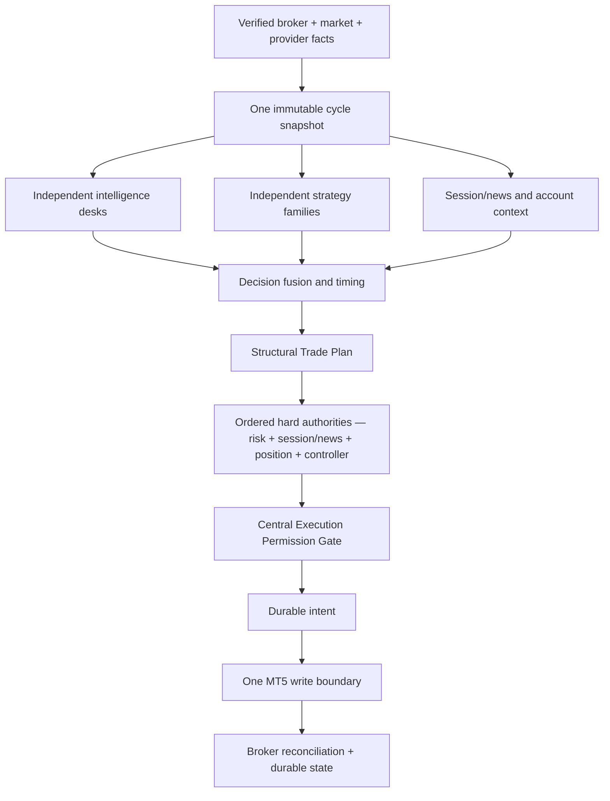
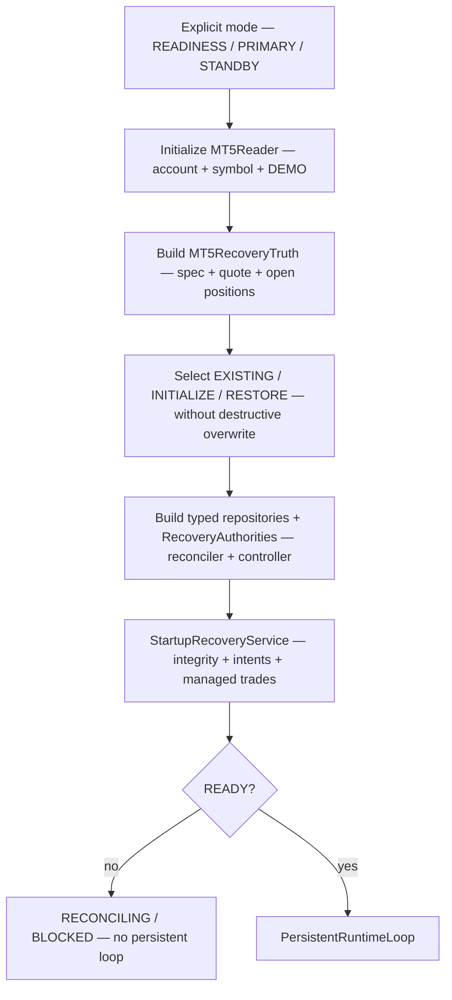
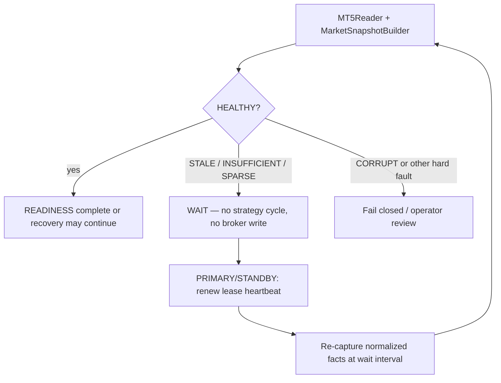
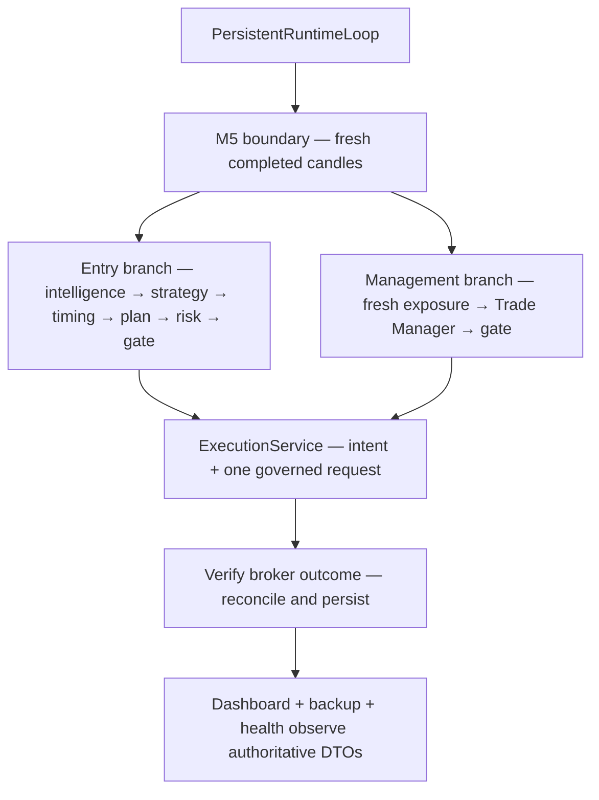
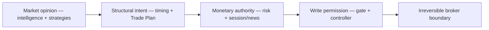

# GoldSwingTraderAI — Architecture

**Status:** PROVISIONAL
**Version:** 0.8-implementation
**Authority:** High-level system architecture

## Purpose

This document explains the runtime topology, dataflow, parallel analytical
lanes, ordered authority gates, persistent loop, management branch, recovery
path and research boundary. It is the system-level map; domain documents own
the detailed rules for each lane.

## High-level flow

```text
VERIFIED MARKET / BROKER FACTS
            │
            ▼
PARALLEL MARKET-INTELLIGENCE DESKS
Candle/Structure | Technical/Location | Technical Confluence
Liquidity/SMC    | Indicator/Quant     | Fundamental Facts | Session Context
            │
            ▼
PARALLEL STRATEGY FAMILIES
(base hypotheses + bounded optional confluence bonus)
            │
            ▼
BUY THESIS  ↔  SELL THESIS
            │
            ▼
DEBATE / RED TEAM
            │
            ▼
DECISION FUSION
Opportunity + Timing + Conflict + Coverage + Reasons
            │
            ▼
STRUCTURAL TRADE PLAN
Entry Reference + Invalidation/SL + Targets + Original R
            │
            ▼
HARD AUTHORITIES
Risk + Session/News + Data/Account + Position/Order + Controller
            │
            ▼
CENTRAL EXECUTION PERMISSION GATE
DEMO Guard + ALLOW / BLOCK / UNKNOWN + Reasons
            │
            ▼
PERSIST EXECUTION INTENT
            │
            ▼
ONE GOVERNED BROKER WRITE + RECONCILIATION
            │
            ▼
OPEN-TRADE MANAGEMENT FLOOR
            │
            ▼
JOURNAL / LEARNING / RESEARCH / DISCOVERY / PROMOTION
```

Cross-cutting services:

```text
PERSISTENCE / RESTART / BACKUP / MIGRATION
CONTROLLER LEASE / FENCING
SYSTEM HEALTH / DIAGNOSTICS
DASHBOARD / OPERATOR VISIBILITY
```

They support/observe the authoritative flow without creating a second trading authority.

## Runtime topology and parallelism contract

The system has one controlled runtime process with several logical lanes. The
lanes share immutable facts and durable owners, but they do not share hidden
permission or broker-write shortcuts.



The three independent inputs to fusion are intentionally shown as separate
lanes. They may be evaluated one after another for deterministic Python
execution; “parallel” means that no desk is allowed to call another desk,
silently turn absence into a veto, or mutate a shared result. A future
concurrent implementation is valid only if it preserves the same snapshot,
chronology, bounded outputs and deterministic final decision.

| Logical lane | Owns | May influence | Cannot do |
|---|---|---|---|
| Market intelligence | normalized evidence about price, structure, liquidity, quant, session and news | strategy hypotheses and decision explanations | grant execution permission or write broker state |
| Strategy/decision | family hypotheses, BUY/SELL thesis, fusion, timing and Trade Plan | entry direction/action and structural geometry | size monetary risk or bypass hard authorities |
| Hard safety | affordability, session/news state, account/position identity, controller and execution checks | ALLOW/BLOCK/UNKNOWN | improve a score or rewrite a structural plan silently |
| Execution/reconciliation | one-shot intent, broker request and verified outcome | durable lifecycle state | decide strategy direction or blind-retry ambiguity |
| Operator/research | visibility and offline evidence | diagnosis, calibration and governed candidate flow | become a production write authority |

## Startup and recovery topology

Startup is a prerequisite graph, not a normal cycle. Every downstream owner is
constructed from verified upstream facts.



The read-only READINESS path can stop after verified inspection when the result
is healthy or a non-retryable failure. If required quote/candle data is
`STALE`, `INSUFFICIENT` or `SPARSE`, the launcher remains in a read-only wait
and polls again; it does not invoke strategy, risk sizing or broker execution.
PRIMARY and STANDBY may proceed only after local state selection, recovery and
controller rules are satisfied. A newly acquired fencing epoch is not by itself
READY: takeover still requires broker/state reconciliation.

### Closed-market and stale-feed wait lane

The runtime treats market closure as an observable operating state rather than
an instruction to terminate or manufacture trading permission. The same
initialized MT5 read boundary is reused for bounded re-probes:



The wait lane is intentionally narrower than a generic retry mechanism. Data
freshness/warm-up is retryable; corruption, identity mismatch, DEMO failure,
unknown session/news, persistence integrity and controller faults retain their
existing fail-closed or terminal behavior. A stale feed is not itself proof of
a calendar closure, so logs expose the exact `DataQuality`/recovery reason.

### Readiness dashboard visibility

The operator must be able to see the wait state while the runtime is alive.
Readiness therefore has its own presentation path; it does not borrow the
full-cycle dashboard because no strategy, risk or execution result exists
before a governed cycle:

~~~mermaid
flowchart TB
    SNAP["Normalized MarketSnapshot"] --> MAP["build_readiness_dashboard_data"]
    MAP --> FRAME["ReadinessDashboardData"]
    FRAME --> RENDER["render_readiness_dashboard"]
    RENDER --> VIEW["Terminal monitor — WAIT / stale reason / write lock"]
    VIEW -.->|"no authority"| CYCLE["Strategy and broker cycle remain untouched"]
~~~

The frame is emitted after every READINESS snapshot, including
STALE/INSUFFICIENT/SPARSE polls. It shows broker/read facts, completed-candle
counts and exact data issues, and explicitly shows that strategy is not run
and broker writes are disabled. A healthy READINESS snapshot still remains
read-only; only the governed persistent runtime can render the Decision/Risk/
Execution dashboard after a fresh cycle.

## Runtime cycle topology



The entry and management branches use the same execution boundary. They are
separate decisions because an open trade has different authority and lifecycle
rules, not because management is allowed to bypass risk, controller or
reconciliation.

## Authority boundaries at a glance



No arrow may be skipped. In particular, a high score cannot create a lot size,
a Trade Plan cannot create broker permission, and a dashboard/research result
cannot create a broker request.

## Architectural principles

### 1. Parallel analysis

The system does not force all evidence through one long sequential filter chain where a weak optional signal can prematurely kill a valid opportunity. Specialist desks consume the same validated snapshot and publish independent bounded evidence.

### 2. One behavioural owner per rule

- Data layer owns broker/market facts.
- Candle Structure owns candle sequences/swings/BOS/MSS geometry.
- Technical owns generic zones/location/target room.
- Technical Confluence owns causal trendlines, Fibonacci geometry and broker-local volume-profile/POC context.
- Liquidity owns pools/sweeps/FVG/qualified OB/premium-discount interpretation.
- Quant owns indicators/volatility/momentum/extension metrics.
- Fundamental/Session intelligence publishes facts/context, not broker-write authority.
- Strategy families own family-specific opportunity hypotheses.
- Decision Fusion owns thesis combination/conflict/decision attribution.
- Entry Timing owns executable timing/setup lifecycle.
- Trade Plan owns initial structural entry/SL/targets/original R.
- Risk owns affordability/exposure/daily-loss policy.
- Session/Risk State owns hard market/news/risk permission composition.
- Execution owns the positive DEMO guard, centralized final broker-write permission, controller ownership checks and irreversible MT5 path.
- Trade Manager owns post-entry management intent.
- Persistence owns durable state/recovery/backup mechanics.
- Research/Learning owns governed evidence/candidate creation, never direct broker authority.
- System Health aggregates faults/impact/recovery without redefining subsystem rules.

Technical Confluence is explicitly **soft**. Trendline/Fibonacci/POC may strengthen an already-valid directional hypothesis through bounded bonus evidence. Their absence does not penalize a base strategy score; disagreement may be recorded as context/conflict but is not a hard execution blocker.

### 3. Separate opportunity from entry timing

A market opportunity may be strong while current execution timing is poor. Persistent setup lifecycle and separate Opportunity/Entry Timing scores preserve valid ideas without chasing.

### 4. Separate market opinion from hard safety

Analytical uncertainty may lower confidence. Safety uncertainty can block action. Missing optional macro/indicator/confluence evidence is different from unknown financial risk, required event safety, broker identity, order outcome, controller ownership or corrupted state.

### 5. Structural plan before monetary sizing

Strategy/timing define a coherent structural plan first. Risk sizes or rejects that plan; risk must not distort market invalidation simply to fit a lot size.

### 6. One final broker-write permission boundary

All bot-managed create/modify/close operations pass a single centralized permission boundary consuming authoritative subsystem results.

V1 environment permission is one positive input:

```text
verified connected MT5 DEMO account
→ DEMO_GUARD PASS
```

If DEMO status is not verified, broker-write permission is not granted. V1 does not define a separate REAL authorization/hard-block path.

### 7. State survives process and machine boundaries

Restart/laptop migration must not erase risk locks, order ambiguity, open-trade context, strategy genealogy, learning or promotion history. Broker truth is freshly reconciled before execution resumes.

### 8. One cross-machine execution owner

Only one PRIMARY may have broker-write authority for the managed account/symbol.

V1 controller ownership uses a shared lease with monotonic fencing epoch. Initial renewal target is 10 seconds and lease TTL is 30 seconds. Every irreversible write freshly verifies the current non-expired ownership epoch.

Standby takeover after expiry enters recovery/reconciliation first; lease ownership alone is not execution readiness.

## Timeframe hierarchy

```text
H4  → macro regime / major external structure / major liquidity
H1  → directional structure / thesis context
M15 → opportunity / location / target / confluence context
M5  → entry timing / fine structure / retest / reclaim / local confluence
M1  → diagnostics/execution telemetry unless explicitly promoted later
```

Higher timeframes provide context and meaningful contradiction rather than universal vetoes.

## Setup lifecycle

High-level lifecycle remains conceptually:

```text
DISCOVERED
   ↓
ARMED
   ↓
READY
   ↓
TRIGGERED
```

with branches such as:

```text
ARMED → WAITING → READY
ARMED → MISSED → RE-ARMED
ARMED → STALE
ARMED → INVALIDATED
```

Exact vocabulary belongs to `../20-trading-decisions/ENTRY_TIMING.md`.

## Decision outputs

The decision/timing system distinguishes at least:

- ENTER BUY;
- ENTER SELL;
- WAIT;
- MISSED;
- INVALID;
- BLOCKED.

`WAIT` means the thesis may remain valid. `INVALID` means the opportunity itself failed. `BLOCKED` means an independent safety/risk/system authority prevents execution.

## Decision attribution

Every cycle should preserve where the path stopped, for example:

```text
Data        PASS
Strategy    BUY 87
Entry       PASS
Trade Plan  PASS
News        PASS
Risk        BLOCK: MIN_LOT_UNAFFORDABLE
Execution   NOT_REACHED
```

This is decision attribution, not the same as a System Health fault.

## Execution architecture

```text
Approved Plan
→ Risk/Session/News/Data/Account/Position/Order/Controller results
→ DEMO Guard + Execution Permission Gate
→ persist Execution Intent
→ fresh broker pre-check
→ one irreversible request
→ ACCEPTED_VERIFIED | ACCEPTED_UNKNOWN | FAILED
→ reconciliation as required
```

Ambiguous broker acknowledgement is reconciliation-only; blind duplicate retry is prohibited.

A verified DEMO account is real-time broker execution on that DEMO account, not DRY RUN.

## Open-trade architecture

An open managed trade is continuously evaluated by parallel evidence. The Trade Manager consumes at least:

- Continuation Score;
- Reversal Score;
- Structure Integrity;
- Candle Health;
- Momentum/Expansion Health;
- Target Remaining / Liquidity Path;
- Protection Need;
- Session/Pre-Close requirement.

It returns HOLD, PROTECT, TRAIL, RUNNER or EXIT. Broker modification/close still passes through the governed execution boundary.

Known scheduled XAU closure is a hard V1 session boundary: PRE_CLOSE blocks new entries and mandatory flatten overrides HOLD/RUNNER before closure.

## Persistence / recovery architecture

Durable state includes risk/order/trade lifecycle, original R, Opportunity/Episode lineage, Strategy Registry, learning/research/promotion state and diagnostic/backup metadata where applicable.

Initial V1 local durable storage is standard-library SQLite with typed adapters/canonical records/checksums/schema versions. Broker truth remains authoritative for current positions/orders/deals.

Startup conceptually:

```text
explicit READINESS / PRIMARY / STANDBY mode
→ select EXISTING / INITIALIZE / RESTORE state without overwrite
→ connect/verify MT5 + DEMO status through MT5Reader
→ build live broker recovery truth
→ reconcile broker positions/orders/deals
→ restore risk/trades
→ build authoritative RecoveryAuthorities
→ acquire current controller lease/epoch
→ governed startup recovery
→ READY / RECONCILING / BLOCKED
```

The current integrated startup composition implements this sequence and hands
the live owners to the persistent M5 cycle. The cycle shares one fresh market
and recovery fact set across intelligence, decisions, risk, gate, management
and dashboard. Session/news remains an injected authority provider; absent
truth is UNKNOWN and prevents READY.

## Research / learning architecture

```text
Runtime evidence / trades / missed+blocked opportunities
                         │
                         ▼
                   RESEARCH LAB
            ┌────────────┼────────────┐
            ▼            ▼            ▼
       Entry/Exit     Discovery     Invention
        Learning         │        declarative only
            └────────────┼────────────┘
                         ▼
             Candidate created OR explicit
               governed suppression reason
                         ▼
               Independent validation
                         ▼
                 Locked Challenger
                         ▼
               Final untouched holdout
                         ▼
                       Stress
                         ▼
                       Shadow
                         ▼
                    DEMO Canary
                         ▼
               governed promotion
```

Eligible discovery evidence must not disappear silently. If the discovery engine cannot create/suppress an eligible cluster with an auditable reason, Discovery Health is degraded.

Research cannot bypass risk/execution, silently mutate production or generate arbitrary executable strategy code.

Trendline/Fibonacci/POC may participate in research as audited primitives. Research must use ablation/opportunity-recall metrics to prove they improve quality rather than merely reduce trade count.

## Health / operator architecture

System Health reports `OK/WARN/DEGRADED/BLOCKED/ERROR`, subsystem, trading impact and recovery state. Dashboard presents compact Market/Decision/Setup/Trade/Risk/Execution/Learning/Backup/Health panels with restrained emojis and stable reason codes.

Optional market context such as trendline/Fibonacci/POC should remain compact and must be presented as confluence, not a hard trade permission state.

## Verification and implementation trace

| Architecture boundary | Source owner | Main proof |
|---|---|---|
| Startup, state selection and recovery composition | `app/main.py`, `app/runtime.py`, `app/recovery.py`, `app/startup.py` | `tests/test_live_startup_runtime.py`, `tests/test_startup_recovery.py` |
| Shared fresh cycle and persistent scheduling | `app/cycle.py`, `app/loop.py` | `tests/test_runtime_loop.py`, `tests/test_live_startup_runtime.py` |
| Broker read/write separation | `market_data/mt5_reader.py`, `execution/mt5_writer.py`, `execution/service.py` | `tests/test_market_data.py`, `tests/test_execution_safety.py` |
| Durable state, backup and research isolation | `persistence/`, `research/` | `tests/test_persistence_recovery.py`, `tests/test_backup_catalog.py`, research suites |

The architecture diagrams describe dependency and authority contracts; they do
not substitute for connected Windows MT5, shared-storage failover or DEMO
evidence. Those proof requirements are owned by the testing and release docs.
