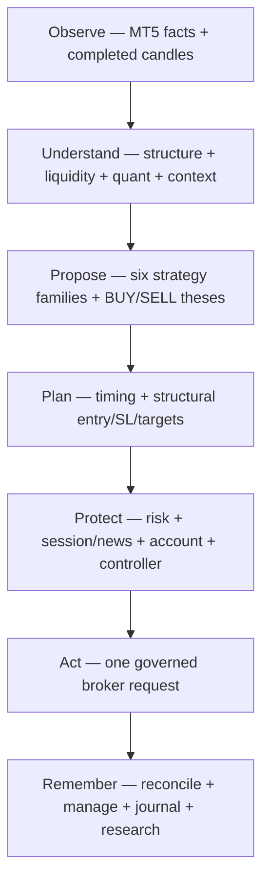

# GoldSwingTraderAI — Project Vision

**Status:** PROVISIONAL
**Version:** 0.2-design
**Authority:** Product intent and project direction

## Purpose

GoldSwingTraderAI is a fresh XAUUSD/XAUUSDm trading system designed to capture meaningful intraday and swing expansion rather than repeatedly scalp small fluctuations. The goal is to identify, enter and manage high-quality directional moves with enough flexibility to take a healthy number of valid trades without becoming a filter-heavy, ultra-restricted bot.

The system should be capable of participating in moves that may reach 100, 200, 300+ normalized pips when market structure supports them. These pip labels are reporting concepts, not fixed take-profit requirements. Trading logic must reason in broker-native price/point units and original R.

## What the product is, layer by layer

GoldSwingTraderAI is not one indicator and not one order function. It is a
governed chain of responsibilities:

Each layer has a purpose and a boundary:

| Layer | Purpose | It must not become |
|---|---|---|
| Observe | establish trustworthy broker/market facts | a strategy or permission shortcut |
| Understand | describe price behaviour and context | a hidden hard gate |
| Propose | express coherent directional opportunities | a lot-size or broker authority |
| Plan | define structural invalidation and objectives | a monetary-risk workaround |
| Protect | decide whether action is financially/operationally allowed | a weighted opinion score |
| Act | perform one auditable broker operation | a blind retry loop |
| Remember | preserve truth across cycles, restarts and research | silent self-modification |

This separation is what lets the project remain flexible in market
interpretation while conservative at the irreversible boundary.

## Design philosophy

1. **Institutional-floor thinking.** Multiple specialist desks analyse the same verified market snapshot in parallel.
2. **Price and candle structure first.** Candle sequences, swings, BOS/MSS, displacement, compression/expansion, rejection and liquidity behaviour are primary market language.
3. **Indicators support; they do not rule.** EMA, RSI, ATR and related indicators provide bounded evidence rather than single-point authority.
4. **Flexible opportunity detection.** A weak supporting desk should not automatically destroy a valid trade thesis.
5. **Strong opposing evidence matters.** BUY and SELL theses compete independently and disagreement is explicitly measured.
6. **Opportunity and timing are separate.** A strong setup may remain armed while the bot waits for a better M5 entry.
7. **Safety is not a score.** Risk, news, broker identity, market-data integrity and execution safety retain hard authority.
8. **Large-move management.** Open positions are managed by structural continuation/reversal evidence rather than small-profit reflexes.
9. **Governed improvement.** Strategy discovery and autonomous invention are research processes, never direct self-modification of live trading authority.
10. **Documentation before implementation.** Core behaviour is documented and audited before production trading code is written.

## Accuracy, opportunity and safety

“Accuracy” does not mean taking only the rarest perfect-looking setup. The
design objective is to improve the quality of valid directional participation
while preserving healthy opportunity recall:

- one strong coherent family may be sufficient;
- missing optional evidence is absence, not automatic opposition;
- a weak current entry should normally become WAIT while the opportunity stays
  alive;
- strong opposing structure, poor target room, chase or invalidation must be
  visible rather than hidden inside one score;
- hard safety truth always outranks analytical confidence.

The result should be explainable at three levels: why the market was
interesting, why the action was or was not timed now, and which hard authority
allowed or prevented a broker operation.

## Documentation and code navigation

The vision is implemented through the following ownership chain:

| Vision concern | Design authority | Main implementation area |
|---|---|---|
| market facts and completed-candle chronology | 10-market-intelligence/MARKET_DATA_AND_HISTORY.md | market_data/ |
| specialist evidence | 10-market-intelligence/ and TRADING_FLOOR_ARCHITECTURE.md | intelligence/ |
| family opportunities and timing | 20-trading-decisions/ | strategies/, decisions/ |
| monetary and broker safety | 30-risk-execution/ | risk/, execution/ |
| durable memory and improvement | 30-risk-execution/ and 40-research-learning/ | persistence/, research/ |
| operator understanding | 50-operator/ | app/dashboard.py, operator/ |
| source quality and runtime composition | 60-engineering/ | app/, CODER_GUIDE.md, CODING_STANDARD.md |

## Timeframe intent

- **H4:** macro regime, major structure, major liquidity and long-range context.
- **H1:** directional structure and higher-timeframe thesis.
- **M15:** opportunity, location, target and structural trade context.
- **M5:** entry timing and fine structural confirmation.
- **M1:** diagnostics/execution telemetry only unless a future validated design explicitly promotes it.

## Desired behaviour

GoldSwingTraderAI should prefer good opportunities over perfect-looking opportunities. It should avoid filter soup, avoid chasing, preserve valid setups while timing improves, permit structurally justified re-entry, and manage winners in a way that leaves room for larger directional expansion.

The system must remain explainable: the operator should be able to see which desks support BUY, which support SELL, why the final decision was made, what invalidates the thesis, and what the trade manager is doing after entry.

## Verification boundary

The vision is proven in layers: deterministic market/decision/risk tests prove
the software contract; replay and walk-forward prove specified historical
simulations; controlled MT5 DEMO evidence proves the connected environment.
No layer may be presented as proof of a stronger claim than it actually
supports. `SYSTEM_CONTRACT.md`, `TESTING_AND_VERIFICATION.md` and
`FINAL_RELEASE_AUDIT.md` own the corresponding checks.

## Non-goals

- No guarantee of profit, accuracy, win rate or future return.
- No requirement to take a fixed number of trades per day.
- No fixed 100/200/300-pip TP logic.
- No unrestricted self-writing or self-executing strategy code.
- No strategy or AI component may bypass hard risk/execution controls.
