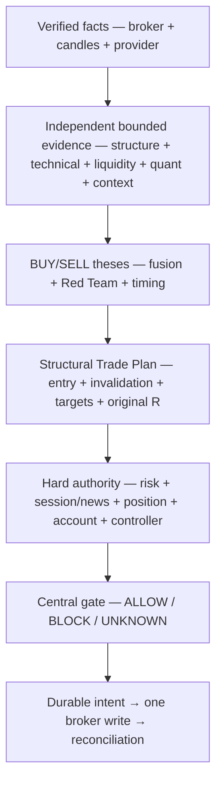

# GoldSwingTraderAI — System Contract

**Status:** PROVISIONAL
**Version:** 0.6-design
**Authority:** Highest-level behavioural contract

## Core contract

GoldSwingTraderAI is an XAUUSD/XAUUSDm trading system built around multi-timeframe structure, parallel specialist analysis, independent BUY/SELL theses, explicit opportunity/timing separation, structural Trade Plans, hard risk/safety authority, centralized broker-write permission and governed research/learning.

If another document conflicts with this contract, the contradiction must be formally resolved; implementation must not silently choose a different rule.

## Contract in one execution path

The contract can be read as one controlled movement from facts to action:



The arrows are not interchangeable. Evidence may be independent; authority
must be ordered. A score cannot create risk permission, a risk result cannot
rewrite structural invalidation, and a broker acknowledgement cannot replace
reconciliation.

## Contract ownership map

| Contract area | Detailed authority | Source owner | Proof family |
|---|---|---|---|
| raw facts and chronology | 10-market-intelligence/MARKET_DATA_AND_HISTORY.md | market_data/mt5_reader.py, snapshot.py | market-data and snapshot tests |
| structure and specialist evidence | 10-market-intelligence documents | intelligence/ | intelligence/technical/liquidity tests |
| family opportunity and fusion | 20-trading-decisions documents | strategies/, decisions/ | strategy/decision tests |
| structural trade geometry | 20-trading-decisions/TRADE_PLAN.md | decisions/trade_plan.py | trade-plan tests |
| monetary risk and risk-day state | 30-risk-execution/RISK_CONTRACT.md | risk/engine.py, risk/state.py | risk/regression tests |
| hard session/news permission | 30-risk-execution/SESSION_AND_RISK_STATE_MACHINE.md | risk/permissions.py | session/news tests |
| broker-write safety | 30-risk-execution/EXECUTION_AND_BROKER_SAFETY.md | execution/ | execution/controller tests |
| restart and current exposure truth | 30-risk-execution/PERSISTENCE_RESTART_AND_RECOVERY.md | persistence/, app/recovery*.py | recovery/checkpoint tests |
| research and promotion | 40-research-learning documents | research/ | replay/validation/promotion tests |
| operator presentation | 50-operator documents | app/dashboard.py, operator/ | dashboard tests |

## Market-analysis contract

- H4, H1, M15 and M5 are primary timeframes.
- Completed candles are authoritative for structural confirmation; unfinished candles may supply telemetry only where explicitly allowed.
- Market analysis runs in parallel rather than as a long sequential filter chain.
- Candle/structure, technical/location, technical confluence, liquidity/SMC, indicator/quant, fundamental/session and strategy specialists publish bounded evidence from the same verified snapshot.
- Technical confluence may include causal trendlines, Fibonacci geometry and broker-local volume-profile/POC context.
- Trendline, Fibonacci and POC are **optional soft confluence** intended to improve directional/setup accuracy. They are not universal entry requirements or hard safety gates.
- Missing optional non-safety evidence is not automatically bearish/zero.
- Strong opposing evidence matters more than missing confluence.
- Optional confluence should be evaluated through replay/ablation for whether it improves accuracy, Net R and capture without unnecessarily reducing valid opportunity recall/trade frequency.

## Decision contract

Maintain at least:

- BUY Thesis;
- SELL Thesis;
- Directional Edge;
- Conflict / Red-Team objection;
- Opportunity Score;
- Entry Timing Score;
- Evidence Coverage / Confidence;
- operator-facing Final Trade Score;
- stable decision/reason trace.

A strong opportunity may remain `ARMED` while entry timing is poor. Timing weakness should normally produce `WAIT`, not destroy the setup.

Every meaningful `WAIT`, `MISSED`, `INVALID` or `BLOCKED` state must expose a machine-readable reason plus concise operator explanation.

## Strategy-floor contract

Initial V1 families:

1. `TREND_PULLBACK_CONTINUATION`
2. `BREAKOUT_EXPANSION`
3. `BREAKOUT_RETEST_CONTINUATION`
4. `LIQUIDITY_SWEEP_REVERSAL`
5. `FAILED_BREAKOUT_REVERSAL`
6. `COMPRESSION_EXPANSION`

FVG, qualified Order Block, premium/discount, liquidity pools, session highs/lows, EMA20/EMA50, RSI, ATR, causal trendlines, Fibonacci geometry, broker-local POC/volume profile and individual candle patterns are primarily evidence primitives, not mandatory independent production strategies.

Trendline/Fibonacci/POC confluence is **bonus/support evidence only in the initial implementation**: supportive presence may increase a family/thesis score within bounded limits; absence must not reduce the base strategy score; disagreement may be recorded as context/conflict but must not automatically become a hard BLOCK.

All strategy families evaluate the same verified market snapshot in parallel. Compatible agreement may add bounded support; correlated evidence must not be counted as independent certainty repeatedly.

## Timing and Trade Plan contract

- M15 primarily identifies opportunity/location/target context.
- M5 primarily identifies executable timing.
- Opportunity/setup state and entry decision are separate.
- Entry outcomes include ENTER BUY, ENTER SELL, WAIT, MISSED, INVALID and BLOCKED.
- Valid second-chance entry requires the thesis to survive and a genuinely fresh structural/timing event.
- Chase detection normally defers entry rather than erasing a valid opportunity.
- Structural invalidation/SL and market objectives are defined before monetary sizing.
- Risk rejects an unaffordable plan rather than distorting structural SL.
- Original approved R remains immutable.

Initial target economics use structural objectives rather than fixed 100/200/300-pip take profits. Primary Target is normally a management checkpoint, Expansion Target is the normal broker objective when valid, and Runner extension must be earned by fresh continuation evidence plus a new objective.

## Risk and safety contract

Risk/safety are not weighted-scoring components. They return hard authority such as PASS/BLOCK/UNKNOWN.

A high strategy score cannot override:

- invalid/stale required market data;
- unacceptable broker/account state;
- daily loss lock/cooldown;
- news/session safety;
- monetary risk/margin;
- position ownership/capacity;
- unresolved broker/order lifecycle;
- critical persistence corruption;
- controller ownership uncertainty;
- unsafe execution conditions.

Initial account profiles and risk boundaries are owned by `../30-risk-execution/RISK_CONTRACT.md`; current V1 uses SMALL for **any positive DayStartEquity below `$300`**, MEDIUM `$300–$999.99`, NORMAL `$1,000+`, one independently risk-bearing Gold position (`0/1`), UTC risk-day accounting, governed manual-reset semantics and broker-aware all-in sizing.

There is no arbitrary `$100` minimum account floor. A positive SMALL account is judged by actual executable minimum-lot risk geometry, hard risk ceiling, margin, daily lock, exposure/capacity and execution safety rather than by an extra balance threshold.

## V1 environment contract

V1 defines one positive environment guard only:

```text
Connected MT5 account positively verified DEMO
→ DEMO_GUARD = PASS
```

Broker writes may proceed only when the DEMO guard and every other required authority pass.

If DEMO status is not verified, broker-write permission is not granted.

V1 does not define a separate REAL authorization workflow, REAL hard-block contract, LIVE override or alternate REAL execution path.

A verified DEMO account is real-time broker execution on that DEMO account, not dry-run simulation.

## Execution contract

The irreversible broker path remains narrow:

```text
validated decision
→ Trade Plan
→ risk/session/news/data/account authorities
→ centralized Execution Permission Gate
→ persist Execution Intent
→ broker pre-check
→ ONE governed irreversible submit
→ classify result
→ verify/reconcile
```

All bot-managed create/modify/close writes use this path. Strategy, research, dashboard and learning code may not call raw irreversible MT5 writes directly.

Ambiguous acknowledgement never triggers blind duplicate submission.

## Single-controller contract

For one managed account/symbol, only one runtime may hold broker-write authority.

V1 uses a shared controller lease with monotonic fencing epoch. Initial renewal target is 10 seconds and lease TTL is 30 seconds. Every irreversible write must freshly verify current holder, unexpired lease and matching current epoch.

A second laptop remains Observer while another valid holder exists. Standby takeover requires authoritative expiry, a new epoch and full broker/local-state reconciliation before becoming PRIMARY READY. A stale old epoch cannot write.

## Session / scheduled-close contract

V1 does not intentionally carry bot-managed Gold through known scheduled XAU closure/reopen gap risk.

```text
Daily:   T-20m no new entry, T-10m mandatory governed flatten
Weekend: T-60m no new entry, T-30m mandatory governed flatten
```

Daily reopen requires normalized conditions plus at least one clean completed M5. Weekend reopen requires gap assessment, normalized conditions and at least two clean completed M5 candles.

If flatten acknowledgement is ambiguous or broker becomes unavailable, unresolved exposure remains durable and must reconcile; it is never marked closed by assumption.

## News-safety contract

Initial V1 new-entry policy:

```text
TIER 1 CRITICAL  -15/+15 min
TIER 2 HIGH      -5/+5 min
TIER 3 CONTEXT   no automatic hard blackout
```

Scheduled news alone does not automatically force-close an existing managed trade. Required event truth failure becomes safety unknown rather than silent clear. Severe post-event dislocation requires normalized execution conditions plus a clean completed M5 before new entry permission resumes.

## Trade-management contract

Open-trade management is a second decision floor. It evaluates continuation and reversal evidence in parallel and returns one of:

- HOLD;
- PROTECT;
- TRAIL;
- RUNNER;
- EXIT.

Trailing should primarily follow proven market structure with volatility-aware buffering. It should not mechanically tighten on every small profit fluctuation. Stops may tighten but must not intentionally widen beyond original approved risk. Original R remains immutable.

Mandatory PRE_CLOSE flatten overrides HOLD/RUNNER continuation logic.

## Persistence / recovery contract

Critical responsibilities survive restart and machine replacement. Durable/portable state includes, as applicable:

- risk/order/trade lifecycle;
- Trade Plan/original R context;
- Opportunity/Market Episode identity;
- controller/reconciliation context as required;
- Strategy Registry and genealogy;
- Champion/Challenger/promotion history;
- entry/exit learning and StrategyMemory;
- research/autonomous candidate history;
- fault/backup/schema metadata.

Broker positions/orders/deals are current exposure truth. Restored/local state supplies intent/context and must reconcile before new broker writes.

The public repository may back up project intelligence. Credentials, tokens, private keys or other authentication material capable of unauthorized financial action, authenticated account control or direct paid-service cost must never be committed.

## Research and learning contract

Research evaluates completed trades, missed opportunities, blocked/rejected opportunities and invalidated setups. Entry/exit learning measures MFE/MAE, entry efficiency, capture efficiency and premature-exit cost.

Governed discovery/autonomous invention may propose bounded declarative candidates but may not directly rewrite production code, hard risk controls, broker permissions or safety gates.

Trendline/Fibonacci/POC evidence may participate in research/discovery only as audited declarative primitives/context. Discovery may later prove a distinct setup family, but initial production must not silently convert them into mandatory filters or a new strategy family without governed evidence/promotion.

No `eval`, `exec`, arbitrary generated executable Python or silent self-modification is part of intended autonomous strategy design.

Promotion is evidence-driven and cannot occur silently.

## System-health contract

Normal trading decisions and technical faults are separate.

- `WAIT`, `ENTRY_EXTENDED`, `NEWS_BLACKOUT`, `SESSION_PRE_CLOSE` or a functioning `LOSS_LOCKED` state are not automatically system errors.
- Data/order/account/state/controller failures expose subsystem, severity, trading impact and recovery/action state.
- No critical unknown silently falls back to a safe-looking default.

## Operator contract

The dashboard remains compact and mostly read-only. It preserves useful prior GoldScalperAI observability and adds separate Decision, Execution, Learning, Backup and System Health state. Presentation never becomes trading authority.

Trendline/Fibonacci/POC may be surfaced compactly when useful, but operator display must make clear that they are confluence/context rather than hard permission gates.

## Development contract

Implementation proceeds in large phases defined by `../CHATGPT_PROJECT_BUILD_AND_RECOVERY_GUIDE.md`.

A phase is complete only when code exists, required tests pass, documentation matches the implementation and no known critical contradiction remains.

No release becomes VERIFIED merely because documentation/code appears complete; controlled DEMO, no-lookahead, duplicate-write, restart/reconciliation, controller/failover and recovery evidence must actually pass.

## Contract reading rule

When a developer changes one rule, they must follow the ownership map rather
than search-and-replace the wording across every file:

1. update the detailed authority;
2. update the owning source module and its focused tests;
3. update the module map and coder navigation if the path changed;
4. update operator/research/release documents that consume the result;
5. run the contradiction/link/test audit before calling the phase complete.
