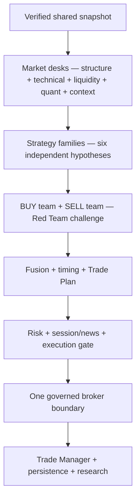

# GoldSwingTraderAI — Trading Floor Architecture

**Status:** PROVISIONAL
**Version:** 0.4-design
**Authority:** Specialist-desk ownership model

## Purpose

GoldSwingTraderAI is designed as a coordinated trading floor rather than one monolithic strategy function. Every desk has a bounded responsibility, structured output and explicit limit on authority.

## Floor wiring

The floor is a directed evidence network. The desks at the top can work from
the same snapshot without waiting for one another; the boards at the bottom
must receive their outputs in a defined order.



The floor uses two different meanings of “parallel”:

- market desks and family evaluators are independent evidence producers;
- BUY and SELL thesis teams are independent opponents using the same evidence;
- fusion, timing, planning, hard permission and execution are ordered boards;
- management is a new decision branch after verified entry, not a second broker
  path.

No desk may obtain permission by accumulating enough soft votes. Permission is
owned by hard-authority modules near the broker boundary.

## Core desks

### Market Data Desk

**Owns:** broker connection/read-only facts, symbol facts, quote freshness, candle retrieval, timeframe synchronization, data quality and broker tradeability facts.

**May:** publish validated immutable market snapshots and data-health state.

**May not:** create BUY/SELL authority, size risk or perform broker writes.

### Candle / Structure Desk

**Owns:** candle anatomy/sequences, swings, protected/external structure, BOS/MSS geometry, displacement, rejection, compression/expansion price-action evidence and exhaustion clues.

Detailed semantics are owned by `../10-market-intelligence/CANDLE_STRUCTURE.md`.

### Technical / Location Desk

**Owns:** generic support/resistance zones, ranges, role flips, location quality, target room and structural conflict zones.

It consumes Candle Structure geometry rather than redefining BOS/MSS.

### Technical Confluence Desk

**Owns:** causal trendline geometry/events, Fibonacci retracement/extension context and broker-local volume-profile/POC context derived from completed-candle/confirmed-swing evidence.

Initial V1 semantics are intentionally non-restrictive:

```text
supportive confluence present → bounded positive score support
confluence missing            → no base-score penalty
opposed/unclear confluence    → context/conflict only, not automatic hard BLOCK
```

Trendline/Fibonacci/POC are not mandatory entry conditions and do not create broker permission. POC is broker-local context; real volume is preferred when available, otherwise tick-volume approximation must be labelled honestly.

### Liquidity / SMC Desk

**Owns:** meaningful liquidity pools, equal highs/lows, internal/external liquidity, sweeps/acceptance/reclaim, FVG context, qualified OB context, premium/discount and liquidity path.

FVG/OB are evidence primitives by default, not automatic strategies or universal entry requirements.

### Indicator / Quant Desk

**Owns:** EMA, RSI, ATR, volatility normalization, momentum/extension state, range statistics and other bounded quantitative context.

It may quantify compression/expansion/exhaustion, but the underlying candle behaviour remains owned by Candle Structure. A separate Expansion view may aggregate Candle + Quant outputs; it should not become a duplicate authority.

**May not:** hard-block a trade merely because one optional indicator is imperfect unless a later frozen contract explicitly grants a safety dependency.

### Fundamental / Macro Desk

**Owns:** soft macro/market opinion and provider-backed scheduled-event facts where reliable information exists.

It publishes two different kinds of information:

1. **Fundamental context opinion** — soft Gold/USD/rates/macro evidence.
2. **Event facts/provider health** — inputs consumed by hard news-safety policy.

It does **not** itself grant final broker-write permission. `../30-risk-execution/SESSION_AND_RISK_STATE_MACHINE.md` owns hard `NEWS_CLEAR / NEWS_BLACKOUT / NEWS_SAFETY_UNKNOWN / POST_NEWS_WARMUP` permission state.

Holiday calendar information is context. Actual broker tradeability/live market facts remain execution authority.

### Session Context Desk

**Owns:** Asia/London/New York participation context, overlaps, session highs/lows and intraday session behaviour as market evidence.

It does not own hard OPEN/CLOSED/REOPEN risk-state semantics.

### Strategy Desks

Initial V1 families:

- Trend Pullback Continuation;
- Breakout Expansion;
- Breakout Retest Continuation;
- Liquidity Sweep Reversal;
- Failed Breakout Reversal;
- Compression Expansion.

All desks evaluate in parallel and may produce BUY, SELL or neutral evidence. One strong coherent family may be sufficient to create an opportunity; every primitive need not align.

Technical Confluence may strengthen a family within a bounded bonus cap, but it is not a seventh mandatory production family. Governed research may later propose a distinct family only if evidence supports it.

### BUY Thesis Team

Builds the strongest coherent bullish case from specialist/family evidence. It does not suppress bearish evidence.

### SELL Thesis Team

Builds the strongest coherent bearish case independently from the same snapshot.

### Debate / Red Team

Challenges the leading thesis with concrete opposing evidence such as poor location/target room, late extension, failed breakout, credible opposite structure or duplicated/correlated support.

It may reduce confidence or recommend WAIT. It may not invent arbitrary blockers.

### Decision Fusion Board

Combines analytical evidence into:

- BUY Thesis;
- SELL Thesis;
- Directional Edge;
- Conflict Score;
- Opportunity Score;
- Entry Timing Score;
- Coverage/Confidence;
- operator-facing Final Trade Score;
- primary/supporting reasons and decision trace.

It does not override hard safety/risk authority.

### Entry Timing Desk

Owns the persistent setup lifecycle and M5 executable moment. It distinguishes ENTER, WAIT, MISSED and INVALID while preserving a valid opportunity when timing is temporarily poor.

### Trade Plan Desk

Owns the pre-risk structural plan:

- approved entry reference;
- structural invalidation/SL;
- volatility-aware stop buffer;
- immediate/primary/expansion/runner objectives;
- target room/RR;
- immutable original R basis.

It does not size volume or call the broker.

### Risk Desk

Owns monetary SL risk, dynamic lot sizing, min-lot affordability, margin policy, aggregate exposure, daily-loss state and risk locks.

Risk approval is binary/hard authority, not a popularity vote.

### Session / News / System Permission Layer

Owns hard permission states derived from broker market state, required event safety, risk state and critical system/data/order truth.

It consumes authoritative subsystem results rather than reimplementing them.

### Central Execution Permission Gate

This is the final auditable broker-write authorization boundary.

It consumes authoritative environment/account/data/news/risk/position/order/controller/fresh-execution results and returns conceptually:

```text
ALLOW / BLOCK / UNKNOWN
primary reason
secondary reasons
```

V1 defines only a **positive DEMO guard**. Verified connected DEMO is required for broker-write permission. V1 intentionally does not define a separate REAL authorization workflow or REAL hard-block contract.

### Execution Desk

Receives only approved broker-write intents. It owns fresh executable price/spec checks, durable pre-submit intent requirement, broker pre-check, one governed irreversible request and reconciliation.

Create/modify/close actions all use the governed execution path. Ambiguous acknowledgements are never blind-retried.

### Trade Management Desk

Runs after entry. It evaluates continuation versus reversal and returns HOLD, PROTECT, TRAIL, RUNNER or EXIT within hard execution/risk constraints.

Its proposed modify/close actions still pass through the central broker-write permission/execution boundary.

### Persistence / Recovery Service

Owns durable order/trade/risk lifecycle, Strategy Registry storage, learning/research/promotion state persistence, schema integrity, restart recovery, backup/restore and laptop migration mechanics.

Initial V1 local persistence uses lightweight standard-library SQLite with typed adapters/checksums/schema versions. It stores state; it does not redefine strategy/risk semantics.

### Quant Research / Strategy Discovery Lab

Analyses completed trades plus missed, rejected/blocked and invalidated opportunities. It owns StrategyMemory, entry/exit learning, validation, strategy discovery, declarative invention and candidate evidence.

It may propose bounded candidates but may not directly deploy broker authority, mutate hard risk or access raw broker writes.

Discovery has a liveness obligation: eligible recurring evidence must create a candidate or an explicit governed suppression reason. Silent inert discovery is a defect.

Trendline/Fibonacci/POC may be audited discovery primitives/context so research can test whether they improve quality or form a distinct setup, but discovery cannot silently make them mandatory production filters.

### System Health / Diagnostics

Aggregates subsystem health, primary/secondary faults, trading impact and recovery state. It must distinguish normal market/risk decisions from actual system faults.

### Operator / Dashboard

Displays market/decision/setup/trade/risk/execution/learning/backup/health state using stable reason codes and concise explanations. It is presentation only.

Optional confluence such as Trendline/Fibonacci/POC and Discovery Health may be shown compactly when available, without becoming authority.

## Standard analytical output

Where applicable, analytical desks should produce structured output similar to:

```text
BUY evidence
SELL evidence
confidence
coverage/state
primary reasons
conflicting reasons
freshness
source IDs/episode references where relevant
```

Hard-authority desks additionally return explicit PASS/BLOCK/UNKNOWN (or equivalent state) with stable reason codes.

## Source and test navigation

| Floor responsibility | Source owner | Behavioural authority | Main proof |
|---|---|---|---|
| Market Data Desk | market_data/mt5_reader.py, snapshot.py | 10-market-intelligence/MARKET_DATA_AND_HISTORY.md | tests/test_market_data.py |
| Structure/technical/liquidity/quant desks | intelligence/candle_structure.py, technical.py, liquidity.py, indicators.py | corresponding 10-market-intelligence documents | tests/test_intelligence_core.py, tests/test_technical_liquidity.py |
| Confluence desk | intelligence/confluence.py | TECHNICAL_STRUCTURE_AND_LEVELS.md | tests/test_technical_confluence.py |
| News/session facts | intelligence/news.py, app/session_news.py | FUNDAMENTAL_AND_NEWS.md and SESSION_NEWS_PROVIDER_CONTRACT.md | tests/test_session_news_provider.py |
| Strategy families | strategies/floor.py, strategies/confluence.py | 20-trading-decisions/STRATEGY_FLOOR.md | tests/test_strategy_decisions.py |
| Fusion/timing/Trade Plan | decisions/fusion.py, timing.py, trade_plan.py | SCORING_AND_DECISION_FUSION.md, ENTRY_TIMING.md, TRADE_PLAN.md | tests/test_strategy_decisions.py, tests/test_trade_plan_risk.py |
| Risk and permission | risk/engine.py, state.py, permissions.py | 30-risk-execution documents | tests/test_trade_plan_risk.py, tests/test_session_news_permissions.py |
| Execution | execution/gate.py, service.py, mt5_writer.py, reconcile.py | EXECUTION_AND_BROKER_SAFETY.md | tests/test_execution_safety.py |
| Management | management/manager.py, execution.py | TRADE_MANAGER_AND_EXIT.md | tests/test_trade_manager.py, tests/test_management_execution.py |
| Persistence/recovery | persistence/, app/recovery*.py, app/startup.py | PERSISTENCE_RESTART_AND_RECOVERY.md | tests/test_persistence_recovery.py, tests/test_startup_recovery.py |
| Research/learning | research/ | 40-research-learning documents | tests/test_research_*.py, tests/test_promotion_governance.py |

This map is navigation, not a second rule set. If ownership changes, update
the detailed authority, module map and coder guide together.

## Dependency rule

The trading floor is intentionally asymmetric near the broker boundary:

```text
many analytical producers
        ↓
central decisions/plan/risk
        ↓
ONE final execution permission boundary
        ↓
ONE governed broker-write path
```

No strategy, dashboard, research or learning desk may bypass that final boundary.

## Verification boundary

The floor contract is checked through shared-snapshot intelligence tests,
strategy/fusion tests, Trade Plan/Risk tests and execution-gate tests. The
primary source/test map is the table above and the detailed feature map in
`docs/CODER_GUIDE.md`; connected broker evidence remains a release-audit
responsibility.
