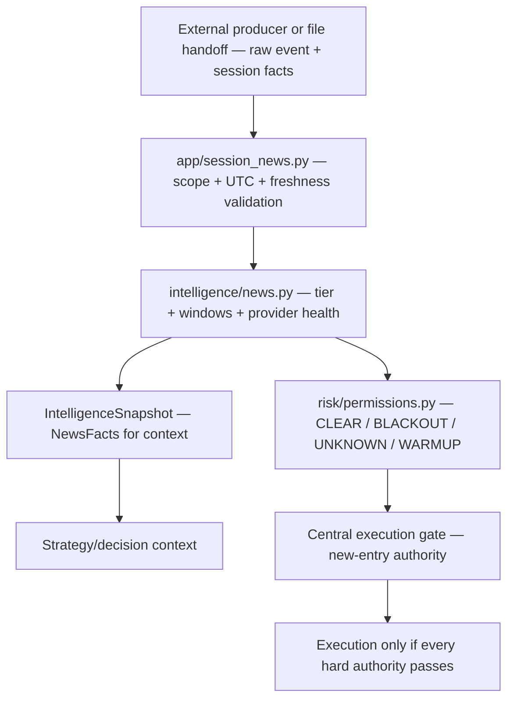

# GoldSwingTraderAI — Fundamental and News Intelligence

**Status:** PROVISIONAL — EVENT AND NEWS FACT CONTRACT
**Version:** 0.5-implementation
**Authority:** Macro/fundamental Gold context, scheduled-event facts, provider freshness and holiday context.
**Depends on:** `MARKET_DATA_AND_HISTORY.md`, `../00-foundation/SYSTEM_CONTRACT.md`

## Purpose

This document defines market-intelligence facts/opinions related to Gold fundamentals and scheduled news. It intentionally separates **macro opinion** from **hard trading permission**.

> **Macro/fundamental opinion is soft evidence. Event-risk permission is enforced by the risk/session safety layer.**

## Facts-to-permission pipeline

News has two deliberately separate products: factual context for intelligence
and a hard permission result for risk/session safety. Keeping the arrows
separate prevents a calendar provider from becoming a hidden execution owner.



| Information | Owner | Can affect | Cannot affect |
|---|---|---|---|
| macro opinion | intelligence/news and future accepted macro adapters | soft BUY/SELL context and reasons | hard permission or direct writes |
| scheduled event facts | intelligence/news | tier/window context and hard-permission input | strategy direction by itself |
| provider health/freshness | handoff + normalizer | NEWS_SAFETY_UNKNOWN when required truth is unsafe | silent NEWS_CLEAR |
| news permission | risk/permissions | new-entry gate and post-news warmup | automatic close of an open trade solely because news is scheduled |

## Implementation ownership and proof boundary

Provider-neutral scheduled-event normalization is implemented in:

```text
src/goldswingtraderai/intelligence/news.py
```

Hard news permission is implemented separately in:

```text
src/goldswingtraderai/risk/permissions.py
```

A provider-neutral live handoff adapter is implemented in `app/session_news.py` and is wired from the launcher through `GSTAI_SESSION_NEWS_FILE`. It validates account/server/symbol scope, UTC timestamps, freshness and event payloads before reusing the existing normalizer and permission owners. A production external calendar provider/credential adapter is **not selected here**; the handoff therefore does not pretend that a live commercial feed is already available. See [`SESSION_NEWS_PROVIDER_CONTRACT.md`](../30-risk-execution/SESSION_NEWS_PROVIDER_CONTRACT.md).

Implemented normalized outputs include:

- provider health/freshness: `VERIFIED/DEGRADED/STALE/UNAVAILABLE/UNKNOWN`;
- provider event ID/title/currency/scheduled UTC time;
- internal TIER 1/2/3 classification;
- factual pre/post window bounds;
- merging of overlapping/linked non-Tier-3 windows;
- explicit `required_event_truth_available` rather than silent `no news`.

`intelligence/snapshot.py` may attach `NewsFacts` to the shared `IntelligenceSnapshot`. The intelligence desk itself never grants broker-write permission.

## Fundamental context

Potential provider-backed soft inputs include:

- USD/DXY behaviour;
- US Treasury yields;
- rate expectations;
- Fed policy context;
- inflation/labour context;
- risk sentiment;
- geopolitical stress where reliable sourcing exists.

These macro-opinion feeds are not required for the current deterministic baseline. Price/structure remains primary trading evidence.

## Scheduled-event facts

Normalized facts may represent FOMC/rate decisions, Fed Chair communications, CPI/Core CPI, NFP, PCE/Core PCE, PPI, Retail Sales, GDP, ISM, JOLTS/ADP/jobless claims and other accepted USD events.

This document publishes event facts/classification. `../30-risk-execution/SESSION_AND_RISK_STATE_MACHINE.md` owns final hard permission state.

## Initial V1 event tiers

### TIER 1 — Critical Gold/USD shock events

Baseline mapping includes FOMC/rate decisions, Fed Chair press conference, CPI, NFP and Core PCE/PCE high-impact concepts.

```text
15 minutes before
through
15 minutes after
```

Linked/overlapping critical windows merge so a known event cluster does not falsely reopen between adjacent critical events.

### TIER 2 — High-impact USD events

Baseline concepts include PPI, Retail Sales, GDP, ISM, JOLTS, ADP and jobless/unemployment claims. Other USD events explicitly marked high/critical by an accepted provider fall into Tier 2 unless a Tier-1 mapping applies.

```text
5 minutes before
through
5 minutes after
```

### TIER 3 — Contextual / ordinary events

Tier 3 records context but carries no automatic hard blackout in V1.

Provider-specific mapping tables may later supersede the baseline keyword mapper, but mappings must remain versioned/auditable.

## Hard news-safety handoff

`risk/permissions.py` consumes normalized facts and derives:

```text
NEWS_CLEAR
NEWS_BLACKOUT
NEWS_SAFETY_UNKNOWN
POST_NEWS_WARMUP
```

Current frozen behaviour:

- Tier 1 and Tier 2 windows block new entries;
- Tier 3 does not automatically block;
- missing/stale required event truth becomes `NEWS_SAFETY_UNKNOWN`;
- severe post-event dislocation requires normalized execution conditions plus at least one clean completed M5;
- scheduled news alone does **not** force-close an already-open managed trade.

This separation keeps calendar facts and hard permission auditable instead of letting a provider adapter place trades or invent policy.

## Provider health and fallback

Fact health states:

```text
VERIFIED
DEGRADED
STALE
UNAVAILABLE
UNKNOWN
```

Current baseline default freshness TTL is 30 minutes when no provider-specific TTL is supplied. That is an implementation default, not frozen provider policy.

Required event truth is usable only under accepted current health. Missing fetch time, stale/unavailable/unknown provider state never becomes silent `NEWS_CLEAR`.

Production integration should use an accepted primary source and, where practical, an accepted fallback source. Exact provider/fallback mapping remains an implementation choice/open integration item.

## Open trades during scheduled news

A scheduled news blackout blocks **new entries** under the hard permission layer. It does not automatically force-close an existing bot-managed position. Open trades remain under Trade Manager + execution safety.

## Fundamental evidence

Future soft outputs may include Fundamental BUY/SELL support, USD context, yield/rates context, Fed/inflation context, risk sentiment, freshness/confidence and counter-evidence.

Fundamental opinion cannot force a trade against clearly contrary price structure and cannot become broker authority.

## Holiday context

Holiday calendars provide participation/liquidity context. A holiday does **not** automatically mean XAU is closed. Actual broker tradeability/live market facts own market-open authority.

## Unscheduled shocks

The system cannot guarantee advance knowledge of every breaking event. Gaps, spread explosions, extreme velocity and feed dislocation are handled by market-data/volatility/execution safety even without a scheduled-event record.

## Replay requirements

Historical event research must preserve what was knowable at decision time. Revised future macro data may not leak backward into prior decisions.

Replay should preserve event tier/window mapping version and provider-health assumptions used at the simulated time.

## Dashboard visibility

Compact example:

```text
Macro Bias       UNKNOWN / MILD BUY
Next Event       CPI • TIER 1
Event In         00:42:15
News Facts       VERIFIED
News Permission  NEWS_CLEAR / BLACKOUT / UNKNOWN / WARMUP
```

Hard permission shown on the dashboard must come from the risk/session authority, not be recreated here.

## Tests and evidence boundary

Deterministic coverage includes:

- event identity/time normalization;
- provider freshness/stale handling;
- Tier 1 mapping and `-15/+15` windows;
- linked critical-event cluster handling;
- Tier 2 mapping and `-5/+5` windows;
- Tier 3 no automatic hard blackout;
- no silent `no news` fallback;
- hard permission composition in `risk/permissions.py`;
- severe post-news one-clean-M5 behaviour.

Deterministic coverage now also includes the provider-neutral file handoff, scope
rejection, stale/future timestamps and fail-closed launcher boundary. Production
provider/fallback and live DEMO event timing remain pending integration evidence.

## Explicit non-goals

This desk must not:

- place orders;
- hard-block entries by itself;
- override price/structure with macro opinion;
- claim perfect breaking-news awareness;
- treat provider failure as neutral/clear;
- automatically close a managed position solely because scheduled news approaches.

## Open questions

- final production data provider(s) and credential/configuration method;
- provider-specific mapping table/freshness TTL;
- primary/fallback reconciliation rules;
- macro-opinion data sources;
- future evidence-based changes to tier membership/windows;
- detailed treatment of unusual long-duration speeches/unscheduled events.
