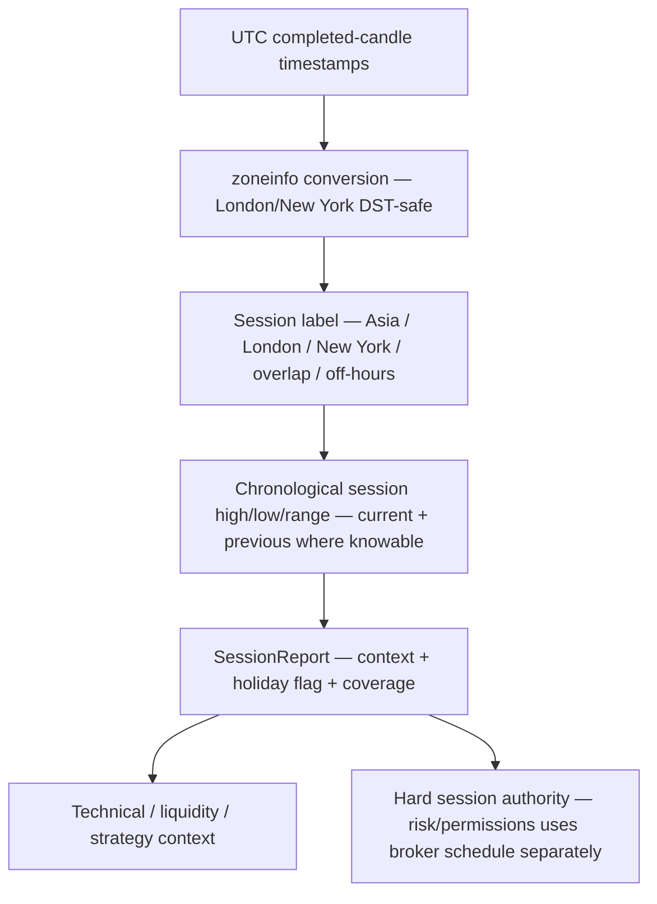

# GoldSwingTraderAI — Session Context

**Status:** PROVISIONAL
**Version:** 0.3-implementation-baseline
**Authority:** Asia/London/New York session context as soft market evidence.
**Depends on:** `MARKET_DATA_AND_HISTORY.md`, `TECHNICAL_STRUCTURE_AND_LEVELS.md`, `FUNDAMENTAL_AND_NEWS.md`

## Purpose

This document defines session context as market evidence. It does **not** own hard OPEN/CLOSED/PRE_CLOSE/LOSS_LOCKED permission; those states belong to `../30-risk-execution/SESSION_AND_RISK_STATE_MACHINE.md`.

## Session-context flow

Session context is a timezone-safe description of participation and range
behaviour. It is not the broker schedule and cannot grant permission.



The key distinction is:

| Fact | Owned here? | Meaning |
|---|---:|---|
| session label and overlap | yes | descriptive market context |
| session high/low/range | yes | chronological location/liquidity context |
| holiday context | yes | participation context |
| broker open/closed/PRE_CLOSE | no | hard schedule/permission authority |
| daily loss/cooldown | no | risk state authority |

## Session model

## Source ownership and tests

`intelligence/session.py` owns timezone conversion, session labels and
chronological session ranges; `intelligence/snapshot.py` attaches the result to
the shared intelligence snapshot. `tests/test_intelligence_snapshot.py`
proves DST-aware classification and shared-snapshot integration. Hard broker
schedule permission remains in `risk/permissions.py` and its permission suite.

The market-intelligence layer classifies:

```text
ASIA
LONDON
NEW_YORK
LONDON_NY_OVERLAP
OFF_HOURS
```

Session assignment must be timezone safe. London and New York use timezone-aware local conversion so daylight-saving changes do not require hard-coded UTC rewrites.

## Initial implementation baseline

Phase 3 implements this authority in:

```text
src/goldswingtraderai/intelligence/session.py
```

Initial research/calibration defaults are:

```text
ASIA        00:00–08:00 UTC
LONDON      08:00–16:00 Europe/London local time
NEW_YORK    08:00–17:00 America/New_York local time
```

If London and New York are simultaneously active, context becomes `LONDON_NY_OVERLAP`.

These are **implementation baselines**, not frozen hard-trading windows. They may be calibrated through replay/research without turning session context into a universal trade gate.

The implementation uses Python standard-library `zoneinfo`; tests prove a UTC timestamp can classify differently across summer/winter because of real DST conversion.

## Session facts

The desk publishes:

- current session/context;
- current session high/low/range where completed M5 evidence exists;
- most recent previous session high/low where available;
- overlap state;
- holiday-context flag;
- evidence coverage.

Session highs/lows may be consumed by Technical and Liquidity desks without redefining their semantics here.

## Soft evidence only

A session is not automatically good or bad for a trade. For example:

- Asia may provide compression/range structure;
- London may create expansion/sweeps;
- New York may continue, reverse or invalidate prior structure.

Historical family performance by session may become bounded learning evidence after validation, but it must not silently become a universal session hard block.

## Holiday interaction

Holiday context may reduce expected participation or change range behaviour, but market closure is determined by broker/live market state. Holiday context in `session.py` is descriptive only.

## Session transitions

Transition periods may increase spread/uncertainty or change liquidity behaviour. These are descriptive facts for scoring/timing. Any actual execution block is owned by hard safety/execution policy.

## Runtime integration

`intelligence/snapshot.py` derives the Session report from the completed M5 series in the current `MarketSnapshot` and includes it in the reusable `IntelligenceSnapshot`.

The Session desk does not query MT5 independently.

## Outputs

At minimum:

- current session/context;
- current/previous session high and low;
- current session range;
- session overlap state;
- holiday context;
- confidence/coverage.

## Replay requirements

Session assignment must be deterministic from historical UTC timestamp + timezone rules. Replay and live use the same `zoneinfo` conversion path.

## Dashboard visibility

Compact example:

```text
Session       LONDON → NY
Asia Range    COMPLETE
London Range  EXPANDING
Context       ACTIVE
```

## Tests required and evidence boundary

Required:
- timezone/DST conversion;
- session-high/low chronology;
- overlap classification;
- holiday does not equal closure;
- replay/live session parity.

Phase-3 deterministic coverage includes DST-aware classification and unified-snapshot integration in `tests/test_intelligence_snapshot.py`. Broader replay/live parity remains a later verification requirement.

## Explicit non-goals

This desk must not:

- own broker market-open state;
- own PRE_CLOSE or reopen safety;
- own daily-loss reset;
- block every trade in a historically weaker session;
- redefine liquidity sweeps or technical zones.

## Open calibration questions

- whether the initial session-hour baselines should be adjusted by replay/research;
- whether more granular transition labels improve strategy performance;
- whether any session transition deserves a validated hard execution restriction later.
