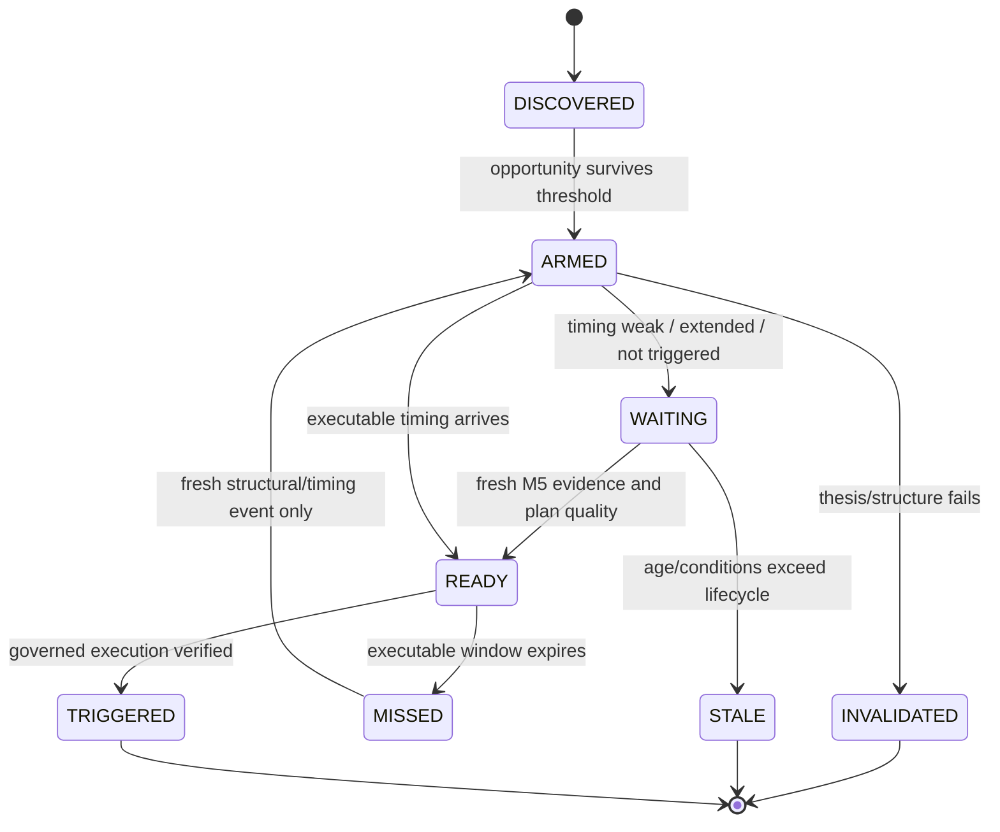

# GoldSwingTraderAI — Entry Timing

**Status:** PROVISIONAL — ENTRY-TIMING CONTRACT
**Version:** 0.4-implementation
**Authority:** Pre-entry timing behaviour and Opportunity timing lifecycle

## Purpose

This document defines how a valid directional opportunity becomes a timely
entry candidate without destroying the underlying thesis when the present M5
location is late, extended or unconfirmed. It also defines persistence,
re-arm and replay boundaries.

## Core rule

A good market opportunity and a good executable entry are different things. GoldSwingTraderAI preserves a valid setup while waiting for a better M5 entry instead of deleting it merely because the current candle is late, extended or poorly located.

```text
M15 → opportunity / location / target context
M5  → executable timing / fine structure
```

## Opportunity-to-entry state machine

Timing answers whether an existing idea should be acted on now. It never
rebuilds the thesis merely because a candle is late.



The lifecycle is separate from hard permission. READY means analytically
executable; it does not mean the risk, session/news, controller and broker
checks have passed.

| State/action | What it preserves | What it must not do |
|---|---|---|
| DISCOVERED | first valid episode evidence | send an order |
| ARMED | opportunity identity and thesis | assume immediate entry |
| WAITING | valid thesis while timing improves | delete the setup because one candle is poor |
| READY | current analytical trigger | bypass Trade Plan or hard gate |
| MISSED | evidence that the window passed | blind re-entry |
| INVALIDATED | audit trail of why thesis failed | call the failure a temporary wait |
| TRIGGERED | link to verified execution outcome | claim success before reconciliation |

## Implementation ownership and proof boundary

Implemented in:

```text
src/goldswingtraderai/decisions/opportunity.py
src/goldswingtraderai/decisions/timing.py
src/goldswingtraderai/decisions/snapshot.py
src/goldswingtraderai/persistence/runtime_state.py
```

The analytical timing path is read-only and does not size risk or call MT5. Opportunity identity can survive restart through the persistence layer, while broker execution remains owned by the centralized execution path.

### Opportunity lifecycle

`Opportunity` preserves:

- `opportunity_id`;
- `episode_id`;
- BUY/SELL direction;
- lifecycle stage;
- created/updated UTC timestamps;
- Opportunity/Thesis score;
- source strategy families.

A surviving same-direction thesis preserves its identity across decision cycles and persisted recovery.

Implemented lifecycle includes:

```text
DISCOVERED
→ ARMED
→ WAITING / READY
→ TRIGGERED when a governed execution succeeds

MISSED → RE_ARMED only with a genuinely fresh structural/timing event
STALE / INVALIDATED are terminal for that Opportunity instance
```

Blind re-entry into an unchanged missed setup is explicitly rejected.

## Entry Timing inputs

Current M5 timing baseline consumes bounded evidence from:

- M5 structure;
- M5 candle sequence;
- M5 momentum phase;
- M5 location;
- M5 liquidity evidence;
- M15 remaining target room.

Optional Trendline/Fibonacci/POC support enters upstream as bounded positive-only strategy confluence; Entry Timing does not require any of those tools to exist.

No single soft confirmation primitive is mandatory for every family. Current score weights and thresholds remain replay-calibratable implementation baselines.

## Timing outcomes

This analytical layer owns:

```text
ENTER_BUY
ENTER_SELL
WAIT
MISSED
INVALID
```

`BLOCKED` is not invented by Entry Timing. It is supplied downstream by Risk, Session/News and the centralized Execution Permission Gate.

### WAIT

The thesis/opportunity survives but current entry efficiency is not good enough. Opportunity identity is preserved.

### MISSED

The setup was valid/armed but the executable window passed. The current baseline may classify a long-lived severely extended setup as MISSED rather than chase it forever.

### INVALID

The underlying direction/thesis no longer survives. This is different from temporary timing weakness.

### ENTER

The Opportunity is sufficiently developed and current M5 timing reaches the configured analytical entry threshold. This means **analytically ready**, not permission to place an order.

The implemented downstream path still requires:

```text
TradePlan
→ Risk
→ Session/News
→ account/data/position/controller checks
→ Execution Permission Gate
→ governed one-shot execution
```

## Chase protection

The baseline treats `SEVERELY_EXTENDED` M5 state as WAIT while the setup remains recoverable. After a configurable age window, a still-severely-extended armed setup may become MISSED.

Trade Plan and execution add further current-entry deterioration checks such as target room, structural RR and executable price drift. EMA distance alone is not final chase authority.

## Momentum phases

Timing consumes the Quant desk's typed phases:

```text
BUILDING
EXPANDING
MATURE
EXHAUSTING
REVERSING
UNKNOWN
```

Strong momentum can still be poor timing if price is overextended.

## Strategy-aware timing

The Strategy Floor publishes a preferred timing profile per family, including pullback/reclaim, break acceptance, retest continuation, sweep reclaim, failed-acceptance reversal and compression release.

The current generic timing board uses shared M5 facts. Replay/research may justify bounded family-specific timing refinements without creating six duplicated timing engines.

## Second-chance entry

A MISSED Opportunity may be re-armed only when:

- original thesis remains relevant;
- current Trade Plan/risk geometry remains valid;
- a genuinely fresh structural/timing event is explicitly proven.

`rearm_missed_opportunity(..., fresh_structural_event=False)` rejects the re-arm.

Risk additionally enforces the frozen same-Market-Episode re-entry limit.

## Runtime path

```text
IntelligenceSnapshot
→ StrategyFloorReport
→ DecisionBoard
→ update/create Opportunity
→ evaluate M5 Entry Timing
→ DecisionSnapshot
```

Risk sizing and broker execution are deliberately outside this analytical path.

## Persistence/restart

`RuntimeStateRepository` persists the active Opportunity and validates Opportunity/Market-Episode/TradePlan lineage during recovery. A restored Opportunity is context, not automatic permission: fresh market intelligence and timing must revalidate it after downtime.

## Research requirements and implementation boundary

Phase-10 research infrastructure distinguishes taken/waited/missed/invalidated/blocked outcomes and keeps actual P/L separate from counterfactual missed-move outcomes. This allows research to test whether timing avoids bad entries or merely misses large Gold moves.

Replay remains chronological and bar-close realistic unless a future intrabar dataset explicitly supports more detailed parity.

## Tests and evidence boundary

Deterministic tests prove:

- severe extension becomes WAIT rather than deleting a valid Opportunity;
- Opportunity/Episode IDs survive WAIT and MISSED transitions;
- surviving repeated thesis keeps the same IDs;
- MISSED cannot blindly re-arm without a fresh-event assertion;
- Opportunity state survives persistence/recovery with lineage validation;
- DecisionSnapshot remains read-only with no broker-write boundary;
- research outcome attribution distinguishes missed versus blocked versus taken paths.

## Open calibration questions

- ENTER threshold;
- Opportunity arm/maintain thresholds;
- exact late-entry/MISSED age rule;
- family-specific timing adjustments;
- richer structural chase/entry-efficiency metrics;
- exact fresh-event definition for production re-arm.
