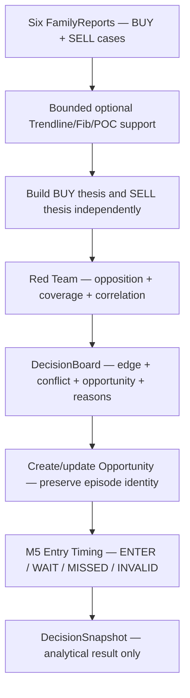

# GoldSwingTraderAI — Scoring and Decision Fusion

**Status:** PROVISIONAL — DECISION-FUSION CONTRACT
**Version:** 0.4-implementation
**Authority:** Analytical scoring, independent BUY/SELL thesis fusion, conflict handling and Red-Team attribution.
**Depends on:** `STRATEGY_FLOOR.md`, `ENTRY_TIMING.md`, `TRADE_PLAN.md`, `../00-foundation/SYSTEM_CONTRACT.md`

## Core principle

Specialist/strategy desks operate in parallel. Final analytical quality is not a simple average and no single soft-evidence desk automatically kills a valid opportunity.

> **BUY and SELL are separate theses. Strong opposition means conflict, not hidden confidence. Hard safety/risk stays outside weighted scoring.**

## Fusion pipeline

Fusion is the analytical board between independent hypotheses and the timing/
Trade Plan path. It preserves provenance instead of reducing the whole floor to
one opaque number.



The board does not convert a hard block into a low score. The downstream
runtime carries the analytical result beside explicit risk/session/news/
execution authority, so research can distinguish “the idea was weak” from
“the idea was acceptable but safety prevented the write.”

| Result | Meaning | Next owner |
|---|---|---|
| BUY/SELL thesis | directional analytical case with reasons | fusion/timing |
| conflict | opposing thesis remains strong | Red Team and operator |
| coverage | how much expected evidence was available | confidence/research |
| opportunity | idea worth maintaining through timing | opportunity lifecycle |
| timing action | current entry quality | Trade Plan if ENTER; persistence if WAIT/MISSED |
| hard BLOCK | independent safety result | risk/session/execution gate |

## Implementation ownership and proof boundary

Implemented owners:

```text
src/goldswingtraderai/strategies/floor.py
src/goldswingtraderai/strategies/confluence.py
src/goldswingtraderai/decisions/fusion.py
src/goldswingtraderai/decisions/snapshot.py
src/goldswingtraderai/decisions/opportunity.py
src/goldswingtraderai/decisions/timing.py
```

Current analytical path:

```text
IntelligenceSnapshot
→ six-family base StrategyFloorReport
→ bounded positive-only optional Trendline/Fib/POC support
→ BUY/SELL DecisionBoard fusion
→ Opportunity lifecycle
→ M5 Entry Timing where applicable
→ DecisionSnapshot
```

This analytical pipeline has no monetary-risk or broker-write authority. Later runtime composition consumes its result together with the already-implemented Risk, Session/News and Execution authorities.

## Independent BUY and SELL theses

Each thesis is built from the same six family reports. Baseline ranks family cases and combines the strongest three with bounded weights rather than summing all six.

Initial baseline:

```text
primary family     65%
secondary family   25%
tertiary family    10%
```

If leading same-direction families are strong, a small bounded synergy may be added. If evidence substantially overlaps, synergy is reduced to avoid pretending correlated facts are independent proof.

Weights/thresholds remain replay-calibratable implementation defaults, not frozen market truth.

## Optional technical confluence

Trendline/Fibonacci/POC support is applied **before thesis fusion** as a small capped positive-only uplift to compatible family cases.

Hard initial invariants:

```text
supportive confluence  → may increase family score within cap
missing confluence     → base family score unchanged
opposed/unclear        → no automatic score subtraction/hard BLOCK from this layer
POC alone              → cannot manufacture directional authority
```

This layer exists to improve accuracy, not to require a 3/3 checklist. Research must ablate it against Opportunity Recall, missed meaningful moves and trade frequency as well as Net R/drawdown/win rate.

## Conflict

`conflict_score` preserves strength of the opposing thesis. A high BUY and high SELL case remains visibly conflicted.

The baseline applies only modest bounded analytical penalty when both sides are strong; conflict is not a universal hard blocker.

```text
BUY 88 / SELL 25 → clear BUY edge
BUY 88 / SELL 84 → high conflict despite BUY leading
```

## Opportunity Score versus Entry Timing

Opportunity asks:

> Is this market idea worth pursuing?

Entry Timing asks separately:

> Is the current M5 moment efficient enough to enter?

A strong Opportunity cannot convert a severely extended entry into ENTER. The setup normally remains alive as WAIT when timing is temporarily poor.

## Evidence coverage and UNKNOWN

Coverage tracks how much expected analytical evidence was actually available. Optional missing inputs are omitted/reweighted rather than automatically scoring zero.

Required hard truth such as event safety, account/order integrity, financial risk and controller ownership is not represented as weighted market evidence.

## Red Team

Current analytical objections include examples such as:

```text
STRONG_OPPOSING_THESIS
LOW_EVIDENCE_COVERAGE
LEADING_FAMILY_CONFLICTS
ENTRY_EXTENDED
CORRELATED_FAMILY_SUPPORT
NO_DIRECTIONAL_EDGE
```

These may reduce confidence or explain WAIT, but they do not impersonate Risk/Execution hard blockers.

## Score bands

Conceptual human interpretation:

```text
0–49   weak/no edge
50–64  developing/watch
65–74  valid/armable
75–84  strong
85–100 exceptional
```

These are not automatic broker-entry rules. Exact thresholds remain configurable/research-calibratable.

## Final action architecture

Whole-system outcomes distinguish:

```text
ENTER BUY
ENTER SELL
WAIT
MISSED
INVALID
BLOCKED
```

Analytical Decision/Timing owns ENTER/WAIT/MISSED/INVALID semantics. `BLOCKED` is supplied by independent hard Risk/Session/News/Data/Execution authorities during runtime composition.

That separation is now implemented in the owning subsystems even though final persistent launcher orchestration remains pending.

## Would Otherwise Trade / hard blocker attribution

The central runtime/dashboard should preserve both:

- analytical `DecisionSnapshot`;
- hard authority result and blocker reason(s);
- `Would Otherwise Trade` where meaningful.

A risk/news/execution block must not erase the original analytical thesis, because research needs to distinguish strategy misses from safety/system decisions.

## Persistence / research

Stable Opportunity/Market Episode identity already exists and Phase-6+ persistence can preserve lifecycle state. Research episode/candidate machinery now consumes outcome/evidence attribution durably.

Decision/family scores and optional confluence labels should be journaled by final orchestration so replay/ablation can attribute whether Trendline/Fib/POC actually helped.

## Dashboard visibility

Dashboard should show at least:

```text
BUY Thesis
SELL Thesis
Directional Edge
Conflict
Opportunity
Entry Timing
Coverage / Confidence
Leading Family
Red-Team objection
Final analytical action
Hard Permission / blocker separately
```

Optional confluence may be shown as context, not permission.

## Tests and evidence boundary

Current deterministic suites prove, among other things:

- six families evaluate in parallel;
- independent strong BUY/SELL conflict remains visible;
- bounded family fusion does not erase opposition;
- missing optional evidence is not zeroed;
- surviving Opportunity identity remains stable;
- severe extension normally WAITs rather than invalidating thesis;
- missing Trendline/Fib/POC leaves base score unchanged;
- supportive Trendline/Fib/POC bonus is capped/positive-only;
- strategy/decision code has no raw broker-write boundary.

Broader replay calibration/ablation remains Phase-10 evidence work.

## Explicit non-goals

Decision Fusion must not:

- let score override hard risk/news/broker/data authority;
- convert missing optional primitives into bearish/zero evidence;
- require Trendline/Fib/POC confluence;
- invent hard blockers;
- hide strong opposing evidence;
- treat counterfactual blocked trades as executed P/L;
- query MT5 directly.

## Open calibration questions

- family fusion weights;
- maximum synergy bonus;
- conflict penalty surface;
- Red-Team thresholds;
- minimum evidence coverage;
- Opportunity thresholds;
- bounded technical-confluence bonus calibration;
- final operator-facing aggregate score presentation.
