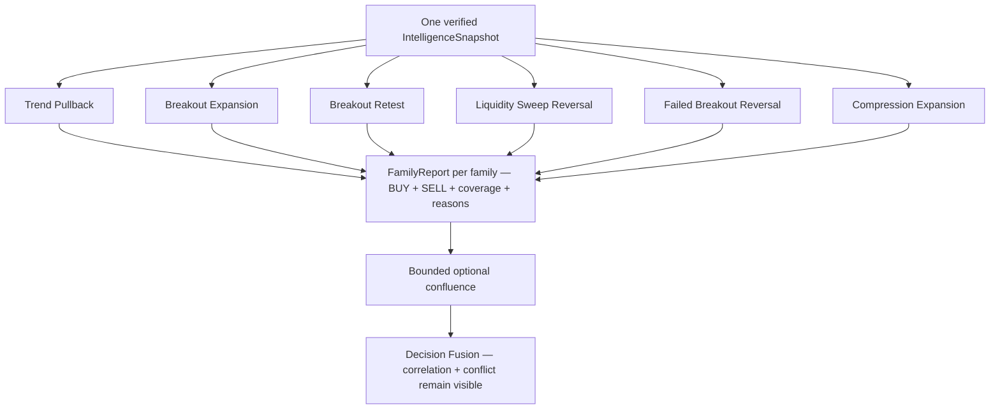

# GoldSwingTraderAI — Strategy Floor

**Status:** PROVISIONAL
**Version:** 0.4-implementation-baseline
**Authority:** Production strategy-family architecture

## Core principle

Strategy families run in parallel against the same verified `IntelligenceSnapshot`. No family waits for another family to fail. Each family is an independent market hypothesis built from shared audited primitives.

> **Parallel hypotheses, bounded evidence, no sequential filter soup.**

> **Trendline, Fibonacci and POC are optional accuracy/confluence inputs. They can strengthen an existing hypothesis but are not mandatory conditions and do not become hidden trade blockers.**

## Six-family parallel map

Every family receives the same IntelligenceSnapshot. The family outputs are
kept separate until fusion so a single label cannot hide which hypothesis
actually carried the opportunity.



The diagram describes logical parallelism. A single-threaded evaluation order
is acceptable if it uses the same immutable snapshot and produces stable
results. A family may be neutral; it does not have to manufacture a score.

| Family | Market question | Distinctive evidence | Does not require |
|---|---|---|---|
| trend pullback | is an established directional move resuming from useful location? | HTF context, pullback, M5 resumption, room | FVG/OB/Fib/trendline |
| breakout expansion | is accepted break releasing directional expansion? | qualified/confirmed break, acceptance, momentum, path | perfect retest |
| breakout retest | did a meaningful break hold on a retest? | break, location, M5 rejection/continuation | every SMC primitive |
| liquidity sweep reversal | was an existing pool taken and rejected? | pool existence, sweep, reclaim, MSS/rejection | wick alone |
| failed breakout reversal | did attempted acceptance fail and reverse? | failed-break event, opposing response, location | identical sweep narrative |
| compression expansion | did compressed range release with evidence? | compression, directional release, break, volatility build | guessed direction before release |

## Implementation ownership and proof boundary

Implemented in:

```text
src/goldswingtraderai/strategies/floor.py
src/goldswingtraderai/strategies/confluence.py
```

The implementation evaluates all six families in one call to `evaluate_strategy_floor()` and returns independent BUY and SELL cases for every family. `apply_optional_confluence()` then applies a small bounded **positive-only** bonus before BUY/SELL fusion.

Each `DirectionalFamilyCase` currently includes:
- score;
- evidence coverage;
- supporting evidence names;
- conflicting evidence names;
- nearest structural target where available;
- normalized expansion potential.

Each `FamilyReport` includes:
- family identity;
- BUY case;
- SELL case;
- preferred timing profile;
- derived leading direction/quality for operator/research convenience.

The numerical feature weights and score mappings in `StrategyFloorConfig` / helper functions are **initial implementation baselines for replay calibration**, not frozen profitability assumptions.

Missing optional evidence is omitted/reweighted rather than silently converted to zero.

## Production families

### 1. TREND_PULLBACK_CONTINUATION

Current baseline consumes bounded evidence from:
- H4 context;
- H1/M15 structure;
- M15 location;
- M5 resumption sequence;
- M15 EMA flow;
- remaining target room.

Optional confluence may strengthen the case when present:
- confirmed support-trendline touch/reclaim for BUY;
- confirmed resistance-trendline touch/reclaim for SELL;
- direction-consistent Fibonacci retracement context;
- POC-near context only when directional confluence already exists.

FVG/OB/liquidity/Fib/trendline/POC primitives are not mandatory.

### 2. BREAKOUT_EXPANSION

Current baseline consumes:
- H1 context;
- M15 qualified/confirmed break evidence;
- M15/M5 directional expansion/acceptance;
- M5 momentum;
- volatility state;
- accepted liquidity break where present;
- remaining target room.

Optional confluence may strengthen:
- BUY when confirmed resistance trendline breaks;
- SELL when confirmed support trendline breaks;
- direction-consistent Fib/path context when present.

A wick-only probe is weaker than accepted break evidence. Perfect retest is not mandatory.

### 3. BREAKOUT_RETEST_CONTINUATION

Current baseline consumes:
- prior meaningful break;
- M15 location/retest context;
- M5 rejection/continuation;
- local structure;
- liquidity acceptance where present;
- target room.

Trendline break/retest or Fib alignment may add bounded support, never a required checklist.

### 4. LIQUIDITY_SWEEP_REVERSAL

Current baseline consumes:
- M15/M5 confirmed sweep evidence;
- M5 rejection;
- M5 MSS/structure-shift evidence;
- M15 location;
- non-hostile H1 context;
- target room.

A long wick without an existing liquidity pool/reclaim narrative is not sufficient. Trendline/Fib/POC can remain contextual support but do not define the family.

### 5. FAILED_BREAKOUT_REVERSAL

Current baseline consumes:
- M15/M5 `FAILED_BREAK` evidence in the attempted opposite direction;
- M5 opposing response/MSS;
- M15 location;
- non-hostile H1 context;
- target room.

This remains distinct from the liquidity-sweep family even when the same market episode supplies related evidence.

### 6. COMPRESSION_EXPANSION

Current baseline consumes:
- M15 compression;
- M5 directional release;
- M15 break evidence;
- M5 momentum/volatility build;
- H1 context;
- liquidity path;
- target room.

A confirmed trendline break may strengthen the release case. The family does not guess release direction before evidence appears; BUY and SELL cases are evaluated independently.

## Optional technical confluence — accuracy only

The V1 rule is deliberately asymmetric:

```text
supportive Trendline/Fib/POC evidence
        → bounded score bonus

missing confluence
        → no penalty

opposing confluence
        → no automatic penalty from this layer
        → may remain visible as market context elsewhere
```

Current bonus is capped so several correlated technical tools cannot dominate the base strategy hypothesis.

POC is direction-neutral by itself. `POC_NEAR` only strengthens an already-directional confluence and cannot manufacture a BUY/SELL thesis.

This design is intentional: these tools are present to improve entry quality/accuracy without turning the bot into a low-frequency checklist system.

## Shared evidence primitives, not standalone automatic strategies

These remain shared inputs unless governed research later promotes a genuinely distinct family:

- FVG;
- qualified Order Block;
- premium/discount;
- session highs/lows;
- liquidity pools;
- EMA;
- RSI;
- ATR;
- individual candle patterns;
- support/resistance;
- trendline touch/break/reclaim;
- Fibonacci retracement/extension context;
- broker-local volume-profile POC.

Trendline setup is important, but V1 does **not** create a seventh mandatory strategy family merely to label it. Its natural behaviours enhance existing pullback/breakout/retest/compression families. If replay/discovery proves a materially different trendline narrative with independent edge, governed strategy discovery may propose a new family.

## Correlation / consensus

Multiple family labels and confluence tools may describe the same underlying market event. Raw family/confluence scores are therefore not summed as independent certainty.

`decisions/fusion.py` owns bounded cross-family synergy/conflict. `strategies/confluence.py` separately caps technical-confluence uplift.

## Market Episode identity

Phase 4 implements durable-style `episode_id` and `opportunity_id` in `decisions/opportunity.py`.

A surviving thesis preserves those IDs across WAIT/READY lifecycle updates. A missed opportunity may be re-armed only when a caller proves a genuinely fresh structural/timing event; blind unchanged re-entry is rejected.

Persistence makes these identities durable across restart.

## Frequency philosophy

The floor should maximize valid opportunity coverage, not raw trade count and not ultra-rare perfection. Soft imperfections remain scores/conflicts; true hard safety remains outside strategy scoring.

Adding a technical tool is **not** permission to add another mandatory filter. A new feature should stay soft unless there is explicit safety authority or strong governed evidence that a harder rule improves out-of-sample performance without materially damaging opportunity recall.

## Runtime path

```text
IntelligenceSnapshot
→ evaluate six strategy families in parallel
→ base StrategyFloorReport
→ bounded positive-only technical confluence
→ independent BUY/SELL thesis fusion
```

Strategy code has no MT5, lot sizing, reset, broker-write or execution-permission authority.

## Tests / evidence

Deterministic tests prove:
- all six families execute from the same shared snapshot;
- BUY/SELL family outputs remain bounded;
- strategy/decision modules contain no `order_send`/MetaTrader5 boundary;
- downstream fusion preserves strong opposition as conflict rather than hiding it;
- missing Trendline/Fib/POC confluence leaves base score unchanged;
- supportive confluence can only add a bounded bonus;
- POC alone cannot become directional authority.

Relevant suites:

```text
tests/test_strategy_decisions.py
tests/test_technical_confluence.py
```

Full profitability/threshold calibration remains replay/research work.

## Open calibration questions

- family feature weights;
- evidence-score mappings;
- minimum useful family coverage;
- family-specific target-room influence;
- correlated-evidence grouping/synergy strength;
- which early versus confirmed structure maturity each family should prefer;
- exact maximum technical-confluence bonus;
- which Trendline/Fib/POC contexts improve out-of-sample accuracy without reducing opportunity recall;
- whether replay evidence justifies any dedicated trendline-derived family in future.
