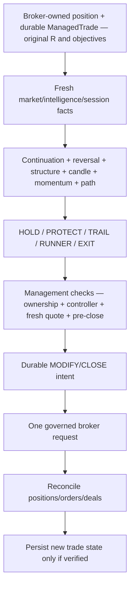

# GoldSwingTraderAI — Trade Manager and Exit

**Status:** PROVISIONAL — TRADE-MANAGEMENT CONTRACT
**Version:** 0.5-implementation
**Authority:** Post-entry position-management behaviour

## Core principle

Open positions are managed by a second parallel decision floor. The system should not close a high-quality large move merely because a small profit threshold has been reached. Exit and protection decisions are driven primarily by structure, continuation, reversal evidence and remaining target opportunity while the market remains safely tradeable.

V1 intentionally avoids carrying bot-managed Gold positions through a known scheduled XAU market closure. Large-move capture is therefore intraday/open-session capture, not scheduled-gap exposure.

## Management decision pipeline

The manager observes a verified managed trade and produces a decision. It does
not mutate local state until the corresponding broker operation is verified.



The manager has two independent concerns: preserve a healthy move and obey
hard session/execution safety. PRE_CLOSE flatten, exposure mismatch, controller
loss and ambiguous broker outcomes outrank a normal HOLD/RUNNER preference.

| Action | Purpose | Minimum evidence | Durable effect |
|---|---|---|---|
| HOLD | let a healthy thesis continue | no earned protective/exit reason | observation only |
| PROTECT | reduce open risk without suffocating move | progress plus confirmed structural reference | modify intent |
| TRAIL | follow earned structure | valid tighter structural reference | modify intent |
| RUNNER | extend objective | acceptance/continuation plus new objective | modify objective/TP |
| EXIT | close failed/exhausted/unsafe trade | meaningful reversal/collapse/mandatory safety | close intent |

## Implementation ownership and proof boundary

Implemented owners:

```text
management/models.py
management/manager.py
management/store.py
management/execution.py
```

The deterministic baseline now implements:

```text
verified bot-owned ManagedTrade
+ fresh MarketSnapshot / IntelligenceSnapshot
→ continuation / reversal / structure / candle / momentum / path evidence
→ HOLD / PROTECT / TRAIL / RUNNER / EXIT
→ governed MODIFY/CLOSE ExecutionIntent where required
→ broker reconciliation/verification
→ only then durable ManagedTrade update/clear
```

Current numeric management thresholds are explicit **research-calibratable implementation baselines**. They do not supersede the behavioural rules in this document and must not become extra arbitrary filters that prevent healthy trades from continuing.

Deterministic regression coverage currently proves that an ordinary pullback/single opposite M5 candle does not force exit, Primary target does not force full exit, protection needs a structural stop reference, runner needs continuation plus a real objective, stop cannot widen beyond original risk, PRE_CLOSE overrides continuation, and local SL/TP/closed state is not changed before broker verification.

Live Windows/MT5 DEMO management evidence remains required before VERIFIED status.

## Core management outputs

The trade manager exposes at least:

- Continuation Score;
- Reversal Score;
- Structure Integrity;
- Candle Health;
- Momentum / Expansion Health;
- Target Remaining / Liquidity Path;
- Protection Need;
- current objective state (`PRIMARY`, `EXPANSION`, `RUNNER`);
- Session/Pre-Close Exit Requirement.

The final management action is one of:

- `HOLD`;
- `PROTECT`;
- `TRAIL`;
- `RUNNER`;
- `EXIT`.

## HOLD

Use when the original thesis remains healthy and no better protective structure has been earned. Small opposite candles or ordinary pullbacks are not sufficient reason to exit a swing/intraday expansion trade.

`HOLD` is not permitted to override a mandatory PRE_CLOSE flatten requirement.

## PROTECT

Use when enough progress and confirmed structure justify reducing risk without suffocating the trade. Protection should be based on a proven new structural reference rather than a fixed small-profit trigger alone.

The manager must not force breakeven merely because price reached a small positive R value. Protection is earned by structure/continuation progress.

Implementation note: current V1 baseline uses positive-R progress only as an **eligibility context** for considering protection. The proposed stop itself must come from a confirmed protected structural reference with volatility buffering; no fixed-R breakeven price is generated.

## TRAIL

Trailing should primarily follow confirmed market structure with volatility-aware buffering.

For a BUY trade the hierarchy may evolve from:

```text
original structural stop
→ confirmed M5 protected swing when appropriate
→ confirmed M15 higher low
→ M15 continuation structure
→ H1 runner structure for extended moves
```

SELL is symmetric.

The current implementation uses this hierarchy as an explicit baseline: M5 is eligible for early structural protection, M15 is preferred once the move/Primary checkpoint earns trailing, and H1 is preferred for established runner management where it still tightens rather than widens risk. Exact thresholds remain research calibration.

The stop may tighten but must never intentionally widen beyond the original approved risk.

## Target progression — V1 frozen direction

The initial target hierarchy is owned by `TRADE_PLAN.md`:

```text
Immediate Obstacle
→ Primary Structural Target
→ Expansion Target
→ Runner Objective
```

### Primary Target

Primary Target is normally a **management checkpoint**, not an automatic full exit.

At/near Primary Target the manager evaluates:

- rejection versus acceptance;
- whether directional structure remains intact;
- continuation/expansion health;
- reversal evidence;
- quality of the path to Expansion Target;
- remaining session time/safety.

If continuation remains healthy, the position may continue toward Expansion Target. The implemented baseline may also tighten to newly earned M15/M5 structure rather than taking profit merely because Primary was touched.

### Expansion Target

Expansion Target is the default initial broker TP objective when valid under the Trade Plan.

As price approaches/accepts the Expansion Target, the manager decides whether the move should end there or earn runner extension.

If Expansion is consumed and continuation materially collapses, the manager may exit rather than inventing a new target with no objective anchor.

### RUNNER

A trade may continue beyond its Expansion Target only when fresh market evidence earns the extension.

Initial V1 runner requirements:

- Expansion/previous objective is being accepted/broken rather than strongly rejected;
- directional structure remains intact;
- continuation/displacement evidence remains credible;
- reversal evidence is limited relative to continuation;
- a fresh next objective is objectively defined from structure/liquidity/HTF context;
- target path to that objective is still credible;
- execution/session conditions remain safe.

The current implementation evaluates runner eligibility as Expansion is approached/accepted. It requires an existing valid Runner Objective from the Trade Plan plus adequate continuation, structure and liquidity-path quality with limited reversal evidence. Profit alone cannot satisfy runner eligibility.

The manager may then move the broker objective to the validated Runner Objective through the governed execution path.

A TP must **not** be extended simply because price is profitable or because a fixed 3R/4R number has been reached.

Only one current Runner Objective is active at a time. A later extension requires a newly identified objective plus fresh evidence; the system must not create an infinite moving target with no objective anchor.

A runner still must be flattened before the scheduled XAU closure according to the Session/Risk State Machine.

## EXIT

Exit should normally require meaningful evidence that the original thesis has failed, continuation has materially collapsed, the target path is exhausted, or a hard session/execution safety requirement applies.

Examples include combinations of:

- material M15 structural break;
- failed reclaim;
- strong opposing displacement;
- credible opposite MSS/reversal structure;
- major target reached with continuation collapse/rejection;
- target path no longer offering credible continuation room;
- severe execution/session safety requirement.

A single RSI reading, a single opposite candle, or merely touching Primary Target is not sufficient by itself.

The implemented baseline deliberately combines opposing evidence with weak continuation before normal thesis-reversal EXIT; it does not let one soft signal act as a universal veto.

### Mandatory pre-close exit

`PRE_CLOSE_FLATTEN` is an explicit session-safety exit and does not require reversal evidence. When the Session/Risk State Machine enters the frozen pre-close flatten window, any bot-managed Gold position must be closed through the normal governed execution path while the broker remains tradeable.

If close acknowledgement is ambiguous or the broker becomes unavailable before flatten completes, the system must preserve the unresolved exposure and reconcile it; it must not mark the position closed merely because the session ended.

## Original R and durable lifecycle

Original risk distance and original R definition remain immutable for analytics and restart recovery even after stops/targets move. Trailing/protection/runner extension cannot redefine historical risk to make performance appear better.

`ManagedTradeRepository` persists broker position ticket, Trade/Plan/Opportunity/Episode lineage, entry, original/current stop, immutable original-R price distance, Primary/Expansion/Runner objectives and objective stage using the project SQLite state store.

Durable state changes after PROTECT/TRAIL/RUNNER/EXIT are applied **only after the corresponding ExecutionIntent is broker-verified**. Ambiguous acknowledgement does not advance local trade state.

A PRE_CLOSE exit is journaled as a session-policy exit so research can separately measure favorable movement forgone/avoided gap risk later.

## Partial profit — V1 baseline

V1 core behaviour does not depend on partial closes. A minimum `0.01` position may be indivisible, so the baseline manager handles the full bot-managed position through HOLD/PROTECT/TRAIL/RUNNER/EXIT.

Future research/version work may test partial-profit policies for larger volumes, but they are not required for V1 and must not be silently introduced as a dependency.

## Research requirements

Post-trade research should measure at least:

- MFE / MAE;
- realized R;
- move-capture efficiency;
- premature-exit cost;
- profit given back after runner decisions;
- structural trail quality;
- Primary→Expansion continuation rate;
- Expansion→Runner continuation/rejection rate;
- 2R / 3R / 4R reach rates;
- normalized 100/200/300+ pip move capture where meaningful;
- PRE_CLOSE exit frequency and foregone/avoided gap exposure where measurable without lookahead abuse.

The aim is to improve both downside control and the system's ability to remain in large directional moves during tradeable market hours.

## Tests required

- Primary Target touch does not force automatic full exit;
- ordinary pullback does not force exit while thesis remains intact;
- small profit alone does not force breakeven/protection;
- protection/trailing requires valid structural reference;
- stop never intentionally widens beyond original approved risk;
- runner extension requires a fresh objectively defined next target;
- profit alone cannot extend TP;
- only one current Runner Objective is active at a time;
- sequential runner extension requires fresh acceptance/structure evidence and a new objective;
- no fixed 100/200/300-pip profit exit controls the manager;
- no partial close is required for correct V1 behaviour;
- mandatory PRE_CLOSE flatten overrides HOLD/RUNNER;
- ambiguous modify/close acknowledgement does not mutate durable local trade state;
- verified management write persists the new SL/TP/objective state;
- managed-trade original R/objectives survive restart.

## Open questions / research calibration

- exact protection/trailing R eligibility values and M5/M15/H1 precedence refinements;
- exact continuation/reversal score thresholds for objective extension/exit;
- family/regime-specific runner-quality calibration;
- research-backed sequential runner-objective discovery after an already-active runner target is accepted.
