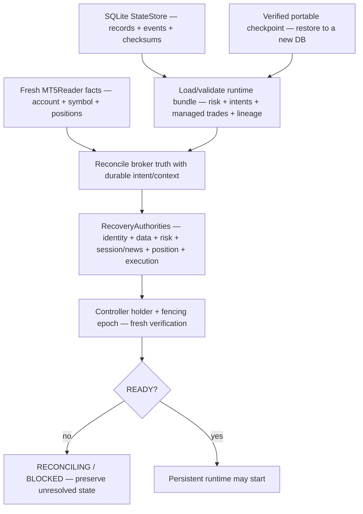

# GoldSwingTraderAI — Persistence, Restart and Recovery

**Status:** PROVISIONAL — PERSISTENCE AND RECOVERY CONTRACT
**Version:** 0.9-implementation
**Authority:** Durable lifecycle state, crash recovery, startup reconciliation, portable runtime checkpoints, automatic local backup cadence/retention, machine migration and backup/restore integrity.
**Depends on:** `EXECUTION_AND_BROKER_SAFETY.md`, `RISK_CONTRACT.md`, `../10-market-intelligence/MARKET_DATA_AND_HISTORY.md`, `../20-trading-decisions/TRADE_PLAN.md`, `../40-research-learning/LEARNING_AND_AI_BOUNDARIES.md`

## Purpose

The bot must survive process restart, laptop loss/change and controlled migration without forgetting active obligations, strategy lineage or learning history.

> **Restart is not a fresh trading day unless actual rules say so. Restored state is context, never broker truth. Unknown broker exposure is never zero exposure.**

## Truth layers and recovery flow

Persistence stores what the runtime knows and intends. Broker reads establish
what the account currently exposes. Recovery joins the two and refuses to
invent the missing side.



| Truth layer | Examples | Authority |
|---|---|---|
| durable intent/context | ExecutionIntent, ManagedTrade, Opportunity, risk-day, journal | local lifecycle/history |
| portable recovery artifact | checkpoint records/events and manifest | transportable context only |
| broker truth | current account, symbol, positions, orders/deals, actual SL/TP | current exposure/execution outcome |
| recovery decision | authority traces and READY/BLOCKED state | may permit runtime continuation |

Restore never means “resume writing.” It means “load context, obtain fresh
broker truth, reconcile, then re-establish every hard authority.”

## Source and storage ownership

```text
persistence/store.py
persistence/runtime_state.py
persistence/checkpoint.py
persistence/backup.py
persistence/publication.py
app/recovery.py
app/recovery_mt5.py
market_data/mt5_reader.py
security/financial_secrets.py
```

## Durable StateStore

Standard-library SQLite stores canonical current records + append-only events with checksums, schema versions, WAL, `synchronous=FULL`, transactional writes and integrity verification. Corruption fails closed.

`RuntimeStateRepository` validates risk/cooldown/Episode/Opportunity/TradePlan lineage. Execution Intent and Managed Trade repositories use the same StateStore.

Restore parsers are deliberately non-coercive. JSON booleans and integers must
remain those types; numeric values must be finite; optional `null` remains
absent; UTC timestamps and entity identities are explicit. This applies to
`persistence/runtime_state.py`, `execution/intent_store.py`,
`management/store.py`, the research episode journal and discovery status. A
malformed record raises an integrity error and stops recovery; it is never
converted into a convenient zero, `False`, empty exposure or passing state.

## Portable checkpoint + local backup

Portable checkpoint:

```text
checkpoint_manifest.json
records.jsonl
events.jsonl
```

It is write-new, content-hashed, secret-scanned and restored only into a NEW DB. Restore explicitly requires broker reconciliation.

Local rolling backup:

```text
backup_catalog.json
checkpoints/runtime-YYYYMMDDTHHMMSSZ-<sha12>/...
```

Initial configurable baseline is 15-minute cadence / keep 96. New state is staged + verified before catalog replacement and retention prune. Failed backup preserves previous known-good state.

`persistence/publication.py` stages only the newest catalog-verified checkpoint
into a new destination, verifies the checkpoint identity, writes a canonical
publication manifest and scans every staged text artifact for financial
secrets. The staging command never authenticates, commits or pushes to GitHub.
The final external publication remains an explicit operator/CI action using
credentials that never enter runtime state.

## Governed startup recovery

`app/recovery.py` owns the fail-closed READY sequence:

```text
StateStore integrity
→ typed runtime bundle
→ current ExecutionIntent
→ current ManagedTrade
→ current DEMO/account/server/symbol truth
→ unresolved Intent reconciliation
→ ManagedTrade vs current broker position
→ all hard RecoveryAuthorities PASS
→ fresh controller holder/epoch verification
→ takeover completion only now
→ READY
```

It performs no broker write.

### Intent semantics

- terminal/none: lifecycle may continue;
- APPROVED pre-submit: may be safely cancelled to FAILED with zero sends;
- CREATED: explicit review/reconciliation;
- SUBMITTING / ACCEPTED_UNKNOWN: existing broker reconciler, never blind resend;
- VERIFIED OPEN without ManagedTrade context: RECONCILING.

### Managed Trade semantics

Restored ManagedTrade must match exactly one current broker position by ticket/symbol/direction/volume. Current SL/TP must match within an explicit broker-derived price tolerance. Missing/mismatched state prevents READY.

## Live MT5 recovery truth

`app/recovery_mt5.py` now builds the current recovery snapshot through the **existing `MT5Reader` only**:

```text
MT5Reader.account_facts()
→ resolve_symbol()
→ symbol_spec()
→ open_positions()
→ MT5RecoveryTruth
```

`MT5RecoveryTruth` contains:

- `BrokerRecoverySnapshot` with current account, resolved symbol and normalized open positions;
- verified `SymbolSpec`;
- `price_tolerance = SymbolSpec.tick_size`.

This means recovery no longer needs a guessed Gold SL/TP tolerance and does not create a second raw MetaTrader5 read client.

### Exposure fail-closed rule

`MT5Reader.open_positions(symbol)` distinguishes:

```text
MT5 returns empty collection → complete zero-position truth
MT5 returns None             → DATA_UNAVAILABLE / no recovery snapshot
corrupt/duplicate position   → DATA_CORRUPT / no recovery snapshot
```

A failed position read never becomes `positions_complete=True` with fabricated empty exposure.

Normalized recovery position facts include ticket, symbol, direction, volume, open price, SL/TP, optional magic/comment. Recovery ownership still depends on durable lineage; broker position facts alone do not prove bot ownership.

## Controller takeover integration

A higher epoch after expiry remains blocked by `CONTROLLER_TAKEOVER_RECONCILIATION_REQUIRED`. Startup recovery clears it only after durable state, live broker recovery facts and all hard authorities pass, followed by fresh same-holder/same-epoch verification.

## Fresh-machine target sequence

```text
clone/install code
→ obtain + verify checkpoint/catalog
→ restore to NEW local DB
→ configure credentials separately
→ initialize existing MT5Reader
→ build live MT5RecoveryTruth
→ governed StartupRecoveryCoordinator
→ rebuild/revalidate market intelligence/opportunities
→ load learning/research/candidate state
→ all hard runtime permissions
→ READY
```

Software pieces for checkpoint restore + live position snapshot + governed recovery are now deterministic. A real second-machine/Windows MT5 drill remains external evidence.

## Remote publication boundary

Local backup code does not contain GitHub/cloud auth. Use the operator boundary:

```text
python scripts/stage_public_backup.py <backup-root> <new-public-destination>
python scripts/scan_financial_secrets.py <new-public-destination>
review → explicit git add/commit/push using external credentials
```

`scripts/restore_runtime_checkpoint.py <checkpoint> <new-db>` performs a
verified new-DB restore and reports `broker_reconciliation_required=true`;
restoration never grants trading authority.

## Multi-machine safety

Portable state does not grant controller authority. SQLite coordination semantics are implemented, but real cross-laptop shared-storage locking/durability still needs controlled certification.

## Dashboard visibility target

```text
State Integrity       VERIFIED / FAILED
Backup Catalog        VERIFIED / FAILED / PENDING
Latest Checkpoint     VERIFIED / STALE / FAILED / NONE
Live Broker Snapshot  VERIFIED / FAILED / PENDING
Open Gold Positions   count / UNKNOWN
Recovery State        READY / RECONCILING / BLOCKED
Recovery Reason       exact reason
Execution Intent      CLEAR / RECONCILING
Managed Trade         NONE / MATCHED / RECONCILING / BLOCKED
Controller            PRIMARY / OBSERVER / TAKEOVER_RECONCILING / UNKNOWN
```

## Tests and evidence boundary

Deterministic coverage includes persistence/checkpoint/catalog integrity, secret blocking, controller takeover fencing, startup recovery, live account/symbol/spec/open-position normalization, positive empty exposure, unknown read fail-closed, invalid/duplicate position rejection and broker-tick-derived recovery tolerance.

The deterministic test, lint and secret-scan commands are owned by
`60-engineering/TESTING_AND_VERIFICATION.md`; live broker/recovery evidence
belongs to the release audit.

The live startup owner now performs a UTC risk-day rollover when the prior
record is stale and broker equity is positive, but only when there is no
bot-managed open trade and no unresolved Execution Intent. The previous record
and transition remain in StateStore event history. Ambiguous lifecycle state
continues to block rollover/recovery rather than receiving a new baseline.

## Explicit non-goals

Recovery must not treat backup as broker truth, convert unknown exposure into zero, create a duplicate MetaTrader5 client, invent a Gold price tolerance, blind-resend an uncertain Intent, invent missing ManagedTrade context, clear takeover before reconciliation, or embed publication credentials.

## Integrated startup composition

`app/runtime.py` now composes the live startup boundary and exposes fresh live
cycle facts:

```text
explicit EXISTING / INITIALIZE / RESTORE mode
→ MT5Reader initialization and MarketSnapshot
→ live MT5RecoveryTruth
→ account/symbol-scoped StateStore repositories
→ SQLite controller coordination + MT5 reconciler
→ live RecoveryAuthorities
→ StartupRecoveryCoordinator
→ app/cycle governed analysis/management/execution
→ app/loop M5 cadence, lease heartbeat and verified backup cadence
```

`RESTORE` verifies a portable checkpoint and refuses to overwrite an existing
runtime database. `INITIALIZE` creates a first UTC risk-day baseline only when
the local runtime store has no other lifecycle state. Missing session/news truth
remains UNKNOWN and prevents READY. Checkpoint state is never broker truth.

## Remaining work

- real fresh-machine + Windows MT5 broker reconciliation drill using the staged/restore tooling;
- controlled cross-laptop coordination/failover proof;
- external authenticated public backup publication;
- UTC risk-day rollover + restart/fault-injection certification;
- final shutdown/restart certification on the intended Windows environment;
- schema migration transforms when v2 exists.
