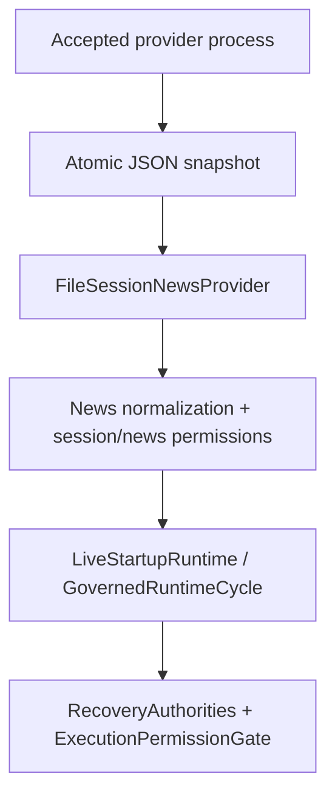
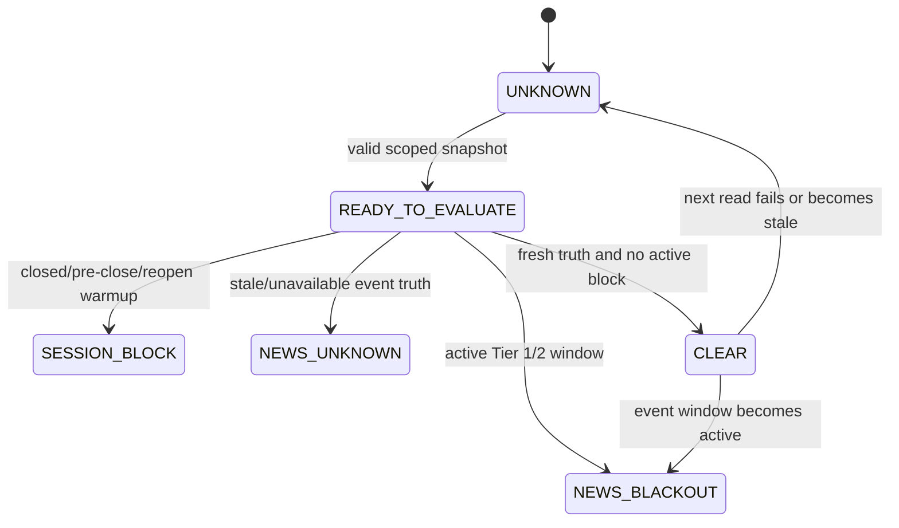

# GoldSwingTraderAI — Session/News Provider Handoff Contract

**Status:** PROVISIONAL — PROVIDER-NEUTRAL HANDOFF CONTRACT
**Version:** 1.1-contract
**Authority:** The provider-neutral input boundary between an accepted session/news producer and the live runtime. Permission states remain authoritative in `SESSION_AND_RISK_STATE_MACHINE.md`.
**Depends on:** `SESSION_AND_RISK_STATE_MACHINE.md`, `../10-market-intelligence/FUNDAMENTAL_AND_NEWS.md`, `PERSISTENCE_RESTART_AND_RECOVERY.md`

## Purpose

The runtime does not select a commercial calendar vendor or store provider credentials. A separate local/provider process may publish one complete JSON snapshot, and the runtime reads it on every startup/cycle through:

```text
FileSessionNewsProvider
→ scope/timestamp/schema validation
→ normalize_news_facts()
→ evaluate_market_permission()
→ evaluate_news_permission()
→ combine_session_news_permission()
```

The adapter is a typed handoff, not an independent broker authority. Missing, malformed, mis-scoped, stale or future-dated input becomes explicit `UNKNOWN` through the live runtime; it never becomes `SESSION_OPEN` or `NEWS_CLEAR` by default.

## End-to-end ownership and timing



The provider process owns acquisition and publication. `app/session_news.py`
owns file parsing, scope validation and conversion into typed facts. The
intelligence and risk modules own tier mapping and hard permission semantics.
The runtime owns the final `UNKNOWN` fallback and shares one observation with
startup, entry, management and dashboard composition.

The handoff is read-only from the bot's perspective. It is evaluated against
the current `MarketSnapshot`, `MT5RecoveryTruth` and UTC cycle time; it is not
cached as a permanent substitute for fresh broker/session truth. A valid
calendar snapshot may explain event safety, but it cannot prove current
positions, account identity, symbol tradeability, or broker write permission.

## Source and test ownership

| Contract responsibility | Source owner | Executable proof |
|---|---|---|
| Environment/configuration resolution | `config/settings.py`, `app/main.py` | `tests/test_settings.py`, `tests/test_session_news_provider.py` |
| JSON size/schema/scope/type validation | `app/session_news.py::FileSessionNewsProvider` | `tests/test_session_news_provider.py` |
| Provider health, event tiering and blackout windows | `intelligence/news.py` | `tests/test_intelligence_snapshot.py`, `tests/test_session_news_permissions.py` |
| Broker session state and reopen/pre-close rules | `risk/permissions.py` | `tests/test_session_news_permissions.py` |
| Startup readiness authority | `app/startup.py`, `app/recovery.py`, `app/runtime.py` | `tests/test_startup_recovery.py`, `tests/test_live_startup_runtime.py` |
| Final broker-write enforcement | `execution/gate.py`, `execution/service.py` | `tests/test_execution_safety.py`, `tests/test_live_startup_runtime.py` |
| Operator visibility | `app/dashboard.py`, `operator/dashboard.py` | `tests/test_dashboard.py` |

Changing a provider field or permission reason therefore requires a contract
update, source-owner review and the corresponding executable tests; changing
the provider name alone must never alter the hard policy.

## Configuration

```text
GSTAI_SESSION_NEWS_FILE=.state/session-news.json
GSTAI_SESSION_NEWS_TTL_SECONDS=1800
```

The file path is non-secret configuration. The TTL is an operator safety bound and must be calibrated for the selected provider. If the path is absent, the launcher preserves the documented fail-closed `UNKNOWN` behaviour. `PRIMARY`/`STANDBY` cannot become `READY` without known session/news truth.

## JSON schema

The current schema is strict at the required-field/type boundary:

```json
{
  "schema_version": 1,
  "provider": "accepted-provider-name",
  "provider_health": "VERIFIED",
  "fetched_at_utc": "2026-09-18T18:30:00+00:00",
  "scope": {
    "account_login": 123456,
    "server": "Broker-Demo",
    "symbol": "XAUUSD"
  },
  "session": {
    "tradeable": true,
    "schedule_verified": true,
    "next_close_utc": "2026-09-18T20:30:00+00:00",
    "next_close_kind": "DAILY",
    "reopened_at_utc": null,
    "reopen_kind": null,
    "clean_completed_m5_since_reopen": 0,
    "execution_normalized": true,
    "unresolved_gap_or_reconciliation": false,
    "weekend_gap_assessed": true,
    "holiday_context": false
  },
  "events": [
    {
      "provider_event_id": "calendar-123",
      "title": "CPI",
      "currency": "USD",
      "scheduled_at_utc": "2026-09-18T19:00:00+00:00",
      "impact": "high"
    }
  ]
}
```

`provider_health` is one of `VERIFIED`, `DEGRADED`, `STALE`, `UNAVAILABLE` or `UNKNOWN`. `fetched_at_utc` is either timezone-aware UTC or `null`; a `VERIFIED`/`DEGRADED` feed without a fetch time is normalized to unusable `UNKNOWN`. `events` may be an empty array when the provider truthfully reports no accepted events, but the field itself is required.

The runtime derives event tiers/windows and `mapping_version` from the versioned code in `intelligence/news.py`; the handoff file cannot override that policy. `next_close_kind` and `reopen_kind` are `DAILY` or `WEEKEND`. A schedule marked verified but missing its required close time remains unknown under the existing permission owner.

## Field contract

| Field | Required | Accepted meaning |
|---|---:|---|
| `schema_version` | Yes | Exact integer `1`; unknown versions are rejected |
| `provider` | Yes | Non-empty display/identity string; no credentials |
| `provider_health` | Yes | `VERIFIED`, `DEGRADED`, `STALE`, `UNAVAILABLE` or `UNKNOWN` |
| `fetched_at_utc` | Yes | UTC timestamp or `null`; freshness is evaluated against the cycle clock |
| `scope` | Yes | Exact live `account_login`, `server` and resolved `symbol` |
| `session` | Yes | Broker/session facts used by `BrokerSessionFacts` |
| `events` | Yes | JSON array of raw scheduled-event records; empty is valid only when truthful |
| `session.tradeable` | Yes | Provider's session view; false blocks entry but does not erase broker exposure |
| `session.schedule_verified` | Yes | Whether the close/reopen schedule is trusted |
| `session.next_close_utc` | Conditional | UTC close timestamp when the schedule is verified |
| `session.next_close_kind` | Conditional | `DAILY` or `WEEKEND` when `next_close_utc` is present |
| `session.reopened_at_utc` / `reopen_kind` | Optional pair | Reopen facts used by the clean-M5 warmup |
| `session.clean_completed_m5_since_reopen` | Optional | Non-negative count; defaults to `0` |
| `session.execution_normalized` | Optional | Defaults to `true`; must be explicit `false` when dislocated |
| `session.unresolved_gap_or_reconciliation` | Optional | Defaults to `false`; true blocks reopen readiness |
| `session.weekend_gap_assessed` | Optional | Defaults to `true`; weekend reopen requires an assessment |
| `session.holiday_context` | Optional | Context only; it does not by itself close the market |

Each event requires `provider_event_id`, `title`, `currency`,
`scheduled_at_utc` and `impact`. Provider-specific impact labels remain input
metadata; the canonical tier/window policy is selected by
`intelligence/news.py`.

The adapter accepts `fetched_at_utc: null` so an unavailable producer can be
represented explicitly, but `normalize_news_facts()` converts that input to
unusable `UNKNOWN` truth. A healthy empty `events` array is different: it means
the provider has positively reported no accepted events.

## Validation and failure semantics

| Condition | Adapter result | Runtime meaning |
|---|---|---|
| Missing/unreadable file, invalid JSON or non-object root | `ValueError` | `UNKNOWN`; readiness and new entry fail closed |
| File larger than 2 MiB | `ValueError` | `UNKNOWN`; producer must publish a bounded snapshot |
| Unsupported `schema_version` | `ValueError` | `UNKNOWN`; deploy a compatible producer |
| Missing/wrong field type | `ValueError` | `UNKNOWN`; do not coerce unsafe input |
| Scope mismatch | `ValueError` | `UNKNOWN`; never apply another account/server/symbol's calendar |
| Future `fetched_at_utc` | `ValueError` | `UNKNOWN`; producer clock/publication is invalid |
| Old timestamp beyond configured TTL | Typed `NewsFacts` with stale health | `NEWS_SAFETY_UNKNOWN` |
| Provider `UNAVAILABLE`/`UNKNOWN` | Typed unusable `NewsFacts` | `NEWS_SAFETY_UNKNOWN` |
| Empty `events` with healthy, fresh provider | Valid `NewsFacts` | `NEWS_CLEAR` if session permission also passes |
| Active Tier-1/Tier-2 window | Valid `NewsPermission` | `NEWS_BLACKOUT`; new entry blocked |
| Session pre-close/reopen warmup | Valid `MarketPermission` | `SESSION_PRE_CLOSE`, `PRE_CLOSE_FLATTEN` or `REOPEN_WARMUP` |

The adapter does not silently turn an exception into an empty event list.
`LiveStartupRuntime._session_news_observation()` converts provider exceptions
to an explicit unknown permission, so startup and the execution gate see the
same safety result.

## Permission lifecycle



`CLEAR` is only the session/news sub-permission. It is not global `READY` and
does not authorize an order without risk, account, capacity, controller,
DEMO and execution checks.

## Publication invariants

The external producer must:

- write a complete temporary file and atomically replace the configured path;
- scope every snapshot to the exact live account login, server and resolved symbol;
- use UTC timestamps and a real provider fetch time;
- preserve provider health instead of converting an API failure to an empty event list;
- keep credentials, tokens and raw authentication material outside the file and repository;
- version any upstream mapping change through the normal code/review path.

The runtime never writes or repairs the snapshot. A file read failure, JSON/schema failure, scope mismatch, stale timestamp or future timestamp is retained as an observable provider failure and is fail-closed by `LiveStartupRuntime`.

The recommended publication sequence is:

1. Fetch and validate provider data outside the bot process.
2. Build the complete schema-versioned object, including health and scope.
3. Write it to a same-directory temporary file with UTF-8 encoding.
4. Flush/close it, then atomically replace the configured snapshot path.
5. Leave the previous valid file untouched if acquisition or serialization
   fails.
6. Let the next runtime cycle evaluate freshness; do not extend TTL by
   repeatedly rewriting an old payload.

The producer may be a scheduled task, service or separate connector. Its
implementation and credentials are intentionally outside this repository's
trading authority boundary.

## Persistence, restart and research boundary

The snapshot is an input handoff, not durable trading truth. Restart recovery
must re-read a fresh provider snapshot and independently reconcile positions
through `MT5RecoveryTruth`; a copied old session/news file cannot prove that a
new process is safe to write.

Replay and research should convert provider records into the same
`RawScheduledEvent`/`NewsFacts` policy path where possible. If the provider
mapping differs between a replay bundle and live operation, the evidence
package must record the mapping version and timestamp basis rather than
silently comparing incompatible blackout rules.

## Evidence boundary

Deterministic tests prove schema/scope/freshness normalization and fail-closed behaviour. They do not prove that a chosen commercial provider is correct, that the producer is refreshed atomically in production, or that the broker schedule agrees with the provider. Those remain controlled environment evidence under `FINAL_RELEASE_AUDIT.md`.

## Explicit non-goals

- selecting or endorsing a commercial news vendor;
- storing provider credentials, access tokens or raw API responses;
- replacing MT5 broker/session truth or recovery reconciliation;
- allowing a provider file to bypass risk, controller or broker-write gates;
- treating missing events as proof that the market is safe;
- adding a second news-permission implementation outside the existing owners.
