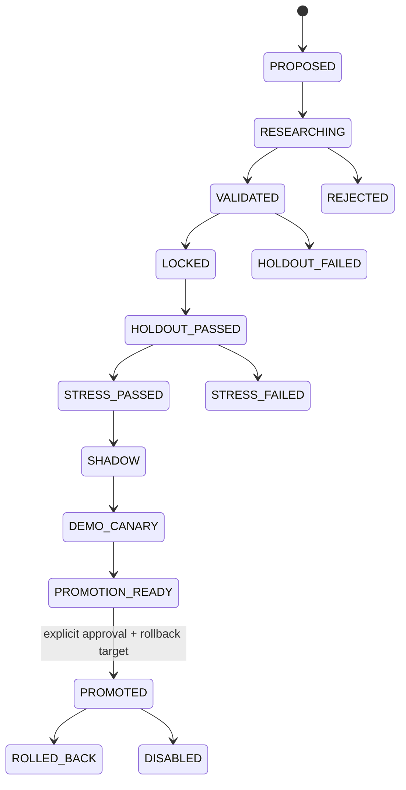

# GoldSwingTraderAI — Governed Experiments and Promotion

**Status:** PROVISIONAL
**Version:** 0.3-implementation
**Authority:** Champion/challenger lifecycle, final-holdout use, stress, shadow, DEMO canary, promotion, rollback and production-policy versioning.
**Depends on:** `RESEARCH_AND_VALIDATION.md`, `GOVERNED_STRATEGY_DISCOVERY.md`, `AUTONOMOUS_STRATEGY_INVENTION.md`

## Purpose

Research may discover promising changes, but production policy changes require staged evidence and a reversible governance path.

> **A candidate can recommend itself. It cannot promote itself.**

## Promotion state machine

Promotion is a sequence of evidence gates with durable state, not a single
“approved” boolean.



Each transition records candidate identity, policy semantics, evidence and
reason. LOCKED freezes the semantic fingerprint; HOLDOUT is one-shot; SHADOW
has zero broker authority; DEMO_CANARY uses the normal DEMO/Risk/Execution
path; PROMOTION_READY still cannot self-approve.

| Stage | Evidence question | Broker authority |
|---|---|---|
| research/validation | does the idea improve the declared objective without leakage? | none |
| locked holdout | does the unchanged candidate survive untouched data? | none |
| stress | is it robust to declared friction/latency/regime/missing optional facts? | none |
| shadow | does live timing look plausible without real orders? | none |
| DEMO canary | does actual terminal lifecycle behave safely? | ordinary governed DEMO path only |
| promoted | has a human/governed approval accepted it with rollback? | still ordinary hard gate |

## Champion and Challenger

The currently approved policy/strategy is the `CHAMPION`. A proposed improvement is a `CHALLENGER`. A Challenger is evaluated against the approved baseline, not merely against zero.

## Candidate types

Candidates may alter researchable strategy parameters, scoring, entry timing, target/trailing policy, regime suitability or declarative strategy recipes. Hard safety semantics are not ordinary experiment candidates.

## Enforced lifecycle

The implemented registry permits only explicit next-stage transitions:

```text
PROPOSED
→ RESEARCHING
→ VALIDATED
→ LOCKED
→ HOLDOUT_PASSED
→ STRESS_PASSED
→ SHADOW
→ DEMO_CANARY
→ PROMOTION_READY
→ explicit approval
→ PROMOTED
```

Failure/terminal states include `HOLDOUT_FAILED`, `STRESS_FAILED`, `REJECTED`, `DISABLED` and `ROLLED_BACK`.

A candidate cannot jump directly from discovery to Shadow/Canary/production.

## Locked candidate

A validated candidate is locked to a durable SHA-256 semantic fingerprint before final holdout.

The same fingerprint must be supplied when the holdout is consumed. If recipe/parameters/semantics changed after locking, the final holdout cannot proceed under the old candidate claim; a new candidate/version must restart the required evidence cycle.

## Final holdout — one-shot

The final holdout has a durable identity and may be consumed only once for the locked candidate. A failing candidate terminates that candidate's untouched-holdout claim.

Repeatedly testing changed alternatives on the same holdout and still calling it untouched is prohibited.

## Stress gate

A holdout-passing candidate must survive reasonable stress such as worse spread/slippage, execution delay, parameter perturbation, different regimes/directions and missing optional evidence where valid.

Fragility may fail the candidate even with positive headline return.

## Shadow

Shadow evaluates live/forward facts but has zero raw broker authority. Agreement/disagreement, hypothetical entries/exits, missed/extra opportunities, R/capture/drawdown counterfactuals and regime differences remain isolated from real broker P/L.

## DEMO Canary

A candidate reaching DEMO Canary may only participate through the ordinary DEMO guard, Trade Plan, Risk and centralized Execution path. The research/promotion registry itself never grants raw broker authority.

Canary evidence is intended to validate real broker timing/spread/fill/restart/lifecycle behaviour that bar-close replay cannot fully prove.

## Promotion approval

`PROMOTION_READY` is not production authority.

The implemented baseline requires an explicit approval flag plus a known rollback target. Calling promotion without approval raises a permission failure; autonomous invention/learning cannot set itself to production.

## Rollback / disable

A promoted candidate retains its rollback target. Rollback is explicit, reasoned and durable. Safety violations may disable a candidate; performance rollback must avoid reacting blindly to an ordinary short losing streak.

## Evidence objectives

Promotion evaluates multiple objectives, including Net/Avg R, drawdown, Profit Factor, Capture Efficiency, Opportunity Recall, entry/exit efficiency, loss-streak distribution, execution friction, trade frequency and complexity/stability.

A policy that marginally raises win rate while destroying opportunity recall or large-move capture is not automatically better.

## Evidence isolation

Keep environments/version evidence distinct:

```text
REPLAY
VALIDATION
FINAL_HOLDOUT
SHADOW
DEMO_CANARY
MAIN_DEMO
```

Counterfactual Shadow P/L never becomes actual broker P/L.

## Persistence

Candidate promotion stage, locked fingerprint, consumed holdout identity/status, rejection reason, rollback target and promotion timestamp are durable in the SQLite research registry and survive restart.

## Implementation ownership and proof boundary

Owner:

```text
research/promotion.py
```

Deterministic regressions enforce:

- no stage skipping;
- candidate fingerprint cannot change after lock and reuse the holdout;
- final holdout is one-shot;
- failed holdout terminates the candidate path;
- Shadow/Canary lifecycle order;
- research registry never grants direct broker authority;
- autonomous/self-promotion is denied;
- explicit approved promotion requires rollback target;
- promotion and rollback survive restart.

Deterministic CI is not proof that a candidate has market edge. Actual candidates must still supply the required evidence at every stage.

## Tests required

- strict lifecycle ordering;
- final-holdout one-shot enforcement;
- locked fingerprint immutability;
- Shadow zero raw broker authority;
- Canary uses normal risk/execution path;
- self-promotion denied;
- safety violation disables candidate;
- open-trade policy version preserved;
- promotion/rollback history survives restart;
- unsafe state-schema migration blocks promotion.

## Explicit non-goals

Governance must not promote on development profit alone, let research/AI self-promote, silently mutate open-trade semantics, erase failures/rollbacks, or treat a few losses as proof of strategy failure.

## Open questions / calibration

- exact minimum validation/Shadow/Canary samples;
- material-improvement tests versus Champion;
- DEMO Canary duration/scope;
- final operator approval UX;
- automatic performance-degradation alerts versus manual rollback review.
