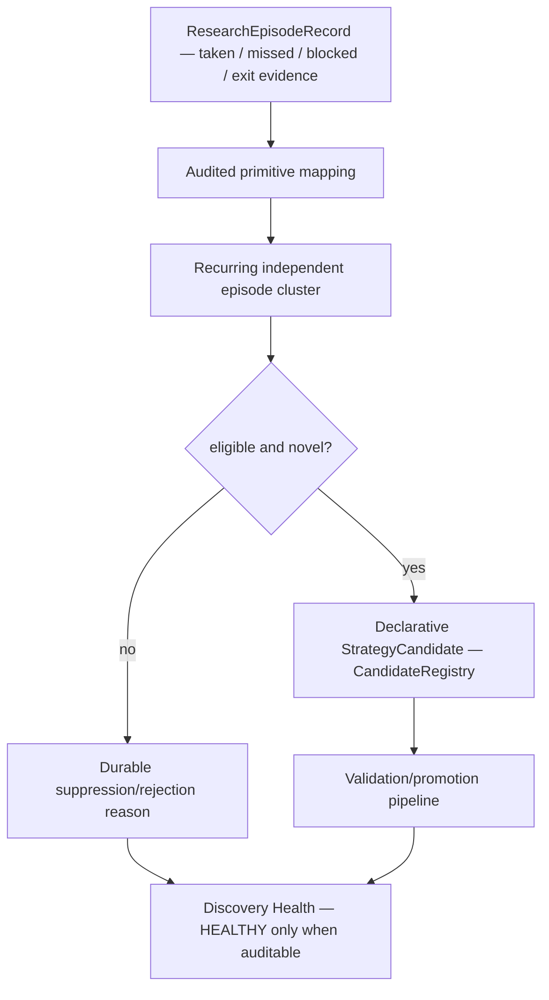

# GoldSwingTraderAI — Governed Strategy Discovery

**Status:** PROVISIONAL
**Version:** 0.4-implementation
**Authority:** Parameter discovery, strategy-recipe discovery, candidate comparison and evidence-driven market-behaviour discovery.
**Depends on:** `RESEARCH_AND_VALIDATION.md`, `../20-trading-decisions/STRATEGY_FLOOR.md`, `LEARNING_AND_AI_BOUNDARIES.md`

## Purpose

The discovery system searches for improvements while preserving production semantics, safety boundaries and statistical discipline.

> **Discovery proposes candidates. It does not directly change production.**

## Discovery liveness and boundary

Discovery is a durable evidence process, not a class that merely exists in the
package. Every eligible cluster must end in a candidate or an explicit
suppression reason.



The candidate recipe is data: primitive names, timing profile, invalidation,
target model, regime and evidence lineage. It cannot contain executable source,
MT5 calls, risk limits or a permission override. A duplicate or rejected idea
must remain remembered so restart cannot create an endless loop of identical
proposals.

## Discovery liveness contract

Discovery must not exist only as a documented feature or silently remain inert.

When a coherent evidence cluster reaches configured eligibility requirements, each discovery cycle must produce one of two auditable outcomes:

```text
eligible recurring evidence
→ candidate created and durably registered
OR
→ explicit machine-readable suppression/rejection reason
```

Examples of legitimate non-creation reasons include insufficient independent episodes, insufficient evidence strength, no stable primitive pattern, duplicate existing candidate, or substantially similar rejected candidate.

If eligible evidence cannot be processed and no governed reason is produced, discovery health is `DEGRADED`; it must not pretend to be healthy.

## Automatic evidence feed

```text
Replay / forward outcome
→ ResearchEpisodeRecord
→ durable ResearchEpisodeRepository
→ audited primitive mapping
→ recurring cluster
→ invention/discovery cycle
→ CandidateRegistry
```

Normal operation must not depend on an operator manually constructing candidate observations one by one.

## Discovery levels

### Level A — Parameter discovery
May research bounded score/entry/management values explicitly designated as researchable. Hard safety invariants are not parameter-search space.

### Level B — Strategy recipe discovery
May combine approved audited primitives into a declarative hypothesis containing required behaviour, optional support, timing profile, invalidation model, target model and preferred regime.

### Level C — Market-behaviour discovery
May search repeated missed/losing/winning episode clusters for recurring behaviour not represented well by current families.

The objective is evidence-driven hypothesis generation, not random combinatorial search.

## Candidate source map

The initial implementation can derive discovery triggers from repeated:

- meaningful missed moves;
- false-entry episodes;
- premature-exit / weak-capture episodes;
- high-capture sequences;
- later regime-deterioration research.

Blocked/safety/system-fault attribution must remain distinct so discovery does not incorrectly rewrite strategy logic for a broker/system failure.

## Approved primitive registry

Autonomous discovery accepts only audited `ApprovedPrimitive` values implemented in `research/discovery.py`.

Current vocabulary includes:

```text
STRUCTURE_TREND
STRUCTURE_BREAK
MSS_SHIFT
CANDLE_REJECTION
DISPLACEMENT
COMPRESSION
TECHNICAL_LOCATION
TRENDLINE
FIBONACCI
VOLUME_PROFILE_POC
LIQUIDITY_SWEEP
FVG
ORDER_BLOCK
EMA_FLOW
RSI_MOMENTUM
ATR_VOLATILITY
SESSION_CONTEXT
TARGET_PATH
ENTRY_TIMING
```

Trendline/Fibonacci/POC are allowed **research primitives/context**, not automatic production requirements. Their inclusion exists so the research system can test whether they genuinely improve accuracy/Net R/capture and whether they form a useful recurring setup. Discovery may not silently turn them into mandatory hard filters.

`episode_journal.py` maps durable strategy-evidence labels such as `TRENDLINE_*`, `FIB_*` and `POC_*`/`VOLUME_PROFILE_*` into these audited primitives.

Arbitrary strings/executable code are not candidate primitives.

## Candidate discipline

A candidate retains at least:

- typed Candidate ID;
- candidate type (`VARIANT`, `NEW_FAMILY`, `ENTRY_POLICY`, `EXIT_POLICY`);
- parent family when applicable;
- discovery trigger/hypothesis;
- declarative required/optional primitives;
- timing/invalidation/target model;
- evidence source IDs;
- fingerprint and chronology;
- current status / rejection reason.

The implementation requires independent episode IDs; repeated copies of one source episode cannot inflate sample count.

## Duplicate / variant / rejected-memory handling

A candidate close to an existing family is normally a variant rather than a fake new family. A materially unrepresented primitive pattern may become a `NEW_FAMILY` research candidate.

Candidate fingerprints and similarity checks suppress duplicates. Rejected candidates remain durable; a substantially similar rejected idea is not silently reinvented after restart without materially new evidence/versioning.

## Complexity control

Candidates are declarative and bounded. Initial implementation caps required/optional primitives per recipe and prefers a small stable primary pattern over filter soup.

Trendline/Fibonacci/POC must not create a giant multi-confluence recipe merely because they are available. More conditions require stronger evidence.

## Hard exclusions

Discovery may not optimize/remove/bypass:

- account/DEMO identity checks;
- no-lookahead rules;
- monetary hard-risk ceilings/daily lock;
- one-shot broker submission;
- ambiguous-ack reconciliation;
- controller/fencing safety;
- unknown broker/exposure fail-safe behaviour;
- original-R immutability;
- financial-secret handling.

## Candidate evaluation and promotion boundary

```text
Candidate Registry
→ governed validation
→ locked candidate
→ one-shot final holdout
→ stress
→ shadow
→ DEMO canary
→ PROMOTION_READY
→ explicit governed approval
```

Discovery/invention contains no direct production-edit or broker-write authority.

## Implementation ownership and proof boundary

Implemented files:

```text
research/episode_journal.py
research/discovery.py
research/invention.py
research/promotion.py
```

Key deterministic regressions include:

- recurring independent missed-move evidence actually creates a candidate;
- durable journal still feeds discovery after restart;
- duplicate source IDs cannot fake evidence count;
- variant versus new-family classification;
- entry/exit policy challenger creation;
- unapproved primitive rejection;
- Trendline/Fibonacci/POC evidence maps to explicit audited primitives;
- candidate/rejected memory persistence;
- duplicate/rejected candidate suppression;
- candidate cannot skip promotion stages;
- locked fingerprint must match final holdout candidate;
- final holdout is one-shot;
- candidate cannot self-promote.

Deterministic CI proves software behaviour only. Replay quality and later DEMO/forward evidence are still required before any candidate can be considered production-ready.

## Outputs / dashboard visibility

```text
Discovery Health   IDLE / HEALTHY / DEGRADED
Eligible Clusters  ...
Candidate Count    ...
Latest Candidate   ...
Type / Stage       ...
Suppression Reason ...
Broker Authority   NONE
```

## Tests required

- liveness: eligible evidence creates candidate or explicit suppression reason;
- hard-safety fields excluded from search space;
- approved primitive enforcement;
- Trendline/Fibonacci/POC primitive mapping;
- duplicate/variant/new-family classification;
- failed-candidate persistence across restart;
- independent-episode enforcement;
- complexity guard;
- entry/exit candidate creation without production mutation;
- no broker authority;
- no self-promotion.

## Explicit non-goals

Discovery must not generate/execute arbitrary Python, directly edit production policy, learn around hard safety, self-promote candidates, randomly search unlimited condition combinations, or turn optional confluence into mandatory filters without governed evidence.

## Open questions / research calibration

- final per-trigger sample/confidence requirements;
- final primitive similarity/complexity thresholds;
- parameter-search bounds and scheduling/resource budget;
- richer regime-deterioration clustering;
- evidence thresholds required before candidate validation begins;
- whether Trendline/Fibonacci/POC materially improve results in ablation/Opportunity Recall analysis or should remain lightweight context only.
