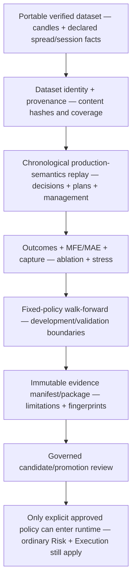

# GoldSwingTraderAI — Research and Validation

**Status:** PROVISIONAL — RESEARCH AND VALIDATION CONTRACT
**Version:** 1.4-implementation
**Authority:** Chronological replay, no-lookahead validation, dataset/evidence identity, portable research datasets, historical acquisition, historical session-policy replay, immutable evidence packaging, holdouts, robustness/stress evidence and research claims.
**Depends on:** `../00-foundation/SYSTEM_CONTRACT.md`, `../10-market-intelligence/CANDLE_STRUCTURE.md`, `../20-trading-decisions/ENTRY_TIMING.md`, `../20-trading-decisions/TRADE_MANAGER_AND_EXIT.md`

## Purpose

Research must test the real documented trading semantics without future leakage, cherry-picking, untraceable datasets or exaggerated claims.

> **A positive backtest is evidence about a specified historical simulation, not proof of future profitability.**

## Research boundary and evidence pipeline

Research is an offline evidence factory. It may reuse production semantics to
avoid a fake simplified backtest, but its outputs are artifacts for review—not
runtime broker authority.



| Research layer | Produces | Must preserve |
|---|---|---|
| acquisition/dataset | portable candle bundle | exact counts, source/version, completed-bar chronology |
| replay | decision/trade/management outcomes | no-lookahead and production semantics |
| ablation/stress | marginal value and fragility | same chronology/policy, declared assumptions |
| walk-forward/holdout | out-of-sample evidence | non-overlap and one-shot holdout identity |
| package | portable review artifact | hashes, code/policy/dataset identity, limitations |
| promotion | governed stage transition | explicit approval, rollback target, no self-promotion |

## Implementation ownership and proof boundary

Implemented owners include:

```text
research/replay.py
research/ablation.py
research/outcomes.py
research/management_replay.py
research/session_history.py
research/stress.py
research/validation.py
research/evidence.py
research/datasets.py
research/acquisition.py
research/packages.py
research/metrics.py
research/learning.py
research/episode_journal.py
research/discovery.py
research/invention.py
research/promotion.py
scripts/run_walk_forward.py
scripts/acquire_mt5_dataset.py
```

The foundation reuses production Intelligence, Decision, Trade Plan, hard session permission and Trade Manager semantics rather than separate simplified backtest rules.

Implemented deterministic infrastructure includes prefix-only replay, confluence ablation, ambiguity-safe Trade Plan/Trade Manager outcomes, declared execution stress, fixed-policy walk-forward, content-addressed dataset/evidence identity, portable datasets, read-only MT5 historical acquisition, verified historical PRE_CLOSE/session-policy replay, immutable evidence packages, metrics/learning and governed discovery/invention/promotion. The offline `scripts/run_walk_forward.py` boundary now imports a verified dataset bundle, runs fixed-policy validation and exports an immutable evidence package without MT5 or broker authority.

This remains a **software/research foundation**, not completed market validation. Broad real XAU datasets, trustworthy real broker-session history, empirical calibration, sufficiently large validation, untouched holdout and DEMO forward evidence remain required before claiming edge.

## No-lookahead / replay boundary

Every fact becomes available only when it existed historically. Future bars may later label outcomes but never alter the original historical decision.

```text
historical facts at T
→ production decision/Trade Plan at T
→ freeze decision facts
→ only later bars may label outcome/management evidence
```

Same-bar stop/target ambiguity is preserved; unresolved/open cases stay outside resolved P/L.

## Trade Manager / historical session / stress / walk-forward

`research/management_replay.py` reuses production HOLD/PROTECT/TRAIL/RUNNER/EXIT logic after active barrier checks. Default manager realism is `BAR_CLOSE_IDEALIZED`.

When an explicit `HistoricalSessionSchedule` is supplied, manager replay also reuses the production `evaluate_market_permission()` session authority. Mandatory PRE_CLOSE flatten is therefore passed into the real Trade Manager as `pre_close_flatten=True`; the research layer does not duplicate daily/weekend thresholds.

`research/session_history.py` owns verified historical session intervals. It never guesses a broker clock. A schedule must identify `source_label`, `source_version`, verified coverage and chronological non-overlapping tradeable intervals with `DAILY` or `WEEKEND` closure kind.

Historical-session rules:

- DAILY PRE_CLOSE remains production `T-20 no new entry / T-10 mandatory flatten`;
- WEEKEND remains production `T-60 / T-30`;
- close instant belongs to the closed side;
- within verified coverage but outside a tradeable interval, market state is CLOSED;
- outside verified schedule coverage, replay raises `HistoricalSessionCoverageError` rather than inventing permission;
- if session-aware manager replay encounters a completed candle where the verified schedule says the market is closed, it fails explicitly instead of treating the bar as normal;
- omitting `session_schedule` preserves earlier replay behaviour, but such a run must not claim historical PRE_CLOSE parity.

`research/stress.py` holds analytical decisions fixed and can declare adverse entry, executable-side spread, completed-M5 modify delay and deterministic modify rejection. Structural stop/target/original R are not rewritten to improve results.

`research/validation.py` owns `FIXED_POLICY_WALK_FORWARD`: development history may reconstruct state but is not scored; validation slices do not overlap; outcomes are clipped at each validation end; no optimizer exists; final one-shot holdout authority stays separate.

## Dataset identity and evidence manifests

`research/evidence.py` creates content-addressed `ReplayDatasetIdentity` and `ResearchEvidenceManifest` records.

Dataset identity covers source label/version, replay realism/spread, calculation-relevant symbol geometry, economic replay account context and every candle OHLC/volume/spread field. Broker endpoint `login/server` are intentionally excluded.

Evidence manifests record code revision, policy version, dataset identity, normalized configuration/results, limitations, `input_fingerprint_sha256` and `manifest_sha256`. Financial-secret-shaped keys are rejected with `FINANCIAL_SECRET_DETECTED`.

## Portable replay dataset bundles

`research/datasets.py` owns public-safe offline input bundles:

```text
dataset_manifest.json
H4.csv
H1.csv
M15.csv
M5.csv
[optional supported timeframe CSVs such as M1.csv]
```

Bundles are write-new/immutable, contain all present series, exclude broker endpoint login/server, and verify manifest/file/bar-count/recomputed dataset identity on import. Canonical filenames are required and manifest/CSV symlinks are rejected.

## Read-only MT5 historical acquisition

`research/acquisition.py` reuses the existing `MT5Reader`; it does not create a second raw MetaTrader5 boundary.

Rules:

- H4/H1/M15/M5 requested counts mandatory; optional supported M1 may be requested;
- completed candles only through existing read boundary;
- actual history count must equal requested count or acquisition fails;
- default replay spread = median positive historical M5 `spread_points × point`;
- absent historical spread requires explicit non-negative override;
- current live spread is not used as hidden historical fallback;
- source label/version are explicit provenance;
- `acquire_and_export_mt5_bundle()` composes directly with the portable dataset writer;
- acquisition has zero broker-write/promotion authority.

The controlled Windows operator command is:

```text
python scripts/acquire_mt5_dataset.py DATASET_BUNDLE \
  --source-label <broker-history-source> \
  --source-version <terminal-export-version>
```

The default counts match the setup guide (`H4=400`, `H1=750`, `M15=2000`,
`M5=4000`). Repeated `--count TIMEFRAME=COUNT` options may replace them, but
all required timeframes must remain explicit. The command requires the already
connected local MT5 terminal, reads exact completed candles through
`MT5Reader`, derives spread from positive historical M5 spread points unless an
explicit non-negative override is supplied, and writes a verified portable
bundle. It never sends, modifies or closes a broker order.

Controlled Windows/MT5 evidence against real broker history remains pending.

## Immutable research evidence packages

`research/packages.py` persists a finished `ResearchEvidenceManifest` as an immutable integrity-checked directory without copying a potentially large historical dataset.

V1 package:

```text
package_manifest.json
evidence_manifest.json
```

`package_manifest.json` binds:

- package schema version;
- canonical evidence filename;
- evidence file SHA-256;
- evidence `manifest_sha256`;
- evidence `input_fingerprint_sha256`;
- evidence `dataset_sha256`;
- optional verified portable-dataset `manifest_sha256`.

Export rules:

- destination is write-new; existing evidence packages are never overwritten;
- canonical evidence JSON is written in a temporary sibling directory before rename;
- if a portable dataset bundle is supplied, it is fully verified first and its `dataset_sha256` must match the evidence dataset;
- large dataset bytes are **not duplicated** inside every evidence package.

Import rules:

- package manifest SHA-256 must match;
- canonical evidence filename and file SHA-256 must match;
- the evidence manifest's own internal `manifest_sha256` is recomputed;
- the evidence input fingerprint is recomputed from experiment-input fields;
- dataset/input/evidence identities must agree between the two manifests;
- an optional supplied dataset bundle is verified by dataset identity and, when recorded, bundle-manifest identity.

This gives stable pairing:

```text
dataset_sha256
↔ optional dataset bundle manifest SHA
↔ evidence input fingerprint
↔ evidence manifest SHA
↔ package SHA
```

The evidence package has no trading, risk, execution or promotion authority.

## Reproducible walk-forward operator command

The operator command consumes only a verified portable dataset bundle and writes
to a new evidence-package directory. It does not tune parameters, consume the
final holdout, connect to MT5 or grant broker authority:

```text
python scripts/run_walk_forward.py DATASET_BUNDLE EVIDENCE_PACKAGE \
  --development-events 200 \
  --validation-events 50 \
  --step-events 50 \
  --horizon-m5-bars 96 \
  --code-revision <reviewed-code-revision> \
  --policy-version <policy-version>
```

`--minimum-bars TIMEFRAME=COUNT` may be repeated for explicit history
requirements; `--without-stress` omits the declared execution-stress layer.
The command binds the evidence identity to the imported dataset bundle manifest
and records the fixed-policy report, configuration and limitations. A successful
command is reproducible research evidence, not real-broker or DEMO certification.

## Execution realism

```text
Decision replay          BAR_CLOSE
Initial bracket outcomes BAR_HIGH_LOW
Trade Manager replay     BAR_CLOSE_IDEALIZED + active barriers
Historical session       VERIFIED_INTERVALS + production session permission
Execution stress         BAR_CLOSE_EXECUTION_STRESS + declared assumptions
Walk-forward             FIXED_POLICY_WALK_FORWARD over declared replay layers
```

None is tick-perfect broker execution.

## Evidence chronology / final holdout

```text
DEVELOPMENT / SELECTION DATA
→ INDEPENDENT VALIDATION / WALK-FORWARD
→ LOCK ONE CANDIDATE
→ FINAL UNTOUCHED HOLDOUT
→ STRESS
→ SHADOW
→ DEMO CANARY
```

Walk-forward/evidence/package utilities cannot consume the final holdout automatically.

## Quality objective

Evaluate not only win rate but modeled Net/Average R, Profit Factor, drawdown, MFE/MAE, Capture Efficiency, giveback, action mix, PRE_CLOSE exits, 2R/3R/4R reach, Opportunity Recall, missed-opportunity rate, trade frequency and ambiguity/open coverage.

A feature that slightly raises accuracy by removing too many good opportunities is not automatically an improvement. Optional confluence exists to improve quality, not recreate filter soup.

## Reproducibility requirements

Serious evidence should identify code revision, policy version, configuration, dataset source/version/content hash, bundle manifest hash where applicable, historical-session source/version/coverage when session-aware, evidence input/manifest/package hashes, historical windows, realism/stress assumptions and limitations. A mutable filename alone is insufficient.

## Tests and evidence boundary

Deterministic coverage includes no-lookahead replay, confluence ablation, ambiguity-safe outcomes, production Trade Manager reuse, verified historical-session/PRE_CLOSE integration, execution stress, walk-forward boundary isolation, dataset/evidence identity, portable dataset integrity, exact-count MT5 acquisition, immutable evidence package integrity and the verified-bundle walk-forward/evidence-package CLI boundary.

Historical-session tests prove:

- DAILY production PRE_CLOSE timing reuse;
- WEEKEND production PRE_CLOSE timing reuse;
- closed-state handling inside verified coverage;
- explicit failure outside verified coverage;
- interval overlap rejection;
- manager-replay integration where a verified T-5 DAILY event exits through production `PRE_CLOSE_FLATTEN`.

Current deterministic CI after integrated runtime, dashboard/research DTO and
verified-bundle walk-forward CLI composition: **279 tests PASS**, Ruff PASS and
financial-secret scan PASS.

Still required for full validation:

- controlled Windows/MT5 acquisition on real broker history;
- trustworthy versioned real broker-session schedule history covering research periods;
- broad regime-diverse XAU datasets;
- actual real-data evidence packages and walk-forward reports;
- empirical execution-friction calibration;
- final untouched holdout;
- Shadow/DEMO forward evidence and replay-versus-DEMO comparison.

## Explicit non-goals

Research must not guess historical broker session times, infer unverified session coverage from missing candles, duplicate large datasets unnecessarily, rely on mutable paths as identity, accept tampered evidence/data, export financial authority, mutate production, hide uncertainty or turn historical evidence into a profitability guarantee.

## Open questions

- controlled Windows/MT5 source/version convention and reliable history depth;
- trustworthy historical broker-session schedule source/version and coverage acquisition;
- real-data periods/sample requirements;
- higher-level publication/catalog convention for many evidence packages;
- walk-forward window sizes/stepping;
- empirical spread/slippage/modify-failure distributions;
- Monte Carlo/bootstrap method;
- minimum robustness/validation/promotion thresholds;
- final optional-confluence retention threshold.
