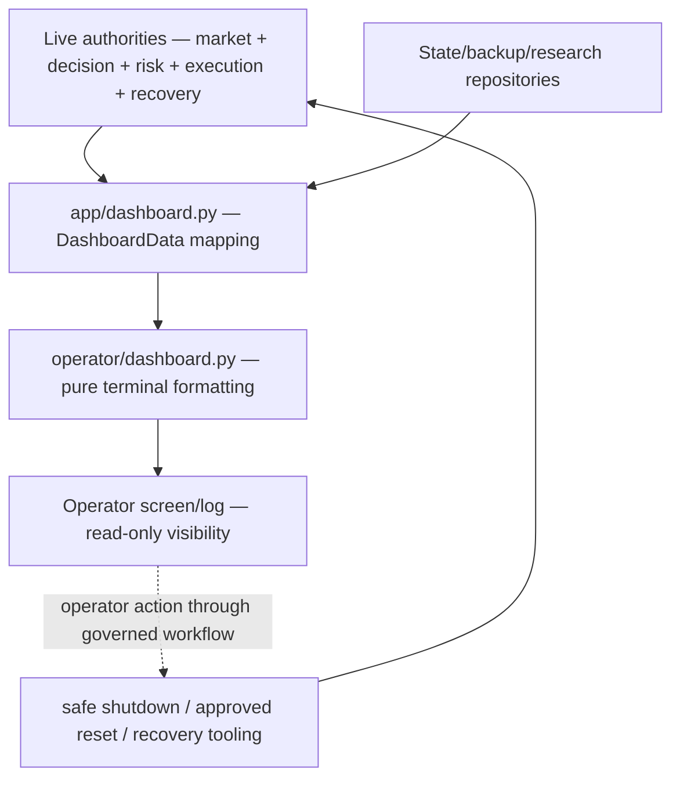

# GoldSwingTraderAI — Dashboard and UX

**Status:** PROVISIONAL — OPERATOR-VISIBILITY CONTRACT
**Version:** 0.10-implementation
**Authority:** Main terminal dashboard information architecture, operator visibility, reason presentation and restrained emoji usage.
**Depends on:** `../20-trading-decisions/SCORING_AND_DECISION_FUSION.md`, `../30-risk-execution/RISK_CONTRACT.md`, `../30-risk-execution/EXECUTION_AND_BROKER_SAFETY.md`, `../60-engineering/SYSTEM_HEALTH_AND_DIAGNOSTICS.md`

## Purpose

The dashboard answers at a glance:

- what the market is doing;
- what the bot currently thinks;
- why it entered, waits, missed, invalidated or is blocked;
- what risk/execution authority says;
- what is happening to an open managed trade;
- whether learning/discovery, persistence/backup and system health are healthy.

The dashboard **observes authoritative state; it never defines trading behaviour or broker-write permission.**

## Dashboard dataflow

The dashboard has a one-way presentation flow. It receives already-decided
facts and renders them; a refresh cannot cause a second decision.



The DTO mapper may summarize or label data but must not recalculate a risk
percentage, infer a blocker, create a strategy score or invoke MT5. Stable
reason codes stay machine-readable; human explanations make those reasons
understandable without changing their meaning.

### Readiness monitor frame

The default READINESS launcher has no strategy, risk or execution result yet.
It therefore uses a separate compact frame rather than displaying invented
WAIT, score or permission values. The frame is emitted after every snapshot,
including retryable stale/insufficient/sparse data:

~~~mermaid
flowchart TB
    MT5["MT5Reader + MarketSnapshotBuilder"] --> MAP["app/dashboard.py — build_readiness_dashboard_data"]
    MAP --> DTO["ReadinessDashboardData — market/read facts only"]
    DTO --> RENDER["operator/dashboard.py — render_readiness_dashboard"]
    RENDER --> SCREEN["Terminal — WAIT / freshness / DEMO / write lock"]
    SCREEN -.->|"Ctrl+C only"| STOP["Safe operator stop"]
~~~

The readiness frame shows symbol, account mode, DEMO guard, identity result,
Bid/Ask/spread, quote age, data quality, completed-candle counts, exact data
issues and the next poll interval. It explicitly shows BROKER WRITES DISABLED
and STRATEGY NOT RUN. It does not calculate indicators, scores, risk,
session/news permission or execution authority. A fresh snapshot ends the
readiness wait, but READINESS remains read-only; the full Decision/Risk/
Execution dashboard belongs to the governed persistent runtime.

| Panel | Source of truth | Refresh concern |
|---|---|---|
| Market | MarketSnapshot/IntelligenceSnapshot | show freshness and completed-candle boundary |
| Decision | DecisionSnapshot/RuntimeCycleResult | preserve BUY/SELL, timing, coverage and exact reason |
| Risk | RiskEvaluation + risk state | never recalculate sizing or daily P/L in UI |
| Execution | gate, intent, controller, reconciliation | show ALLOW/BLOCK/UNKNOWN and lifecycle state |
| Open trade | broker-verified ManagedTrade | show immutable original R and current SL/TP separately |
| Learning/discovery | durable research registry/status | show stage/health, never imply broker authority |
| Backup/health | persistence/health DTOs | show stale/failed state prominently |

## Implementation ownership and proof boundary

Implemented owner:

```text
app/dashboard.py — authoritative DTO mapping
operator/dashboard.py — pure terminal rendering
operator/__init__.py — public presentation API
```

The V1 renderer is pure standard-library terminal presentation. `DashboardData`
receives already-authoritative cycle facts and `render_dashboard()` only formats
them. `ReadinessDashboardData` receives only the normalized MT5 snapshot/readiness
facts and `render_readiness_dashboard()` formats the pre-cycle wait frame.
`app/dashboard.py` maps both contracts without invoking strategy, risk, gate or
broker-write code.

Deterministic tests prove the renderer itself has no MT5/risk/gate authority
and preserves useful prior GoldScalperAI visibility. The readiness launcher
supplies its DTO after every read poll; the persistent runtime supplies the full
DTO after startup/recovery and each cycle. Terminal in-place refresh and final
Windows visual verification remain operator polish/evidence, not a second
trading authority.

## UX principles

- compact and decision-focused;
- stable English machine terms/reason codes;
- concise English/Roman-Urdu explanations where useful;
- meaningful emojis only;
- normal `WAIT` must not look like a system fault;
- final Execution Permission must remain visible;
- useful prior dashboard facts must not be removed merely for visual minimalism;
- optional analysis must not be presented as a hard gate;
- refresh must never create strategy triggers or broker writes.

## GoldScalperAI visibility preservation rule

Preserve or improve whenever available:

- account mode / DEMO guard / runtime role;
- XAU symbol;
- Bid / Ask;
- live spread and spread quality;
- M5 candle time remaining;
- concise H4/H1/M15/M5 structure;
- EMA20 / EMA50;
- RSI;
- ATR;
- current decision/action + exact reason;
- Account Profile / proposed risk / lot;
- daily Account Safety P/L, limit and remaining budget;
- position count/capacity;
- loss streak/cooldown;
- open-trade entry/current price/original/current SL/TP/objectives/R context.

Add Decision, Execution, Learning/Discovery, Backup/State and System Health visibility around that core.

## Optional technical confluence visibility

Trendline/Fibonacci/POC may be shown compactly when the authoritative intelligence snapshot provides them.

Example:

```text
Confluence  TL M15 SUPPORT TOUCH | Fib BUY 0.618 | POC NEAR (tick-vol)
```

Rules:

- these are **context/bonus evidence**, not hard permission;
- missing confluence should normally display `—`/`N/A`, not a red failure;
- POC source should distinguish real volume from tick-volume approximation where useful;
- UI must not recompute trendlines/Fibonacci/POC independently from intelligence state;
- UI must not imply `3/3 confluence required`.

## Emoji / text markers

```text
🌍 MARKET        ⚖️ DECISION       📈 OPEN TRADE
🛡️ RISK          ⚙️ EXECUTION      🧠 LEARNING
💾 STATE/BACKUP  🩺 HEALTH          💬 WHY

✅ PASS/HEALTHY
🟡 WAIT/CAUTION
🔴 BLOCK/ERROR
⚠️ DEGRADED
```

Plain-text fallback must preserve semantics.

## Header / Market panel

Header should expose project, symbol, account mode, DEMO guard, controller role, Account Profile, UTC time, M5 countdown and market/session state.

Market panel may show:

- Bid / Ask / spread + spread state;
- H4/H1/M15/M5 structure;
- EMA20/EMA50;
- RSI;
- ATR;
- volatility/momentum/session/news;
- optional Trendline/Fibonacci/POC confluence.

Visible market tools remain supporting context; UI visibility does not turn them into trade gates.

## Decision panel

Show at least:

- BUY Thesis score;
- SELL Thesis score;
- Opportunity Score;
- Entry Timing Score;
- Evidence Coverage;
- leading strategy family;
- final action;
- exact reason code.

Example:

```text
⚖️ DECISION    🟡 WAIT
BUY 84 | SELL 28 | Opportunity 82 | Entry 58 | Coverage 92%
Strategy TREND_PULLBACK_CONTINUATION
Reason ENTRY_EXTENDED
```

Never collapse every non-trade into generic `NO TRADE`.

## Human reason explanation

Stable reason code remains primary; concise explanation may follow.

Examples:

```text
ENTRY_EXTENDED
Entry extended hai; setup valid ho sakta hai, better timing ka wait.
```

```text
MIN_LOT_UNAFFORDABLE
Current setup par broker minimum lot actual risk ceiling se bahar hai.
```

```text
PRE_CLOSE_FLATTEN
Scheduled close qareeb hai; managed trade governed close path par hai.
```

Renderer must not invent a reason different from the authoritative subsystem.

## Risk panel

Display supplied authoritative facts:

- Account Profile;
- risk state;
- proposed all-in risk %;
- proposed lot;
- Day Safety P/L;
- daily limit/remaining budget;
- position count/capacity;
- loss streak;
- cooldown.

UI must not recalculate sizing/daily loss/broker risk.

## Execution panel

Example:

```text
⚙️ EXECUTION   ✅ ALLOW
Controller PRIMARY | Epoch 12
Reconcile COMPLETE | Reason EXECUTION_READY
```

Relevant details may include account identity, DEMO guard, Intent lifecycle and primary blocker.

Dashboard does not independently call execution permission or raw MetaTrader5 functions.

## Session/news visibility

Show as applicable:

- OPEN / PRE_CLOSE / CLOSED / REOPEN_WARMUP;
- PRE_CLOSE countdown/flatten requirement;
- reopen clean-M5 progress;
- NEWS_CLEAR / BLACKOUT / UNKNOWN / POST_NEWS_WARMUP;
- next event/tier/countdown.

Mandatory PRE_CLOSE flatten remains prominent even if market continuation is otherwise strong.

## Open Trade panel

Prioritize:

- direction;
- entry/current price;
- original/current SL;
- current broker TP;
- Primary / Expansion / Runner objectives;
- current R based on immutable original R;
- Trade Manager action;
- exact management reason.

Open-trade display never grants MODIFY/CLOSE authority.

## Learning / Discovery / State / Health

Phase-10 research foundation now exists, so the UI contract should support compact fields such as:

```text
🧠 Learning         ACTIVE / PENDING / DEGRADED
Discovery Health    IDLE / HEALTHY / DEGRADED
Candidate           CAND_... / NONE
Candidate Stage     PROPOSED / VALIDATING / ...
Suppression Reason  ...
💾 Backup/State     VERIFIED / STALE / FAILED / PENDING
🩺 Health           HEALTHY / DEGRADED / BLOCKED
```

Discovery must not be silently inert. If eligible evidence cannot be processed into a candidate or explicit suppression reason, `DISCOVERY_DEGRADED` should be visible once runtime wiring supplies that state.

Normal `WAIT`, `NEWS_BLACKOUT` or `LOSS_LOCKED` are not automatically system faults.

## Runtime roles

Visually distinguish:

```text
PRIMARY
STANDBY
OBSERVER
RESEARCH
RECOVERING / RECONCILING
```

Only authoritative controller/execution state decides write capability.

## Operator controls

Main V1 dashboard remains mostly read-only. Do not add casual controls for changing strategy weights, bypassing safety, forcing entries or promoting research candidates.

Governed actions may include safe shutdown, permitted manual loss-reset confirmation and portable export/recovery workflows when implemented.

## Renderer contract

`DashboardData` and `OpenTradeView` are presentation DTOs. They intentionally do not depend on Risk Engine, Strategy Floor, MetaTrader5 or Execution Gate internals.

Changing dashboard code must not change trading behaviour.

## Tests required

- WAIT vs BLOCKED vs OPEN TRADE rendering;
- stable reason + concise explanation;
- Bid/Ask/spread/M5 timer/structure/EMA/RSI/ATR visibility;
- optional confluence visibility must not imply hard failure when absent;
- risk/lot/day-P&L/position/loss-streak/cooldown visibility;
- Execution Permission/controller/epoch/reconciliation visibility;
- open trade SL/TP/objective/manager visibility;
- Discovery Health/candidate/suppression visibility once runtime DTO wiring exists;
- conventional signed money formatting;
- text fallback;
- readiness-frame visibility for stale/insufficient/sparse data, DEMO/identity
  facts, candle counts, exact data issues and explicit broker-write lock;
- source-level absence of raw broker/risk/execution authority;
- integration proof that refresh cannot create duplicate decisions/writes.

## Explicit non-goals

Dashboard must not:

- become a second strategy/risk/execution specification;
- place/modify/close trades because screen refreshed;
- hide blockers behind generic `NO TRADE`;
- remove useful facts solely for minimalism;
- overwhelm primary view with every FVG/swing/log row;
- turn Trendline/Fibonacci/POC into red/green mandatory gates;
- require manual parameter tuning for normal operation;
- introduce web/UI framework without real requirement.
- turn the readiness monitor into a strategy, risk or execution authority;
- hide the stale-data wait behind JSON logs when the terminal monitor is running.

## Runtime wiring

- READINESS renders a separate read-only frame after every normalized snapshot,
  including retryable stale/insufficient/sparse polls;
- persistent M5 loop refreshes the DTO after each fresh cycle;
- Discovery Health, latest candidate/stage and suppression reason are read from durable research state when present;
- backup failure is shown as `FAILED` and degrades system health;
- recovery/controller/session-news reasons remain sourced from live authorities.

## Remaining integration/polish work

- actual in-place terminal refresh loop/screen dimensions;
- final safe-shutdown/export controls;
- live Windows terminal visual verification.
