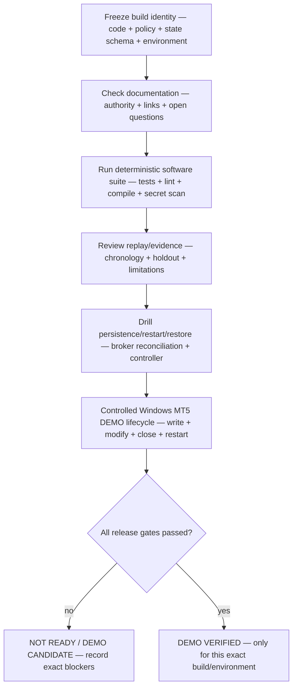

# GoldSwingTraderAI — Final Release Audit

**Status:** DRAFT TEMPLATE
**Version:** 0.6-design
**Authority:** Evidence-backed release snapshot for the exact build being audited.
**Depends on:** `RELEASE_CHECKLIST.md`, `TESTING_AND_VERIFICATION.md`

## Purpose

This is a template until an implementation/release candidate exists. It reports what actually passed, failed or remains pending for the exact code/config/policy/data versions under audit.

> **Do not pre-fill PASS. Evidence is added only after the corresponding test actually executes.**

## Audit inputs and owners

| Audit input | Owner | Evidence form |
|---|---|---|
| Contract identity and cross-document coverage | `docs/README.md`, `90-governance/`, `DOCUMENTATION_STANDARD.md` | exact links, authority map and freeze classification |
| Deterministic software proof | `TESTING_AND_VERIFICATION.md` | test/lint/compile/secret-scan output |
| Research evidence | `40-research-learning/` | dataset/evidence manifest, chronology and holdout record |
| Recovery and controller proof | `30-risk-execution/` | restore/reconciliation/fencing drill records |
| Connected broker/DEMO proof | operator runbook and MT5 logs | account, symbol, order lifecycle and restart evidence |

The audit records the scope and limitation of every item. A source file or
completed Markdown section is not evidence by itself.

## Audit decision flow

The audit is a proof assembly process. It records evidence for the exact build
and stops at the first release-blocking boundary.



“Pass” has scope. A deterministic unit test can prove a state transition; it
cannot prove a broker terminal. A walk-forward package can prove reproducible
historical evidence; it cannot prove future profitability. The audit must keep
these evidence types in separate rows.

## Build identity

```text
Release Version:
Commit/Tag:
Policy Version:
Strategy Versions:
Risk Policy Version:
Execution Policy Version:
State Schema Version:
MT5/Broker DEMO Environment:
Execution Controller ID:
Controller Fencing Epoch:
Audit Timestamp:
```

## Documentation status

```text
Core design docs frozen/classified: PENDING
Cross-doc contradiction audit:      PENDING
Open questions/freeze matrix:       PENDING
Build/recovery guide current:        PENDING
Coder/module/operator docs:          PENDING
Root README/current phase status:    PENDING
Final Build Prompt current:          PENDING
```

## Software verification

Current local software evidence snapshot for branch `codex/complete-runtime`
(2026-09-19; not a release sign-off): `PYTHONPATH=src:. pytest -q` =
**275 passed**; Ruff check = **PASS**; source/script annotation check =
**PASS**; Python compile check = **PASS**; financial-secret scan = **PASS**;
`git diff --check` = **PASS**. The strict persisted-state, broker-read
exception, non-finite configuration, standby-retry, strict portable-manifest and
runtime integration regressions are included in this count. The Windows/MT5
acquisition command and walk-forward evidence-package command are implemented,
but this workspace has
not produced real-XAU or broker-connected evidence.

The CI workflow additionally runs the full dependency-installed suite with a
coverage report artifact. The local snapshot above is the reproducible software
checkpoint available in this workspace; it is intentionally not a DEMO release
sign-off and no real-environment result is inferred from it.

```text
Unit / contract tests:              PASS — local deterministic suite (275 passed)
Replay / no-lookahead:              PASS — deterministic replay/chronology tests
Trendline/Fib/POC causality:        PASS — deterministic causal confluence tests
Confluence bonus-only invariant:    PASS — deterministic score/gate tests
Integration tests:                  PASS — injected MT5/startup/runtime composition
Positive DEMO guard:                PASS — software contract; connected account PENDING
Execution Permission Gate:          PASS — deterministic authority/gate tests
Broker-write bypass audit:          PASS — source ownership + execution tests
Controller lease/fencing:           PASS — deterministic lease/SQLite tests
Crash recovery:                     PASS — durable intent/recovery tests
SQLite persistence/recovery:        PASS — checksum/schema/restore tests
Laptop migration/restore:           PENDING
Financial-secret scan:              PASS — repository scan
```

Use actual counts when available.

## Windows MT5 readiness evidence

Recorded from the controlled Windows operator run on 2026-09-19 against the
runtime branch at commit `4ad6ab20c872270142fee9cd83479a298782e415`:

```text
Command: python -m goldswingtraderai
Account mode: DEMO
Symbol: XAUUSDm
Identity pins: PASS (not configured; runtime identity check PASS)
DEMO guard: PASS
Broker writes: NOT PERFORMED (READINESS mode)
Market data quality: STALE
Quote age: 47298.8 seconds (> 10.0 second readiness threshold)
H4/H1/M15/M5 completed candles: STALE
```

This proves the Windows terminal can be initialized and the connected account
was positively identified as DEMO for a read-only readiness snapshot. It does
not prove fresh market-data readiness, persistent PRIMARY operation, order
lifecycle, restart reconciliation or failover. The stale-data result must be
rechecked while the terminal is receiving fresh XAUUSDm ticks.

## Broker DEMO verification

```text
Final persistent runtime wired:     SOFTWARE FOUNDATION PASS; LIVE EVIDENCE PENDING
Connected account DEMO verified:    PARTIAL PASS — readiness log; lifecycle pending
DEMO Guard PASS:                    PARTIAL PASS — readiness log; lifecycle pending
Account/symbol verification:        PARTIAL PASS — XAUUSDm; freshness stale
Order lifecycle:                    PENDING
One-shot duplicate prevention:      PENDING
Ambiguous ACK reconciliation:       PENDING
Spread/price-drift guards:          PENDING
SL/TP modify/close:                 PENDING
PRE_CLOSE flatten/reopen:           PENDING
Shared controller/failover backend: PENDING
Restart with broker state:          PENDING
End-to-end DEMO lifecycle:          PENDING
```

V1 audit scope is DEMO execution only. This template does not define a separate REAL authorization/release state.

## Trading research evidence

```text
Historical replay period:
Independent validation:
Final holdout:
Stress / walk-forward:
Trades:
Net R:
Average R:
Profit Factor:
Max Drawdown:
Opportunity Recall:
Missed meaningful moves:
Entry Efficiency:
Capture Efficiency:
Premature Exit Cost:
2R/3R/4R reach metrics:
Normalized 100/200/300+ move metrics:
Trade frequency:
PRE_CLOSE exit analysis:
Known limitations:
```

## Optional confluence evidence

Record ablation separately rather than assuming Trendline/Fibonacci/POC improve results:

```text
Base strategy metrics:
Base + Trendline:
Base + Fibonacci:
Base + POC:
Base + bounded combined confluence:
Opportunity Recall change:
Missed-move change:
Trade-frequency change:
Net-R / DD / Capture change:
Decision: KEEP / TUNE / REMOVE / MORE EVIDENCE
```

The release audit must confirm optional confluence did not silently become a mandatory filter.

## Learning / autonomous evidence

```text
StrategyMemory:                   PENDING
Entry Learning:                   PENDING
Exit Learning:                    PENDING
Research Episode Journal:         PENDING
Discovery Liveness:               PENDING
Confluence primitive mapping:     PENDING
Autonomous Candidate Registry:    PENDING
Rejected/Duplicate Memory:        PENDING
Arbitrary-code guard:             PENDING
Self-promotion guard:             PENDING
Shadow governance:                PENDING
DEMO Canary governance:           PENDING
```

Discovery Liveness passes only when eligible recurring evidence demonstrably produces either a durable candidate or an explicit governed suppression reason. Silent eligible-evidence loss is failure/degraded evidence, not PASS.

## Persistence / disaster recovery

```text
Risk/order/trade restore:        PENDING
Execution Intent restore:        PENDING
Strategy Registry restore:      PENDING
Research journal restore:       PENDING
Candidate/rejected memory:      PENDING
Learning restore:               PENDING
Promotion history restore:      PENDING
Backup integrity:               PENDING
Public backup content check:    PENDING
Financial-secret exclusion:     PENDING
Fresh-machine restore drill:    PENDING
Broker reconciliation restore:  PENDING
```

## Operator / diagnostics

```text
Why-no-trade attribution:         PENDING
DEMO Guard visibility:            PENDING
Execution Permission reasons:     PENDING
Controller/epoch visibility:      PENDING
PRE_CLOSE/reopen visibility:      PENDING
Confluence/context visibility:    PENDING
Discovery Health visibility:      PENDING
System Health:                    PENDING
Backup visibility:                PENDING
Emoji/text fallback:              PENDING
Setup/run/manual docs:            PENDING
```

## Outstanding failures / pending work

List every unresolved item. Do not hide pending forward sample, known broker limitation, missing runtime orchestration, untested backup/failover, or unverified research feature.

## Final decision

One of:

```text
NOT READY
DEMO CANDIDATE
DEMO CANARY
MAIN DEMO
DEMO VERIFIED
```

No additional account-mode release state is implied by `DEMO VERIFIED`.

## Auditor note

The audit describes exact evidence that exists. Documentation completion is not implementation proof; deterministic CI is not live DEMO proof; historical backtesting is not a guarantee of profitability.
