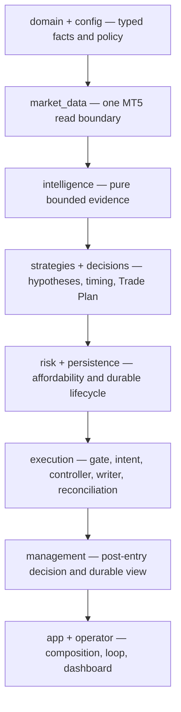
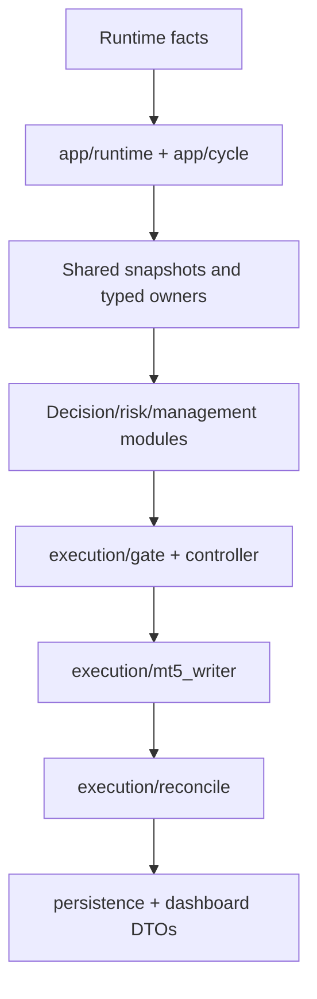
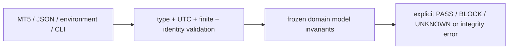

# GoldSwingTraderAI — Module Structure

**Status:** PROVISIONAL — MODULE MAP
**Version:** 3.4-implementation-map
**Authority:** File/module ownership map and dependency direction. It does **not** redefine trading behaviour.
**Depends on:** `CODING_STANDARD.md`, `../CODER_GUIDE.md`, `../00-foundation/ARCHITECTURE.md`

## Purpose

This document maps every runtime package to one primary responsibility and
shows allowed dependency direction. It answers where a new feature belongs,
which imports are forbidden and which tests protect the boundary; behavioural
meaning remains in the domain authority documents.

## Core engineering rule

> **One primary owner per responsibility; facts flow forward; irreversible broker authority stays narrow and last.**

## Package shape and dependency map

```text
src/goldswingtraderai/
├── app/
│   ├── main.py
│   ├── recovery.py
│   ├── recovery_mt5.py
│   ├── runtime.py
│   ├── session_news.py
│   ├── cycle.py
│   ├── loop.py
│   └── dashboard.py
├── config/
├── diagnostics/
├── domain/
│   └── market.py
├── market_data/
│   ├── mt5_reader.py
│   └── snapshot.py
├── intelligence/
├── strategies/
├── decisions/
├── risk/
├── persistence/
│   ├── store.py
│   ├── runtime_state.py
│   ├── checkpoint.py
│   ├── backup.py
│   └── publication.py
├── execution/
│   ├── controller.py
│   ├── sqlite_coordination.py
│   ├── gate.py
│   ├── intent_store.py
│   ├── mt5_writer.py
│   ├── reconcile.py
│   └── service.py
├── management/
├── operator/
├── security/
└── research/

scripts/
├── run_walk_forward.py       # verified bundle → immutable evidence package
├── acquire_mt5_dataset.py    # read-only Windows/MT5 exact-count acquisition
├── stage_public_backup.py    # local public-safe backup staging only
└── restore_runtime_checkpoint.py
```

## Dependency direction

```text
domain/config
→ market_data
→ intelligence
→ strategies
→ decisions
→ risk/persistence
→ execution
→ management
→ operator

MT5Reader
→ normalized Account/Symbol/Quote/Candles/OpenPosition facts
→ app/recovery_mt5
→ app/recovery

StateStore → checkpoint → backup → restored StateStore → app/recovery
CoordinationStore → ControllerLeaseManager → recovery takeover gate → execution
MT5Reader + durable owners → app/runtime → app/recovery → app/cycle → app/loop
provider snapshot → app/session_news → risk/permissions + intelligence/news
```

The execution package remains the only raw irreversible MT5-write owner.

## Executable dependency map

The package tree is organized by authority, not by the order in which files
happened to be created. Each arrow is a permitted information dependency. The
write boundary is intentionally at the far end of the graph.

## File-level ownership index

The package table above explains boundaries; this index names the maintained
files that a coder normally opens for each responsibility. A new file must be
added to the appropriate row and to the feature-level [Coder Guide](../CODER_GUIDE.md)
before the change is considered documented.

| File(s) | Responsibility | First authority to read | Main proof |
|---|---|---|---|
| `app/main.py`, `app/__init__.py`, `__main__.py` | launcher modes, readiness monitor, runtime selection and terminal sinks | `00-foundation/ARCHITECTURE.md`, `SETUP_AND_RUN_GUIDE.md` | `test_app_readiness.py`, `test_live_startup_runtime.py` |
| `app/runtime.py`, `app/startup.py`, `app/recovery.py`, `app/recovery_mt5.py` | live dependency composition, RecoveryAuthorities, startup recovery and broker-truth adapter | `PERSISTENCE_RESTART_AND_RECOVERY.md`, `EXECUTION_AND_BROKER_SAFETY.md` | `test_startup_recovery.py`, `test_recovery_mt5.py`, `test_live_startup_runtime.py` |
| `app/cycle.py`, `app/loop.py` | one governed entry/management cycle, M5 scheduling, heartbeat, stale wait, backup cadence and shutdown | `ARCHITECTURE.md`, `CODER_GUIDE.md` Phase 12 | `test_runtime_loop.py`, `test_live_startup_runtime.py` |
| `app/session_news.py` | provider-neutral JSON handoff and scope/freshness validation | `SESSION_NEWS_PROVIDER_CONTRACT.md` | `test_session_news_provider.py` |
| `app/dashboard.py` | authoritative runtime facts → presentation DTO mapping | `DASHBOARD_AND_UX.md` | `test_dashboard.py`, `test_app_readiness.py` |
| `config/settings.py` | validated environment/configuration and explicit runtime/state modes | `SYSTEM_CONTRACT.md`, `SETUP_AND_RUN_GUIDE.md` | `test_settings.py` |
| `domain/enums.py`, `domain/ids.py`, `domain/market.py`, `domain/models.py` | shared vocabulary, identity and immutable normalized facts | `SYSTEM_CONTRACT.md` | `test_ids.py`, `test_models.py` |
| `diagnostics/logging.py`, `diagnostics/reasons.py` | structured redacted logging and stable reason vocabulary | `SYSTEM_HEALTH_AND_DIAGNOSTICS.md`, `CODING_STANDARD.md` | `test_logging.py`, `test_coding_contract_regressions.py` |
| `security/financial_secrets.py` | financial-authority secret detection | `CODING_STANDARD.md`, `DOCUMENTATION_STANDARD.md` | `test_secret_scanner.py` |
| `market_data/mt5_reader.py`, `market_data/snapshot.py` | single read boundary and normalized MarketSnapshot | `MARKET_DATA_AND_HISTORY.md` | `test_market_data.py`, `test_intelligence_snapshot.py` |
| `intelligence/candle_structure.py`, `technical.py`, `liquidity.py`, `indicators.py`, `confluence.py`, `snapshot.py` | shared chronological market evidence | `10-market-intelligence/` | `test_intelligence_core.py`, `test_technical_confluence.py`, `test_technical_liquidity.py`, `test_intelligence_snapshot.py` |
| `intelligence/session.py`, `intelligence/news.py` | soft session/context facts and event/news normalization | `SESSION_CONTEXT.md`, `FUNDAMENTAL_AND_NEWS.md` | `test_session_news_provider.py`, `test_session_news_permissions.py` |
| `strategies/floor.py`, `strategies/confluence.py` | six family hypotheses and bounded optional confluence | `STRATEGY_FLOOR.md` | `test_strategy_decisions.py`, `test_technical_confluence.py` |
| `decisions/fusion.py`, `decisions/snapshot.py`, `opportunity.py`, `timing.py` | BUY/SELL fusion, lifecycle, timing and attribution | `SCORING_AND_DECISION_FUSION.md`, `ENTRY_TIMING.md` | `test_strategy_decisions.py` |
| `decisions/trade_plan.py` | structural entry, invalidation, objectives and immutable original R | `TRADE_PLAN.md` | `test_trade_plan_risk.py` |
| `risk/engine.py`, `risk/state.py`, `risk/permissions.py` | risk evaluation, risk-day state and hard permission composition | `RISK_CONTRACT.md`, `SESSION_AND_RISK_STATE_MACHINE.md` | `test_trade_plan_risk.py`, `test_risk_state_regressions.py`, `test_session_news_permissions.py` |
| `execution/checks.py`, `gate.py`, `service.py`, `models.py`, `intent_store.py` | hard checks, ALLOW/BLOCK/UNKNOWN gate and one-shot Intent lifecycle | `EXECUTION_AND_BROKER_SAFETY.md` | `test_execution_safety.py` |
| `execution/mt5_writer.py`, `reconcile.py` | narrow irreversible request boundary and broker verification | `EXECUTION_AND_BROKER_SAFETY.md` | `test_execution_safety.py`, `test_recovery_mt5.py` |
| `execution/controller.py`, `sqlite_coordination.py` | lease, renewal and monotonic fencing | `EXECUTION_AND_BROKER_SAFETY.md`, `PERSISTENCE_RESTART_AND_RECOVERY.md` | `test_sqlite_coordination.py`, `test_live_startup_runtime.py` |
| `management/models.py`, `manager.py`, `store.py`, `execution.py` | Trade Manager decisions, managed state and governed modify/close | `TRADE_MANAGER_AND_EXIT.md` | `test_trade_manager.py`, `test_management_execution.py` |
| `persistence/store.py`, `runtime_state.py` | SQLite records/events, checksums and strict typed recovery | `PERSISTENCE_RESTART_AND_RECOVERY.md` | `test_persistence_recovery.py`, `test_coding_contract_regressions.py` |
| `persistence/checkpoint.py`, `backup.py`, `publication.py` | portable restore, verified backups/catalog and public-safe staging | `PERSISTENCE_RESTART_AND_RECOVERY.md` | `test_runtime_checkpoint.py`, `test_backup_catalog.py`, `test_operator_scripts.py` |
| `operator/dashboard.py`, `operator/__init__.py` | pure readiness/full-cycle DTO contracts and terminal renderers | `DASHBOARD_AND_UX.md` | `test_dashboard.py` |
| `research/replay.py`, `management_replay.py`, `session_history.py`, `outcomes.py`, `metrics.py` | chronological replay and actual/counterfactual metrics | `RESEARCH_AND_VALIDATION.md` | `test_research_validation.py`, `test_management_replay.py`, `test_research_outcomes.py`, `test_research_session_history.py` |
| `research/datasets.py`, `acquisition.py`, `evidence.py`, `packages.py`, `validation.py`, `stress.py`, `ablation.py` | portable data/evidence identity, acquisition and validation | `RESEARCH_AND_VALIDATION.md` | corresponding `test_research_*.py`, `test_walk_forward_script.py` |
| `research/learning.py`, `episode_journal.py`, `discovery.py`, `invention.py`, `promotion.py` | learning, liveness, declarative candidates and promotion governance | research folder contracts | `test_discovery_*.py`, `test_promotion_governance.py`, `test_research_session_history.py` |
| `scripts/*.py` | explicit dataset, walk-forward, backup, restore and secret-scan operator boundaries | `SETUP_AND_RUN_GUIDE.md`, research/recovery authorities | `test_operator_scripts.py`, `test_walk_forward_script.py`, `test_secret_scanner.py` |



Research is a separate offline branch. It may reuse domain/intelligence/
decision semantics for replay, but it cannot import the production writer or
turn a candidate into runtime authority.



The app package composes dependencies; it does not own their trading policy.
The domain packages calculate from explicit inputs; they do not discover
global runtime state. This distinction keeps unit tests deterministic and
prevents a convenience import from becoming a hidden authority path.

## Module ownership matrix

| Package/module | Primary responsibility | Allowed inputs | Forbidden responsibility |
|---|---|---|---|
| domain | shared enums, IDs and normalized value contracts | explicit primitive/domain values | broker calls, policy duplication |
| config | validated settings and operator-selected modes | environment/CLI values | silently changing risk or safety rules |
| market_data | MT5 connection and normalized read facts | MetaTrader5 terminal | order_send, strategy decisions |
| intelligence | structure, levels, liquidity, quant, session/news facts | immutable market snapshot and provider facts | broker writes, monetary permission |
| strategies | six family hypotheses and optional bounded confluence | IntelligenceSnapshot | lot sizing, controller checks |
| decisions | fusion, timing, Trade Plan and opportunity lifecycle | strategy evidence + intelligence + state | MT5 access, final permission |
| risk | monetary risk, account profiles, risk-day state, hard permission facts | plan, account, exposure, session/news | strategy score or broker send |
| persistence | SQLite records/events, checkpoints, backups, typed repositories | explicit domain records | broker truth, publication credentials |
| execution | gate, intent lifecycle, controller/fencing, writer, reconciliation | authoritative traces and fresh broker facts | inventing strategy or silently retrying |
| management | HOLD/PROTECT/TRAIL/RUNNER/EXIT decision and managed-trade mapping | fresh evidence + durable trade | raw broker write |
| app | startup composition, recovery authorities, cycle scheduling, shutdown | configured owners and runtime facts | duplicating domain policy |
| operator | DTO mapping and terminal rendering | authoritative runtime results | recalculation or side effects |
| research | replay, validation, stress, discovery, invention, promotion | immutable datasets and evidence | production write authority |
| security | secret scanning and public-safe boundary checks | files/artifacts | storing or publishing credentials |

## Runtime entry-point trace

| Runtime moment | First owner | Next owners | Durable/visible result |
|---|---|---|---|
| process start | app/main.py | app/runtime.py → app/startup.py | startup result and recovery state |
| stale readiness data | app/main.py | config/settings.py → MT5Reader/MarketSnapshotBuilder → app/dashboard.py → operator/dashboard.py | readiness frame, read-only wait log and next poll |
| broker truth capture | market_data/mt5_reader.py | app/recovery_mt5.py | MT5RecoveryTruth |
| authority assembly | app/startup.py | risk/permissions.py, execution/controller.py, app/recovery.py | RecoveryAuthorities aggregate |
| M5 boundary | app/loop.py | app/runtime.py → app/cycle.py | RuntimeCycleResult |
| pre-READY market-data wait | app/loop.py | app/runtime.py → controller + capture_cycle | heartbeat and refreshed recovery state; no cycle/write |
| entry request | app/cycle.py | decisions → risk → execution | ExecutionIntent and verified outcome |
| open-trade decision | app/cycle.py | management → execution | managed-trade update or close outcome |
| heartbeat | app/loop.py | app/runtime.py → controller | renewed lease or fail-closed stop |
| backup | app/loop.py | persistence/backup.py → publication boundary | verified local catalog entry |
| operator view | app/dashboard.py | operator/dashboard.py | read-only readiness/cycle DTOs and renderers |
| offline research | scripts or research entry point | research modules | dataset/evidence/candidate artifact |

## Code-placement decision tree

When adding a feature, answer these questions in order:

1. Is the input a raw broker row? Normalize it in market_data/domain.
2. Is the output descriptive market evidence? Put it in intelligence.
3. Is it a directional family hypothesis? Put it in strategies.
4. Is it an action/timing/structural plan? Put it in decisions.
5. Is it affordability or hard permission? Put it in risk or execution,
   according to the owning contract.
6. Is it durable state or recovery mechanics? Put it in persistence/app.
7. Is it post-entry behaviour? Put the decision in management and the write
   request in execution.
8. Is it presentation? Map it in app/dashboard and render it in operator.
9. Is it historical/offline evidence? Keep it in research and scripts.

Do not solve a cross-cutting need by importing app/runtime into a pure
calculator, importing MetaTrader5 into a strategy, or copying an authority
calculation into the dashboard. Introduce a typed input/output contract at the
boundary instead.

## Ownership

### `domain/market.py`
Shared normalized broker/market DTOs. `OpenPositionFacts` is read-only current exposure truth and does not confer bot ownership.

### `market_data/mt5_reader.py`
Single narrow runtime MetaTrader5 read boundary for account facts, symbol resolution/specification, quote, completed candles and current open positions.

`open_positions(symbol)` rules:

- empty broker collection = verified empty current exposure;
- `None`/missing getter = `DATA_UNAVAILABLE`, not zero exposure;
- invalid direction/symbol/geometry/duplicate ticket = `DATA_CORRUPT`;
- MT5 zero SL/TP = explicit `None`;
- deterministic ticket ordering.

No `order_send` belongs here.

### `app/recovery_mt5.py`
Read-only adapter that composes existing `MT5Reader` facts into `MT5RecoveryTruth`:

```text
BrokerRecoverySnapshot
+ verified SymbolSpec
+ price_tolerance = tick_size
```

It never imports/calls raw MetaTrader5 directly and cannot create a second broker read authority.

### `app/recovery.py`
Startup recovery sequencing owner: persistence integrity, Intent/ManagedTrade recovery, hard authorities and controller takeover completion. No raw broker writes.

### `app/runtime.py`
Live startup composition owner. It reuses the initialized `MT5Reader`, selects
explicit local state mode, builds the account/symbol-scoped repositories,
controller/reconciler and `RecoveryAuthorities`, then delegates recovery to
`StartupRecoveryService`/`StartupRecoveryCoordinator`, and assembles the shared
`MT5Writer`/`ExecutionService` instances used downstream. It does not contain
strategy policy or raw broker writes. The session/news provider is injectable;
missing truth is fail-closed UNKNOWN.

### `app/session_news.py`

Provider-neutral JSON handoff owner. It validates schema, account/server/symbol
scope, UTC/freshness and raw event/session facts, then delegates all permission
meaning to `intelligence/news.py` and `risk/permissions.py`. It never writes
broker state, stores credentials or silently converts provider failure to clear.

### `app/cycle.py`, `app/loop.py`, `app/dashboard.py`

`app/cycle.py` owns one fresh strategy → timing → Trade Plan → risk → gate →
Intent/ExecutionService cycle and post-entry Trade Manager cycle. `app/loop.py`
owns M5 scheduling, 10-second lease renewal, the narrow pre-READY wait for
retryable stale/insufficient/sparse market data, local verified backup cadence,
standby retry after explicit `ANOTHER_ACTIVE_CONTROLLER` contention, full-cycle
dashboard refresh and safe shutdown. `app/main.py` owns the separate read-only
READINESS monitor, its validated poll settings and readiness-dashboard sink.
`app/dashboard.py` maps authoritative read facts into
`ReadinessDashboardData` and full cycle facts into `DashboardData`; neither
mapper invokes strategy, risk, gate or broker-write code.
The launcher supplies a terminal render sink; it does not give the renderer
strategy, risk, gate or broker-write authority.

### `persistence/`
Local durable state, portable checkpoint and verified local rolling-backup/catalog.
`runtime_state.py` owns typed risk/opportunity/Trade Plan recovery; its parser is
non-coercive and rejects malformed JSON types/non-finite values. `store.py`
owns transactional SQLite records/events and checksums. `checkpoint.py` owns
fresh-database restore with strict manifest/record/event metadata parsing;
`backup.py` owns verified local cadence/catalog with strict catalog parsing;
`publication.py` owns public-safe staging only—never authenticated publication.

### `execution/`
Central permission, one-shot intents, controller/fencing, raw broker-write boundary and reconciliation.
`intent_store.py` is the durable Intent parser and history owner; it validates
identity, lifecycle integers, UTC timestamps and finite monetary fields before
`execution/models.py` applies domain invariants. `checks.py` owns fresh
spread/drift checks and finite threshold validation.

### `management/`
Trade Manager decisions + managed-trade persistence. No raw MT5 writes.
`models.py` owns finite management evidence/decision DTOs and immutable
original-risk geometry; `store.py` restores `ManagedTrade`/`PlanTarget` with
strict types; `execution.py` verifies broker-management identity before local
state changes.

### `research/`
Chronological replay/evidence/learning/discovery. No production broker writes.
`replay.py`, `management_replay.py` and `stress.py` reject non-finite research
assumptions; `episode_journal.py`, `discovery.py` and `promotion.py` preserve
typed durable research state and explicit discovery liveness/suppression
reasons. `datasets.py` and `packages.py` validate portable research manifests
before exposing their content.

### Boundary validation rule

Every external boundary has two validation layers:



The parser does not turn malformed values into a convenient default. This is
especially important after restart: durable state is evidence to validate, not
authority to trust merely because it was previously written by the process.

## Prohibited dependency directions

```text
market_data        → raw broker write                   NO
recovery_mt5       → raw MetaTrader5 import/client      NO
recovery_mt5       → broker write                       NO
app/recovery       → broker write                       NO
unknown positions  → empty exposure                     NO
broker position    → automatic bot ownership            NO
hard-coded XAU tick→ recovery tolerance                 NO
checkpoint restore → broker truth / write authority     NO
new fencing epoch  → immediate write authority          NO
backup.py          → embedded publication credentials   NO
research/operator  → production broker write            NO
```

## Deterministic Tests and proof map

Important later suites:

```text
tests/test_market_data.py
tests/test_recovery_mt5.py
tests/test_startup_recovery.py
tests/test_persistence_recovery.py
tests/test_runtime_checkpoint.py
tests/test_backup_catalog.py
tests/test_execution_safety.py
tests/test_sqlite_coordination.py
tests/test_coding_contract_regressions.py
tests/test_live_startup_runtime.py
tests/test_runtime_loop.py
tests/test_research_*.py
```

The deterministic test, lint, compile and secret-scan command set is defined in
`TESTING_AND_VERIFICATION.md`; revision-specific results belong in the release
audit.

The frozen documentation gate itself is implemented by
`scripts/verify_documentation.py` and exercised by
`tests/test_documentation_contract.py`. It is intentionally a structural
check; it cannot replace the behavioural test suites or external broker proof.

## Remaining runtime/release work

- accepted external session/news producer operation through the launcher handoff;
- controlled UTC risk-day rollover and restart/fault-injection certification
  (the deterministic rollover/restart contracts are implemented and tested);
- real fresh-machine broker reconciliation drill;
- controlled cross-laptop failover proof;
- authenticated external backup publication after local staging;
- reviewed real-data execution of the fixed-policy walk-forward command.

## External release work

- real Windows MT5 read/write evidence;
- trustworthy historical session coverage;
- broad real-XAU validation/holdout/DEMO forward evidence;
- live runtime/dashboard/release integration evidence on the intended Windows
  MT5 DEMO environment.

## Phase completion rule

Every coherent code checkpoint updates authoritative topic docs, this map, `docs/CODER_GUIDE.md`, testing contract and open-question ledger before moving on.
