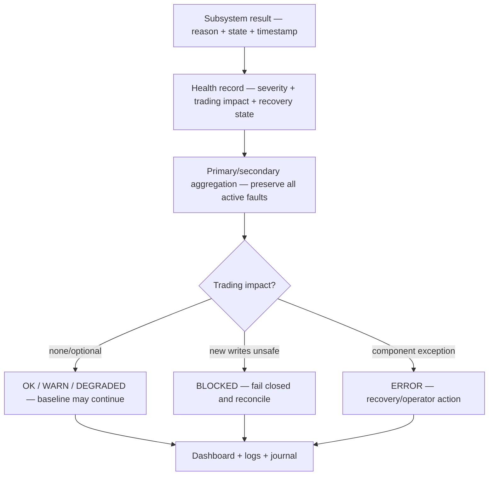

# GoldSwingTraderAI — System Health and Diagnostics

**Status:** PROVISIONAL
**Version:** 0.3-design
**Authority:** Cross-subsystem health aggregation, fault severity, trading impact, recovery state and operator diagnostics.
**Depends on:** `../00-foundation/SYSTEM_CONTRACT.md`, `../30-risk-execution/EXECUTION_AND_BROKER_SAFETY.md`, `../30-risk-execution/PERSISTENCE_RESTART_AND_RECOVERY.md`, `../20-trading-decisions/SCORING_AND_DECISION_FUSION.md`

## Purpose

This document defines how the bot reports its own health. It does **not** redefine subsystem rules that generate a fault.

> **Every material system fault must identify its source, severity, trading impact and recovery state.**

This is separate from normal market decisions such as `WAIT`, `MISSED` or `OPPORTUNITY_WEAK`.

## Fault-to-operator flow

Health aggregates the result of owning authorities; it does not invent a new
trading rule.



The operator must be able to answer four questions from the health record:
what failed, how serious it is, whether new writes are affected, and what
recovery action is safe. A colourful marker without those facts is not health
diagnostics.

| Health field | Example | Why it matters |
|---|---|---|
| subsystem/reason | EXECUTION / ORDER_ACK_UNKNOWN | locates the owning authority |
| severity/state | BLOCKED / RECOVERING | distinguishes normal decision from fault |
| trading impact | new entries paused; management continues | prevents unsafe operator assumption |
| first/last/count | timestamps and recurrence | supports reconstruction |
| recovery state | ACTIVE / ACTION_REQUIRED / RECOVERED | tells operator what to do next |

## Health states

```text
OK
WARN
DEGRADED
BLOCKED
ERROR
```

Suggested semantics:

- `OK` — operating normally;
- `WARN` — issue exists but material behaviour remains available;
- `DEGRADED` — optional capability/evidence unavailable, limited or demonstrably inert;
- `BLOCKED` — safe trading authority cannot continue;
- `ERROR` — component failure; trading impact depends on owning authority.

## Health ownership

Each subsystem defines its failure conditions. System Health aggregates/explains them.

Examples:

- Market Data defines `DATA_STALE`;
- Risk defines daily-P/L/risk blocks;
- Execution defines account/order/controller failures;
- Persistence defines state corruption/restore failures;
- Learning/Discovery defines optional adaptive/research health;
- Technical Confluence defines factual availability/coverage, not broker permission.

This document must not create competing definitions.

## Trading impact

Every active issue should state impact, for example:

```text
Trading impact: none
Trading impact: optional confluence unavailable; base strategies unchanged
Trading impact: discovery degraded; production baseline unchanged
Trading impact: new entries paused
Trading impact: all broker writes blocked pending reconciliation
```

An optional component can be `DEGRADED` while baseline trading remains available if owning contracts allow degradation.

## No silent fallback

A failed optional component must become visible as `UNKNOWN/DEGRADED`; it must not silently pretend it produced valid evidence.

Critical broker/financial/order uncertainty fails closed according to its authority.

Optional confluence has a special non-restrictive rule: missing/unavailable Trendline/Fibonacci/POC does **not** become a hard trading fault or score-zero penalty. It may be visible as unavailable/degraded context while base strategy semantics remain intact.

## Discovery liveness health

Discovery/invention has an explicit liveness contract:

```text
IDLE       no eligible recurring evidence
HEALTHY    candidate created OR every eligible cluster has explicit governed suppression
DEGRADED   eligible evidence could not produce either outcome
```

`DISCOVERY_DEGRADED` is a real research/learning subsystem health issue, even if production baseline trading may continue safely.

A module merely importing successfully is not enough to claim discovery health.

System Health should preserve, when available:

- eligible-cluster count;
- candidate created / suppression result;
- latest candidate/stage;
- last successful discovery cycle;
- failure/recovery reason.

## Fault record

Fault history should retain at least:

- reason code;
- subsystem;
- severity/health state;
- first seen;
- last seen;
- occurrence count;
- trading impact;
- auto-recovery/operator-action state;
- recovery timestamp/result.

## Primary and secondary issues

When multiple faults exist, nominate primary blocker by authority/severity while preserving secondary issues.

```text
Primary: ACCOUNT_IDENTITY_MISMATCH
Secondary: QUOTE_STALE, DISCOVERY_DEGRADED
```

The first blocker must not hide diagnostics.

## Recovery states

Useful metadata:

```text
ACTIVE
RECOVERING
RECOVERED
ACTION_REQUIRED
```

Transient network/provider failures may auto-recover. Deterministic account/state-integrity mismatches should not be hidden by endless retries.

## Decision block versus system fault

Normal trading decisions, **not automatically system faults**:

- `OPPORTUNITY_WEAK`;
- `ENTRY_EXTENDED`;
- `TARGET_ROOM_POOR`;
- `NEWS_BLACKOUT` when policy is functioning;
- `DAILY_LOSS_LOCK` when risk policy is functioning;
- missing optional Trendline/Fibonacci/POC confluence.

System/operational faults include examples such as:

- `DATA_STALE` during expected-open market;
- `ACCOUNT_IDENTITY_MISMATCH`;
- `ORDER_ACK_UNKNOWN`/reconciliation failure;
- `STATE_CORRUPT`;
- required provider unavailable/unknown safety;
- backup/restore integrity failure;
- controller coordination uncertainty;
- `DISCOVERY_DEGRADED` when eligible evidence is silently unprocessable.

Final decision attribution remains owned by Decision/Risk/Execution authorities.

## Backup and migration health

Persistence may publish:

```text
BACKUP_VERIFIED
BACKUP_STALE
BACKUP_FAILED
RESTORE_VERIFIED
RESTORE_FAILED
STATE_VERSION_INCOMPATIBLE
```

A stale/failed backup may be warning/degraded while runtime trading remains available if critical state is healthy, but reduced disaster-recovery protection must remain visible.

## Multi-instance health

Expose controller state such as:

```text
PRIMARY_EXECUTOR
OBSERVER
RESEARCH
ANOTHER_ACTIVE_CONTROLLER
LEASE/CONTROLLER_UNKNOWN
```

Unknown controller ownership that risks duplicate writes is blocking.

## Dashboard contract

Healthy example:

```text
SYSTEM HEALTH
Overall          HEALTHY
MT5              OK
Data             OK
Risk             OK
Execution        OK
Persistence      OK
Learning         OK
Discovery        HEALTHY / IDLE
Backup           VERIFIED
Critical Issues  0
Warnings         0
```

Optional degraded example:

```text
Overall          DEGRADED
Discovery        DISCOVERY_DEGRADED
Trading Impact   Baseline trading unchanged; adaptive discovery unavailable
```

Blocked example:

```text
Overall          BLOCKED
Issue            ORDER_ACK_UNKNOWN
Impact           Conflicting/new broker writes disabled
Recovery         Broker reconciliation in progress
```

Emojis are presentation only and never drive logic.

## Reason consistency

Reason/fault codes should remain consistent across:

- dashboard;
- logs;
- journal;
- research attribution;
- tests.

Human explanations may be English/Roman-Urdu, but machine-readable code remains stable.

## Tests required

- correct overall-health aggregation;
- optional DEGRADED component does not falsely block baseline;
- missing optional confluence does not become hard failure;
- eligible discovery evidence with neither candidate nor suppression becomes degraded;
- critical broker/order uncertainty blocks;
- primary/secondary issue preservation;
- fault recovery history;
- normal WAIT not labeled system fault;
- backup/controller health mapping;
- dashboard reason consistency;
- emoji/text fallback does not affect logic.

## Explicit non-goals

System Health must not:

- redefine risk/execution/market rules;
- convert every losing trade into system error;
- convert missing optional confluence into execution BLOCK;
- hide secondary faults;
- silently clear unresolved critical incidents;
- use dashboard presentation as authority.

## Open questions

- exact overall-health aggregation precedence;
- fault-retention/rotation period;
- notification channels for critical incidents;
- exact operator-action/escalation wording standard.
