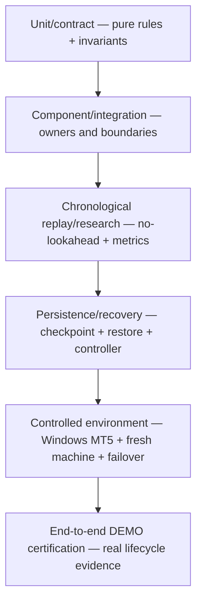

# GoldSwingTraderAI — Testing and Verification

**Status:** PROVISIONAL
**Version:** 2.0-design
**Authority:** Test taxonomy, executable proof requirements, replay/live parity, recovery/broker-read integrity, controller fencing and release verification.
**Depends on:** `../90-governance/DOCUMENTATION_STANDARD.md`, `../10-market-intelligence/MARKET_DATA_AND_HISTORY.md`, `../40-research-learning/RESEARCH_AND_VALIDATION.md`, `../30-risk-execution/EXECUTION_AND_BROKER_SAFETY.md`, `../30-risk-execution/PERSISTENCE_RESTART_AND_RECOVERY.md`

## Purpose

Testing must prove documented invariants. `VERIFIED` is reserved for behaviour that passed required executable validation against the exact implementation.

> **Software verification and strategy validation are separate.**

## Evidence ladder

Each layer answers a different question. Passing a lower layer never silently
certifies a higher one.



| Evidence layer | Proves | Does not prove |
|---|---|---|
| unit/contract | local rule and edge-case behaviour | composition or broker behaviour |
| component/integration | module ownership and typed handoffs | real terminal/failover |
| replay/research | chronology and specified historical simulation | future profitability |
| persistence/recovery | restart/restore/reconciliation semantics in test environment | arbitrary network filesystem safety |
| controlled environment | real terminal/account/machine behaviour | broad market edge by itself |
| DEMO certification | full governed lifecycle on intended DEMO environment | live profitability guarantee |

## Test layers

```text
Unit / Contract
→ Component
→ Deterministic Replay / Research
→ Dataset / Evidence Integrity
→ Persistence / Checkpoint / Backup / Restore
→ Controller Fencing / Startup Recovery
→ Live-Read MT5 Recovery Adapter
→ Controlled Windows MT5 / Fresh Machine / Cross-Laptop / DEMO
→ End-to-End DEMO Certification
```

## Core deterministic invariants

No future leakage; no hidden confluence hard gate; explicit historical session truth; checkpoint/catalog integrity; financial-secret blocking; one-shot execution; broker reconciliation; monotonic fencing; takeover recovery; restored state never equals broker truth; malformed persisted types never become valid-looking runtime state.

## Live MT5 recovery read tests

`MT5Reader.open_positions()` and `app/recovery_mt5.py` must prove:

- current positions come through the existing `MT5Reader` boundary;
- no duplicate raw MetaTrader5 recovery client exists;
- BUY and SELL types normalize correctly;
- result ordering is deterministic by broker ticket;
- MT5 SL/TP `0` normalize to explicit `None`;
- optional magic/comment are preserved as read facts;
- a positive empty broker collection becomes complete empty exposure;
- `positions_get() is None` is `DATA_UNAVAILABLE`, never empty exposure;
- invalid direction/wrong symbol/invalid geometry fail `DATA_CORRUPT`;
- duplicate broker position ticket fails closed;
- recovery adapter resolves configured symbol aliases;
- adapter includes current `AccountFacts` and verified `SymbolSpec`;
- broker filling-policy flags normalize to request-ready `ORDER_FILLING_*` values;
- `BrokerRecoverySnapshot.positions_complete=True` is emitted only after successful position read;
- recovery SL/TP comparison tolerance comes from verified `SymbolSpec.tick_size`;
- no hard-coded XAU tick/price tolerance is hidden in recovery code.

## Governed startup recovery tests

Startup recovery tests prove persistent integrity first, current DEMO/account/server/symbol consistency, unresolved Intent reconciliation, ManagedTrade/current-position matching, required hard authorities and controller takeover completion only at the successful end.

`tests/test_live_startup_runtime.py` additionally proves that the live
composition:

- derives the account/symbol scope from live MT5 facts;
- uses the same initialized MT5 module for reconciliation;
- creates the first risk-day baseline only in explicit `INITIALIZE` mode;
- restores only to a new DB in explicit `RESTORE` mode;
- keeps an unconfigured session/news provider `UNKNOWN` rather than fabricating
  `PASS`;
- blocks a second runtime while another controller lease is active; and
- releases the controller and MT5 bridge on shutdown.

## Persistence / backup / controller tests

Checkpoint/backup tests protect canonical records/events, secret blocking, no-overwrite restore, due/skip cadence, retention/catalog integrity and last-known-good preservation.

Controller tests protect one-winner contention, monotonic epochs, stale-holder denial and reconciliation-gated takeover. Local deterministic SQLite tests do not certify arbitrary network filesystems.

## Controlled evidence boundary

Public CI can verify the read adapter with fake MT5 modules, but cannot prove the intended Windows terminal/broker actually returns equivalent account/symbol/open-position facts. That evidence remains controlled external work.


Windows readiness result: the controlled operator run initialized the MT5
terminal, resolved XAUUSDm, positively verified DEMO mode and completed a
read-only snapshot without broker writes. The snapshot was marked STALE because
the quote and completed candles exceeded the freshness threshold. Fresh-data,
persistent-runtime, order-lifecycle, restart-reconciliation and failover proof
remain separate release gates.

Fresh-machine certification must use a real restored checkpoint plus current broker positions/orders/deals and prove no stale replay before READY.

## Evidence reporting

```text
Deterministic CI                PASS / count
Market read contracts           PASS
Live-recovery adapter software  PASS
State/checkpoint/backup         PASS
Controller/startup recovery     PASS
Real Windows MT5 recovery read  PARTIAL PASS — READINESS DEMO snapshot; stale freshness
Fresh-machine broker reconcile  PENDING/PASS
Cross-laptop coordination       PENDING/PASS
Remote backup publication       PENDING/PASS
DEMO execution                  PENDING/PASS
```

The deterministic proof set covers integrated startup/recovery, persistent-loop,
publication-CLI, dashboard research-state, provider-neutral session/news
handoff and verified-bundle walk-forward CLI composition. Exact run results
belong to the release audit for the audited revision.

`tests/test_runtime_loop.py` proves bounded persistent lifecycle behaviour,
heartbeat renewal, controller-loss fail-closed stopping, startup-not-ready
shutdown, standby retry after explicit active-primary contention and guaranteed
runtime shutdown. The live cycle/dashboard composition
is exercised against the injected MT5 boundary; this remains software evidence,
not real broker DEMO evidence.

Live startup tests also cover safe UTC risk-day rollover and preserve the
fail-closed path for non-clear lifecycle state. Publication/restore CLI tests
prove the explicit no-push/no-authority boundary; durable discovery-status and
dashboard tests prove research liveness is visible without becoming execution
authority.

`tests/test_walk_forward_script.py` proves that a verified portable dataset can
be consumed by the fixed-policy walk-forward operator boundary and exported as
an immutable evidence package bound back to the dataset manifest. This remains
offline software evidence; it is not real-XAU or broker certification.

`scripts/acquire_mt5_dataset.py` is intentionally certified by the existing
`research/acquisition.py`/`MT5Reader` contract tests plus controlled Windows
execution; this workspace has not run the terminal-dependent acquisition.

## Coding-standard regression coverage

`tests/test_coding_contract_regressions.py` protects cross-cutting rules that
are easy to regress while extending individual modules:

- non-finite settings, intelligence, management and research configuration is
  rejected explicitly;
- opportunity/news/risk chronology and score boundaries remain deterministic;
- persisted runtime state rejects coercive strings, non-boolean flags and
  non-finite numeric values instead of silently changing meaning;
- MT5 read exceptions become typed `MarketDataError` outcomes; and
- duplicate/ambiguous broker identity and management-intent mismatches remain
  fail-closed.

The same parsing discipline is applied to durable Execution Intent,
ManagedTrade, research episode, candidate/promotion registry and discovery-status
repositories, plus portable checkpoint/catalog, dataset-bundle and evidence-
package manifests. These are software contract tests; they do not replace a
real fresh-machine restore or broker reconciliation drill.

The CI workflow also runs Python compilation and a source/script annotation
check and emits coverage for review. Coverage is an engineering signal, not a
release authority.

## Release-blocking failures

At minimum:

- future-data leakage;
- unknown broker position read accepted as zero exposure;
- corrupt/duplicate broker position accepted;
- recovery hard-codes a guessed Gold tolerance instead of verified geometry;
- duplicate raw MT5 recovery client bypasses read boundary;
- checkpoint/catalog tamper or financial secret accepted;
- stale restore treated as broker truth;
- blind resend of unresolved Intent;
- ManagedTrade mismatch accepted as READY;
- hard recovery authority UNKNOWN/BLOCK accepted as READY;
- takeover completion before recovery passes;
- non-monotonic fencing/split-brain write;
- centralized execution/DEMO guard bypass.

## Explicit non-goals

Fake MT5 tests are software evidence, not real broker certification. Passing deterministic recovery does not prove profitability, broker behavior, cross-laptop filesystem safety or DEMO execution correctness.

## Pending controlled matrix

- Windows MT5 account/symbol/open-position recovery read;
- fresh-machine + broker reconciliation;
- shared-storage/cross-laptop failover;
- external authenticated public backup publication;
- real history/session evidence;
- final DEMO forward/fault certification.
