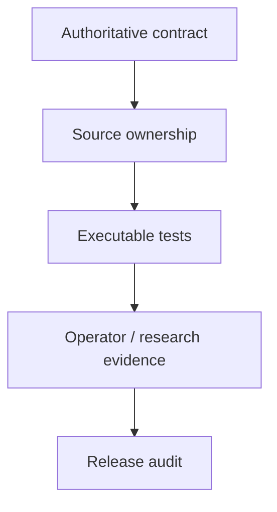

# GoldSwingTraderAI — Documentation Standard

**Status:** FROZEN
**Version:** 0.9-design
**Authority:** Documentation placement, ownership, status and change-control rules.

## 1. Purpose

GoldSwingTraderAI is documentation-first.

> **One behavioural or engineering rule has one authoritative home. Other documents link to it; they do not restate a competing version.**

This standard prevents overlapping Markdown files from silently disagreeing about the same behaviour or implementation-quality rule.

This document is itself the **frozen documentation-maintenance contract**.
Freezing the standard does not freeze the project content: topic documents,
source maps, tests, release evidence and operator guidance must continue to
evolve as implementation advances. It freezes the rules for preserving prior
meaning, synchronizing related documents, classifying status and recording
material changes. Changing this standard requires an explicit governance
decision; ordinary feature work must follow it.

## 2. Repository root and docs-root primary guides

Repository root is reserved for repository entry/runtime artifacts. `README.md` is the primary project introduction/navigation file.

Detailed behavioural and engineering documentation belongs under `docs/`.

The following high-visibility whole-project/operator/developer guides intentionally live directly in `docs/`:

- `docs/FINAL_BUILD_PROMPT.md` — whole-project implementation handoff summary;
- `docs/CHATGPT_PROJECT_BUILD_AND_RECOVERY_GUIDE.md` — large implementation phases, phase completion and recovery navigation;
- `docs/USER_MANUAL.md` — authoritative operator/user manual;
- `docs/SETUP_AND_RUN_GUIDE.md` — authoritative installation/startup/shutdown/migration/recovery guide;
- `docs/CODER_GUIDE.md` — authoritative feature-oriented developer map.

The numbered folders still own the relevant domain categories. Previous subfolder paths for User/Setup/Coder guides may remain only as lightweight compatibility redirects; behavioural content must not be maintained in two places.

These docs-root guides summarize/navigate authoritative subsystem contracts where appropriate; they do not create competing trading, risk, execution, research or coding-standard rules.

## 3. Folder ownership

### `docs/00-foundation/`
Owns the project constitution:

- mission and non-goals;
- system-wide invariants;
- high-level architecture;
- trading-floor authority model.

### `docs/10-market-intelligence/`
Owns market observations/inference:

- market data/history;
- candle structure;
- HTF technical structure/levels/location;
- optional technical confluence such as causal Trendline/Fibonacci/broker-local POC;
- liquidity/SMC primitives;
- indicators/volatility;
- macro/fundamental/event facts;
- session context as market evidence.

`TECHNICAL_STRUCTURE_AND_LEVELS.md` is the behavioural authority for generic technical zones/location and optional Trendline/Fibonacci/POC confluence even if implementation uses separate `technical.py` and `confluence.py` modules for clean code.

Market-intelligence documents do not grant final broker authority.

### `docs/20-trading-decisions/`
Owns how evidence becomes trade intent or open-trade action:

- strategy families;
- BUY/SELL thesis construction;
- scoring/fusion/debate and decision attribution;
- setup lifecycle and entry timing;
- structural Trade Plan;
- Trade Manager and exits.

### `docs/30-risk-execution/`
Owns hard financial/operational authority:

- monetary risk and dynamic/hybrid sizing;
- daily loss/manual reset accounting;
- hard market/news/risk permission states;
- cooldown/blocked states;
- centralized broker-write permission;
- DEMO guard;
- account/symbol/order safety and one-shot execution;
- controller lease/fencing;
- persistence, restart, reconciliation, backup and migration.

Risk/safety rules are not converted into weighted strategy scores.

### `docs/40-research-learning/`
Owns evidence generation and governed improvement:

- chronological replay/backtest parity;
- validation/holdouts/WFA/stress;
- StrategyMemory and entry/exit learning boundaries;
- strategy discovery;
- autonomous declarative invention;
- experiments/promotion/rollback.

There is intentionally no separate authoritative `OFFLINE_RESEARCH.md`.

### `docs/50-operator/`
Owns operator-domain supporting material, especially dashboard/UX and operator-control semantics. Primary `USER_MANUAL.md` and `SETUP_AND_RUN_GUIDE.md` are surfaced at docs root.

### `docs/60-engineering/`
Owns implementation/developer/diagnostic/release authority and maps:

- `CODING_STANDARD.md` — source-code quality, complexity, dependency, commenting, performance and phase-quality contract;
- module structure;
- system health/diagnostics aggregation;
- test/verification strategy;
- release checklist;
- final release audit.

Primary `CODER_GUIDE.md` is surfaced at docs root. Coder Guide is feature-oriented; Module Structure is file/module-oriented; Coding Standard owns engineering-style rules that those documents consume.

### `docs/90-governance/`
Owns:

- design-decision ledger;
- open questions/freeze matrix;
- this documentation standard;
- future change-control records if needed.

## 4. Status lifecycle

Authoritative design/engineering documents use:

```text
DRAFT
PROVISIONAL
FROZEN
IMPLEMENTED
VERIFIED
SUPERSEDED
```

- `DRAFT` — incomplete working document;
- `PROVISIONAL` — current agreed direction, still open to refinement/calibration;
- `FROZEN` — approved behavioural or engineering contract for implementation;
- `IMPLEMENTED` — corresponding behaviour/rule exists in code/process;
- `VERIFIED` — exact implementation passed required executable validation.
- `SUPERSEDED` — replaced by a named authoritative document or contract; keep
  a redirect or traceable replacement note rather than silently deleting useful
  meaning.

Do not mark a document `IMPLEMENTED` because a plan exists, or `VERIFIED` because Markdown is complete.

## 5. Standard technical-document shape

Where useful, subsystem contracts should include:

```text
Title
Status
Authority
Depends on
Purpose
Core principles
Inputs
Outputs
States/models
Decision rules
Hard rules
Soft evidence
Failure behaviour
Persistence/restart
Replay requirements
Dashboard visibility
Tests required
Explicit non-goals
Open questions
```

Engineering standards may adapt this shape where states/market inputs are not relevant, but authority/status/change rules still apply.

### 5.1 Self-contained explanation rule

Each non-redirect document must be understandable without opening a second file
to discover what the document is trying to explain. Cross-links are for
authoritative detail, not for hiding the document's purpose or execution path.
At minimum, the reader must be able to answer:

| Reader question | Required answer in the document |
|---|---|
| Why does this exist? | Purpose, scope and explicit non-goals |
| Where does it run? | Layer, owning modules and entry points |
| What does it consume and produce? | Inputs, outputs, schemas or typed models |
| What happens in order? | Lifecycle, state transitions and authority gates |
| What can run independently? | Parallel/dataflow lanes and shared snapshot rules |
| What happens when information is missing? | `UNKNOWN`, fail-closed, retry, quarantine or explicit error semantics |
| How is it proven? | Source paths, executable tests and live-evidence boundary |
| How is it operated or researched? | Dashboard/operator visibility and replay/calibration implications |

### 5.2 Diagram and table rule

Use a visual when prose alone would make ownership, parallelism, state
transitions, dependency direction or event order difficult to verify.



Choose the smallest visual that makes the relationship precise:

| Relationship being explained | Preferred form |
|---|---|
| Exact field/module/authority mapping | Markdown table |
| Ownership, dependency or dataflow | Mermaid flowchart |
| Lifecycle or permission transitions | Mermaid state diagram |
| Ordered events or handoff | Mermaid sequence/timeline |
| Repeated numeric comparison | Table or chart with named units |
| One fact or one short sequence | Prose; no decorative diagram |

Diagram labels must use the same names as the code and authoritative contract.
Do not draw “parallel” boxes unless the work really shares one immutable
snapshot and has no hidden ordering dependency. A chart must identify its
metric, time basis and data source; it must never imply live or broker evidence
that has not been collected.

## 6. Avoiding duplication

Examples:

- daily-loss/manual-reset arithmetic → `30-risk-execution/RISK_CONTRACT.md`;
- hard news permission → `30-risk-execution/SESSION_AND_RISK_STATE_MACHINE.md` from event facts supplied by `10-market-intelligence/FUNDAMENTAL_AND_NEWS.md`;
- entry-state semantics → `20-trading-decisions/ENTRY_TIMING.md`;
- BOS/MSS/swing definitions → `10-market-intelligence/CANDLE_STRUCTURE.md`;
- technical zones/location and Trendline/Fibonacci/POC confluence semantics → `10-market-intelligence/TECHNICAL_STRUCTURE_AND_LEVELS.md`;
- initial entry/SL/targets/original R → `20-trading-decisions/TRADE_PLAN.md`;
- post-entry management → `20-trading-decisions/TRADE_MANAGER_AND_EXIT.md`;
- centralized broker-write permission/one-shot/controller semantics → `30-risk-execution/EXECUTION_AND_BROKER_SAFETY.md`;
- source-code quality/complexity/dependency/commenting rules → `60-engineering/CODING_STANDARD.md`;
- decision attribution → `SCORING_AND_DECISION_FUSION.md` plus the actual blocking authority;
- fault aggregation → `60-engineering/SYSTEM_HEALTH_AND_DIAGNOSTICS.md`;
- promotion chronology → `40-research-learning/GOVERNED_EXPERIMENTS_AND_PROMOTION.md`.

Compatibility redirect files contain only a pointer to the authoritative path.

If two documents contain competing detailed versions of the same rule, that is a documentation defect and must be resolved before implementing affected behaviour.

## 7. Cross-references

Use relative repository links wherever possible. Supporting docs should link to authoritative sources instead of pasting a second independent version.

Final Build Prompt, Coder Guide, Module Structure and Build/Recovery Guide may summarize Coding Standard requirements for execution clarity, but `CODING_STANDARD.md` remains detailed authority and wins if wording diverges.

## 8. Design decisions and freeze matrix

Material accepted choices belong in `90-governance/DESIGN_DECISIONS.md`.

Unresolved or not-yet-fixed items belong in `90-governance/OPEN_QUESTIONS.md`, classified as appropriate:

```text
FIX BEFORE BUILD
CALIBRATE IN RESEARCH
IMPLEMENTATION CHOICE
DEFER LATER
```

Research calibration and ordinary implementation choices do not automatically block implementation.

When an important question is resolved:

1. update authoritative topic doc;
2. add/supersede decision entry where material;
3. reclassify/remove the open item;
4. update affected summaries/links.

## 9. Implementation synchronization rule

Documentation is updated during each coherent implementation phase, not as end-of-project cleanup.

Synchronize as applicable:

- authoritative topic doc;
- `DESIGN_DECISIONS.md` / `OPEN_QUESTIONS.md`;
- `60-engineering/CODING_STANDARD.md` only after explicitly approved engineering-standard change;
- `60-engineering/MODULE_STRUCTURE.md`;
- `CODER_GUIDE.md`;
- User/Setup/operator docs;
- testing/release docs;
- `docs/README.md`.

A phase is not complete while code and authoritative documentation knowingly disagree or while affected code knowingly violates the frozen Coding Standard.

## 10. Final Build Prompt rule

`docs/FINAL_BUILD_PROMPT.md` is a whole-project handoff summary. It may summarize frozen/current implementation direction, including Coding Standard, but it must not override authoritative subsystem documents.

Before it is marked `FROZEN`:

- implementation-critical behavioural choices must be frozen or explicitly classified/deferred;
- cross-document contradiction/coverage audit must be complete;
- implementation phases and validation expectations must be explicit.

## 11. ChatGPT Project Build and Recovery Guide rule

`docs/CHATGPT_PROJECT_BUILD_AND_RECOVERY_GUIDE.md` is persistent meta-guide for completing the project in large phases and resuming safely after interruption.

It defines:

- large phases and deliverables;
- exit gates before moving forward;
- Coding Standard quality review as part of phase completion;
- context-loss reconstruction;
- incomplete/broken phase recovery;
- docs/code mismatch recovery;
- failed-test procedure;
- Git/local/state mismatch handling;
- crash-during-broker-write recovery;
- new-machine/disaster recovery;
- final completion/audit flow.

It points to authoritative documents rather than inventing behavioural or engineering rules.

## 12. Reference-project rule

External/prior projects may be studied for lessons, but GoldSwingTraderAI documentation describes GoldSwingTraderAI itself. Do not copy legacy project identity, compatibility constraints or architecture merely because they existed elsewhere.

## 13. Preservation-first update rule

Documentation updates are **append-first and contract-preserving**. A new
implementation must not erase the earlier rationale, constraints, planned
sequence, verification boundary or unresolved decision merely because the code
has advanced.

Preserve earlier information by placing its useful meaning in the correct
design section. For example, if a read-only launcher becomes an integrated
startup service, the startup section must still explain the read-only readiness
path, the full startup sequence, the authority handoff and the evidence
required before live use. The reader should learn the whole design in one
place, not hunt through a dated status diary.

Use status/evidence labels only where they prevent a dangerous
misunderstanding. Do not turn normal topic documents into a chronology of
patches. A superseded implementation detail may be named briefly inside the
design explanation, but the document's main voice must remain the intended
system contract.

Normal documentation edits should not produce unexplained deletions. Before
finalizing a docs change, inspect the diff for removed paragraphs, tables,
checklists, prompt instructions and phase gates. A deletion is acceptable only
when it is an exact duplicate, a security exposure, or the same information is
moved into the correct authoritative section without loss of meaning.

## 14. Complete-explanation rule

Every non-redirect document must explain its subject from purpose to evidence.
At the appropriate depth, include:

- why the subject exists and what problem it solves;
- where it sits in the end-to-end runtime and which documents surround it;
- inputs, outputs, state transitions and authority boundaries;
- what may run independently/parallel and what must remain ordered;
- exact source modules, public entry points and important tests;
- persistence/restart and failure/unknown behaviour;
- operator/dashboard/research visibility where applicable;
- a small flow or ownership diagram when relationships are easier to understand
  visually;
- current software evidence versus live broker/DEMO evidence;
- explicit non-goals, calibration items and next proof required.

The root prompt and ChatGPT guide must additionally explain how an implementation
agent should navigate the documentation, choose the next phase, preserve prior
work, verify changes and recover from context loss. They are summaries and
process guides, not hidden replacements for topic authorities.

## 15. Documentation change record

Material documentation work should leave an auditable record in the working
diff or task handoff. The record should name:

```text
date/checkpoint
documents touched
old information retained or moved
new implementation/evidence added
links or source owners updated
tests/link checks run
remaining uncertainty
```

This makes a documentation update reviewable in the same way as a code change.
The record belongs in the review/working handoff; ordinary design documents
should remain timeless manuals rather than becoming chronological change logs.
