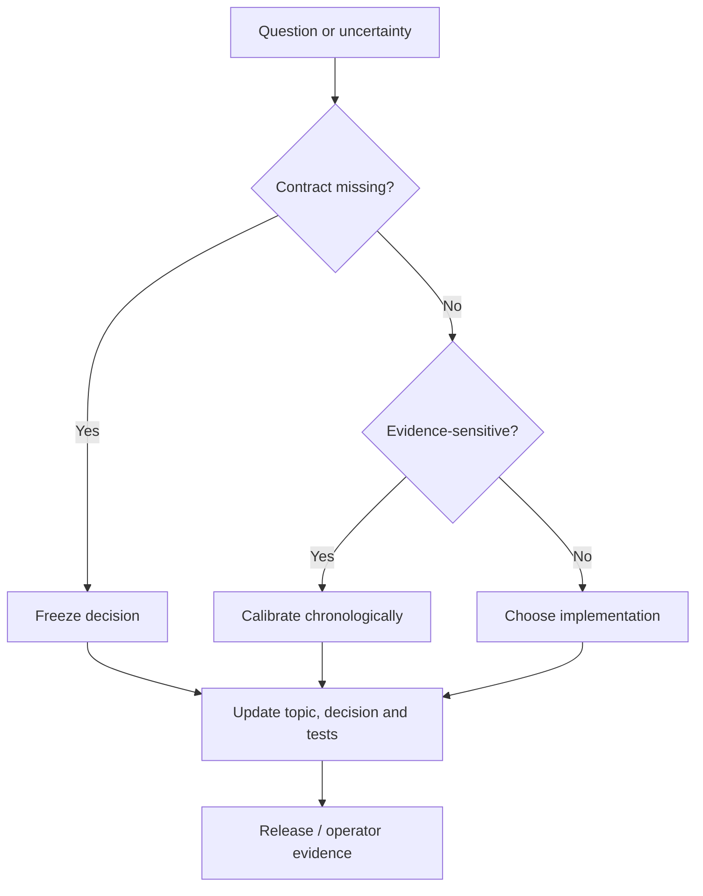

# GoldSwingTraderAI — Open Questions / Freeze Matrix

**Status:** AUTHORITATIVE FREEZE MATRIX
**Version:** 3.8-design

This file separates remaining items so implementation is not delayed by values that should be learned from evidence or ordinary engineering choices.

## Purpose and scope

This matrix prevents a coder from treating calibration, environment evidence
or an ordinary implementation choice as an undocumented behavioural redesign.
It is read together with the decision ledger and the authoritative topic
contract; it is not a substitute for either.

```text
FIX BEFORE BUILD       = required architecture/safety decision still missing
CALIBRATE IN RESEARCH  = explicit deterministic baseline, tune only with chronological evidence
IMPLEMENTATION CHOICE  = coder may choose implementation preserving frozen contract
DEFER LATER            = not required for V1
```

At behavioural-contract level there are **no `FIX BEFORE BUILD` items in the
frozen V1 contract**. Remaining rows in this document describe calibration,
environment proof or ordinary implementation choices; they do not silently
change the hard authority model.

## How a question moves to closure



Every row must have one of four outcomes: a frozen contract, a bounded
research calibration, an implementation choice that preserves the contract,
or an explicit deferral. A question is not closed merely because a class or
configuration field exists; its authority, failure behaviour and proof
boundary must also be documented.

## Contract and proof map

Deterministic core exists through Phase 10 plus Phase-11 recovery and Phase-12 runtime foundation:

```text
1–9  production architecture foundations
10   research replay/session/stress/walk-forward/data/evidence/learning
11   StateStore snapshot + portable checkpoint
     + fresh-local-DB restore
     + automatic local backup/catalog/retention
     + durable SQLite coordination / monotonic fencing
     + reconciliation-gated takeover
     + governed startup recovery
     + read-only live MT5 recovery truth adapter
     + explicit live startup composition and state selection
     + persistent M5 cycle/lease heartbeat/backup lifecycle
     + governed entry/management orchestration
     + live dashboard DTO composition
     + durable discovery-liveness dashboard state
     + strict account/server/symbol-scoped session/news handoff adapter
     + public-safe publication staging and restore operator CLIs
     + verified-bundle walk-forward/evidence-package operator CLI
```

## Live MT5 recovery contract

The existing `MT5Reader` now owns current open-position reads. `app/recovery_mt5.py` composes those facts into `MT5RecoveryTruth`.

Frozen semantics now implemented:

- no second raw MetaTrader5 recovery client;
- positive empty `positions_get` result = verified empty current exposure;
- `positions_get() is None` = `DATA_UNAVAILABLE`, never zero exposure;
- invalid direction/symbol/geometry/duplicate ticket = `DATA_CORRUPT`;
- current position facts normalize ticket/symbol/direction/volume/open-price/SL/TP/magic/comment;
- MT5 zero SL/TP becomes explicit `None`;
- recovery snapshot is marked complete only after successful position read;
- recovery price tolerance comes from verified broker `tick_size`, not a guessed XAU constant;
- broker position facts do not independently prove bot ownership.

The connected Windows MT5 evidence boundary is described in
`docs/60-engineering/FINAL_RELEASE_AUDIT.md`; deterministic software tests
cannot substitute for broker-connected proof.

## Startup recovery contract

`app/recovery.py` owns:

```text
persistence integrity
→ runtime bundle
→ Intent reconciliation
→ ManagedTrade reconciliation
→ DEMO/account/server/symbol checks
→ hard RecoveryAuthorities
→ fresh controller authority
→ takeover completion if required
→ READY
```

Unknown broker truth, unresolved Intent, missing management context, ManagedTrade mismatch or any hard UNKNOWN/BLOCK prevents READY.

The live composition is defined at the software boundary as follows:
`app/runtime.py` initializes the existing reader, derives the account/symbol
scope, selects `EXISTING`/`INITIALIZE`/`RESTORE` state explicitly, builds live
repositories/reconciler/controller dependencies and supplies the resulting
authorities to the coordinator. `app/cycle.py` and `app/loop.py` then share
fresh fact snapshots across decision/risk/execution/management, renew the lease
every 10 seconds, keep a narrow heartbeat-only wait for retryable stale market
data before `READY`, create verified local backups and shut down safely. The
default launcher remains read-only `READINESS`; it also stays alive by default
while required data is stale/warming up, without entering strategy or execution.
Live `PRIMARY`/`STANDBY` modes proceed to cycles only after READY. Session/news
input is an injectable authority provider; when absent or invalid, the result
is `UNKNOWN`, never an invented clear schedule or news state.

## Backup / publication contract

The local software/operator boundary includes:

- portable checkpoint;
- financial-secret blocking;
- fresh-DB restore;
- configurable local backup cadence/retention;
- hashed verified catalog;
- latest known-good selection;
- failure preserves previous known-good backup;
- public-safe latest-checkpoint staging with a second secret scan;
- explicit `scripts/stage_public_backup.py` and
  `scripts/restore_runtime_checkpoint.py` commands.

The external proof boundary includes:

- operator/external-CI authenticated publication of already-verified public-safe artifacts;
- external credential handling that never serializes PAT/tokens into repo/checkpoint state;
- remote failure/retention semantics.

## Controller / failover contract

The deterministic coordination contract includes:

- transactional SQLite coordination;
- one-winner contention;
- monotonic durable epoch;
- stale renew/release denial;
- takeover blocked until governed recovery completion.

The real-machine proof boundary includes:

- selected shared storage across two real machines;
- simultaneous contention;
- primary loss + TTL expiry;
- higher-epoch standby takeover;
- stale-primary denial;
- network/storage interruption fail-closed behavior;
- no split-brain.

If actual storage cannot prove SQLite semantics, replace the backend rather than weaken fencing.

## Implementation choices to make without changing the contract

- select and operate the accepted external session/news producer through the
  implemented provider-neutral launcher handoff;
- run UTC rollover/restart/fault-injection certification against the intended environment;
- execute the explicit external publication step after reviewing a staged artifact.

## Controlled evidence boundary

- real Windows MT5 recovery read facts;
- real fresh-machine checkpoint restore using the operator CLI;
- old backup + newer broker-truth conflict drill;
- unresolved Intent/current deals reconciliation;
- cross-laptop fencing/failover proof;
- controlled DEMO write/modify/close/restart evidence.

## Research calibration boundary

Market intelligence/scoring/timing/trailing thresholds, confluence retention, real-data periods/sample sizes, walk-forward stepping, friction distributions, promotion/Shadow/Canary thresholds, StrategyMemory/discovery thresholds and Monte Carlo/regime-aware methodology remain evidence-calibrated work. The walk-forward execution path is implemented; actual real-XAU bundles, historical broker-session coverage, final holdout and reviewed evidence packages remain pending.

## Freeze conclusion

No major behavioural redesign item is known. Remaining work is **live provider
selection, controlled certification and evidence publication**, followed by the
real-machine/DEMO release audit.
