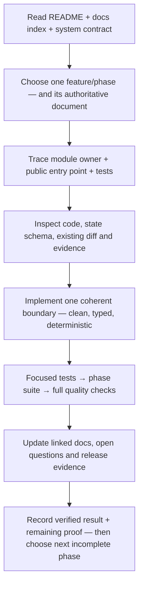

# GoldSwingTraderAI — ChatGPT Project Build and Recovery Guide

**Status:** PROVISIONAL — PROJECT NAVIGATION MANUAL
**Version:** 1.5-implementation
**Authority:** Whole-project implementation sequencing, phase completion, resume/recovery and build-navigation process. This file does **not** redefine trading behaviour.

## Purpose

This guide exists so ChatGPT or another implementation agent can complete GoldSwingTraderAI quickly in large coherent phases, recover after interruption/context loss, and avoid restarting or guessing when something goes wrong.

> **Recover project truth from the repository, repair the smallest broken layer, verify it, then continue from the last verified phase. Do not restart the whole project unless repository/state is genuinely unrecoverable.**

## Agent operating loop

This guide is the project-navigation manual for an implementation agent. It
explains how to use the other documents, not a new trading authority.



Never skip from an idea directly to a broker adapter. The agent must be able
to explain where the data originated, which authority owns the result, what
happens when it is unknown, how restart reconstructs it and which test proves
the boundary.

## What a coherent phase packet contains

| Part | Required content |
|---|---|
| contract | purpose, inputs/outputs, states, hard/soft boundaries |
| architecture | dataflow/ownership diagram when relationships are non-trivial |
| implementation | exact source owner and no duplicate authority |
| tests | positive, negative, unknown, chronology, restart/fault cases as relevant |
| operator view | reason/state/dashboard impact |
| research view | replay/learning/evidence impact where relevant |
| persistence | identity, transaction, recovery and migration behaviour |
| release proof | command/artifact/environment evidence and limitations |
| documentation sync | authority, module map, coder guide, testing/release/open questions |

An implementation agent must not call a phase complete merely because its
primary file exists or the unit test count increased.

## Frozen documentation-completeness protocol

This project is documentation-first. A request that names one missing row,
phase or diagram is an example of a wider consistency risk; it is never the
whole scope of the review. Before coding or calling a phase complete, the
agent must inspect the complete affected chain:

~~~text
requirement / user constraint
→ authoritative contract and decision ledger
→ phase ownership and freeze status
→ architecture/dataflow and parallel/ordered boundaries
→ exact source modules, entry points and configuration
→ typed models, persistence and restart behaviour
→ positive/negative/unknown/chronology/fault tests
→ dashboard/operator/research impact
→ setup/manual/prompt/Coder Guide/module-map propagation
→ testing/release evidence and remaining live proof
~~~

The agent must not update only the highlighted document. It must audit every
affected document, preserve useful prior rationale and phase gates, repair
contradictions, add diagrams/tables where ownership is hard to follow, and
record why a seemingly related document is unaffected. In particular, the
foundation **Phase 1–9** group, research **Phase 10**, recovery/backup
**Phase 11** and integration/certification **Phase 12** must remain separate
concepts in every phase summary.

Before handoff, the agent must verify:

- every material feature has a purpose, authoritative document, source owner,
  public entry point, test owner and operator/evidence boundary;
- DEMO Guard, fail-closed/UNKNOWN states, no-lookahead and the raw broker-write
  boundary are explicitly mapped wherever applicable;
- no useful old section, table, prompt instruction or unresolved proof gate was
  silently deleted;
- code, docs, tests and evidence describe the same current behaviour;
- current software proof is not labelled as live MT5/DEMO certification;
- links, command examples, headings, status labels and phase gates are checked.

This protocol is frozen project process. Any exception requires an explicit
governance decision; normal feature work must follow it.

## Tests and evidence policy

Every phase uses focused positive, negative, unknown, chronology and
restart/fault tests as applicable, followed by the repository-wide quality
commands. A green deterministic suite proves software behaviour only; replay,
shared-storage recovery and connected DEMO evidence require their own
artifacts and cannot be inferred from unit tests.

## Build-order map and completion model

The following phases define dependency order and exit gates; they are a build
map, not a progress diary:

```text
Phase 1  Foundation/config/domain/CI
Phase 2  MT5 read layer + market snapshots
Phase 3  Market intelligence + optional Trendline/Fibonacci/POC confluence
Phase 4  Six strategies + fusion + Opportunity + Entry Timing
Phase 5  Trade Plan + Risk
Phase 6  Session/news permission + SQLite persistence/recovery
Phase 7  Execution intent/gate/controller/write/reconciliation
Phase 8  Trade Manager + management execution bridge
Phase 9  Terminal dashboard renderer
Phase 10 Replay/metrics/learning + durable discovery/invention/promotion foundation
Phase 11 Portable checkpoint/restore + backup/controller fencing + integrated startup recovery
Phase 12 Persistent M5 runtime + governed cycle + live dashboard DTO
```

The documentation gate is part of every phase exit, not a final cleanup task:
run `python scripts/verify_documentation.py .` after synchronized docs are
updated, then review its result together with the focused and full test suites.

Deterministic CI is not live DEMO certification.

The completed architecture described by these phases includes explicit live
`READINESS` / `PRIMARY` / `STANDBY` startup composition,
EXISTING/INITIALIZE/RESTORE state selection, `RecoveryAuthorities` wiring,
persistent M5 orchestration, 10-second controller renewal, governed
entry/management cycling, verified local backup cadence, live
dashboard/research DTO composition, public-safe backup staging and fresh-DB
restore operator CLIs, plus read-only MT5 dataset acquisition and
verified-bundle walk-forward/evidence-package tooling.

External proof gates:

- `app/main.py` / `goldswing` remains read-only by default;
- accepted external session/news producer selection/operation through the
  provider-neutral launcher handoff;
- UTC risk-day rollover and restart/fault-injection certification;
- production shared cross-laptop coordination backend, real fresh-machine broker drill and controlled Windows MT5 DEMO certification are release evidence gates.

## Source-of-truth order

When starting, resuming or recovering work, read in this order:

1. `README.md`
2. `docs/README.md`
3. `docs/90-governance/DOCUMENTATION_STANDARD.md`
4. `docs/00-foundation/SYSTEM_CONTRACT.md`
5. relevant authoritative topic document
6. `docs/90-governance/DESIGN_DECISIONS.md`
7. `docs/90-governance/OPEN_QUESTIONS.md`
8. `docs/60-engineering/CODING_STANDARD.md`
9. `docs/60-engineering/MODULE_STRUCTURE.md`
10. `docs/CODER_GUIDE.md`
11. `docs/FINAL_BUILD_PROMPT.md`
12. this guide
13. current code, tests, state schema, latest commits and executable evidence

If docs conflict, stop affected implementation path and resolve the contradiction in authoritative docs first. Do not silently pick whichever rule is easiest to code.

## Frozen implementation-quality rule

Every phase and every maintained code area obeys
`docs/60-engineering/CODING_STANDARD.md`: runtime, safety, persistence,
operator/dashboard, research/discovery, scripts, configuration and tests are
all in scope. A research or test-specific dependency exception may change the
tooling boundary, never the requirements for chronology, determinism, explicit
failure handling, auditability or secret safety.

Target: **lightweight production-grade code** that is clear, auditable and efficient enough for the real workload without unnecessary architecture.

Before a phase closes, review for:

```text
duplicate MT5 reads / derived calculations
unnecessary abstractions / speculative classes
mixed-responsibility oversized modules
dead code
scattered magic thresholds
vague names
missing safety/chronology comments
broad/silent exception handling
needless runtime dependencies
noisy/secret-leaking logs
weak tests around frozen invariants
```

## Large implementation phases

### PHASE 1 — Foundation, package skeleton and contracts

Build package layout, config, IDs/enums/domain models, reason codes, logging, secret-safe config and tests.

Exit: package imports/runs, config fails clearly, secrets excluded, contracts tested, Coding Standard review passes.

### PHASE 2 — MT5 read layer, Gold facts and market data

Build MT5 read adapter, XAUUSD/XAUUSDm resolution, account/symbol facts, Bid/Ask, H4/H1/M15/M5 completed-candle snapshots and data-quality checks.

Exit: deterministic read contracts, stale/missing states, no-lookahead history tests, no duplicate read paths. Live Windows MT5 proof remains separate evidence.

### PHASE 3 — Full market intelligence

Build Candle Structure, Technical Structure/Levels, Liquidity/SMC, EMA/RSI/ATR/volatility, session/news facts and **optional technical confluence**:

- causal Trendlines from confirmed swings;
- Fibonacci geometry from confirmed impulse anchors;
- broker-local Volume Profile / POC using real volume where available, otherwise honestly labelled tick-volume approximation.

Confluence is soft/bonus-only. Missing Trendline/Fibonacci/POC must not reduce base strategy score or become a hard gate.

Exit: typed evidence from one shared snapshot, no broker authority, no duplicate derived calculations, chronology/no-lookahead tests, confluence absence cannot restrict base strategies.

### PHASE 4 — Strategy floor, BUY/SELL theses and decision fusion

Implement six V1 strategy families in parallel, independent BUY/SELL theses, conflict/Red-Team handling, Opportunity lifecycle and Entry Timing.

Optional confluence may add bounded positive support to compatible families but is not a seventh mandatory family.

Exit: no filter soup; valid setup can remain ARMED/WAIT; deterministic reasons; one strong family may lead; optional evidence cannot become hidden hard gating.

### PHASE 5 — Trade Plan, targets and Risk Engine

Implement structural invalidation/SL, objective hierarchy, immutable original R, frozen RR guard, hybrid profiles, min-lot handling, daily safety P/L, loss lock/reset/cooldown.

Exit: structural stop never distorted to fit risk; actual executable lot/risk authority; no `$100` floor; profile ceilings/daily locks/original R tested.

### PHASE 6 — Session/news safety, persistence and recovery foundation

Implement news states/windows, PRE_CLOSE/reopen rules and lightweight durable persistence.

Initial V1 local store is standard-library SQLite + canonical JSON/checksums/schema/event records + typed recovery adapters.

Exit: restart does not silently erase critical state; corrupt/unknown critical state fails explicitly.

### PHASE 7 — Central execution gate, controller lease and MT5 writes

Implement centralized Execution Permission Gate, positive DEMO guard, account identity, spread/drift/margin/stop/volume checks, durable Execution Intent, controller lease/fencing, one-shot create/modify/close and broker reconciliation.

Exit: raw irreversible writes confined to governed boundary; same Intent ID cannot send twice; success-like ACK still needs broker verification; ambiguous acknowledgement never blind-retries.

Before cross-laptop certification, replace/test any in-memory coordination test backend with a real shared atomic coordination backend.

### PHASE 8 — Trade Manager, structural protection and runner

Implement HOLD/PROTECT/TRAIL/RUNNER/EXIT, structure-led trailing, objective progression and PRE_CLOSE override.

Exit: small profit alone does not force breakeven/exit; runner needs fresh continuation + real objective; local managed state only updates after broker verification.

### PHASE 9 — Dashboard and operator workflows

Implement compact read-only dashboard preserving useful GoldScalperAI facts plus Decision/Execution/Learning/Discovery/Backup/Health. Also render a separate READINESS monitor frame after every normalized snapshot, including stale-data waits, with an explicit strategy/write lock.

Optional Trendline/Fibonacci/POC should be shown only as compact confluence/context. Dashboard must not turn them into permission gates.

Exit: operator can see exactly why WAIT/ENTER/BLOCKED and whether discovery is IDLE/HEALTHY/DEGRADED. During pre-cycle READINESS, the operator can see data freshness, exact issues, DEMO/identity facts and the next poll without any invented decision authority.

### PHASE 10 — Replay, research, learning and governed invention

Implement chronological replay, actual/counterfactual metric separation, MFE/MAE/Capture/Opportunity Recall, StrategyMemory, durable episode journal, approved-primitive discovery, candidate registry, invention and governed promotion lifecycle.

Discovery liveness invariant:

```text
eligible recurring evidence
→ candidate created
OR explicit governed suppression reason
```

Silent eligible-evidence loss is a defect and should surface `DISCOVERY_DEGRADED`.

Trendline/Fibonacci/POC must be available as audited research primitives/context so ablation can test whether they improve quality without simply reducing trade frequency.

Exit: no lookahead; candidates cannot arbitrary-code/self-promote/bypass safety; restart preserves rejected/duplicate memory; liveness end-to-end tests pass.

### PHASE 11 — Backup, migration and fault-recovery drill

Implement portable state export/checkpoint, backup verification, fresh-machine restore workflow and controller handoff/failover proof.

Exit: fresh machine can restore project intelligence, configure credentials separately, reconcile MT5 and safely resume without duplicate exposure.

### PHASE 12 — Full integration, DEMO certification and release audit

Build final persistent runtime orchestration and run end-to-end tests, replay, broker fault injection, restart tests, scheduled-close/news/controller tests, dashboard/research health checks and controlled MT5 DEMO certification.

Exit: evidence recorded in Testing/Release/Final Audit. Only then promote statuses honestly.

## Phase completion rule

A phase is complete only when all five are true:

```text
CODE EXISTS
+ REQUIRED TESTS PASS
+ CODING STANDARD QUALITY REVIEW PASSES
+ DOCUMENTATION MATCHES CODE
+ NO KNOWN CRITICAL CONTRADICTION
```

After each coherent phase update, as applicable:

- authoritative topic doc;
- `DESIGN_DECISIONS.md`;
- `OPEN_QUESTIONS.md`;
- `MODULE_STRUCTURE.md`;
- `CODER_GUIDE.md`;
- User/Setup/Dashboard docs;
- Testing/Release docs;
- root/docs README if project state/navigation changed;
- `FINAL_BUILD_PROMPT.md` when frozen requirements/architecture changed.

Do not postpone a known documentation mismatch to the end.

## What to do if conversation/context is lost

```text
inspect repository tree
→ read docs/README.md
→ read SYSTEM_CONTRACT
→ relevant authority
→ DESIGN_DECISIONS
→ OPEN_QUESTIONS
→ CODING_STANDARD
→ MODULE_STRUCTURE + CODER_GUIDE
→ FINAL_BUILD_PROMPT + this guide
→ inspect current code/tests/commits
→ identify last phase whose exit gate is actually satisfied
→ continue from first incomplete phase
```

Repository truth beats remembered conversation wording when repository contains the later accepted decision.

## Never-guess recovery rule

When confused or something appears missing:

```text
authoritative doc
→ DESIGN_DECISIONS
→ OPEN_QUESTIONS
→ current code/tests
→ identify smallest inconsistency
→ repair
→ verify
→ resume same phase
```

Do not restart the whole project from zero unless repository/state is genuinely unrecoverable.

## If code is incomplete / phase interrupted

1. Identify active phase.
2. Compare required deliverables against actual files/tests.
3. Classify privately as DONE / PARTIAL / MISSING / BROKEN.
4. Finish smallest missing dependency first.
5. Run focused tests.
6. Run phase/integration tests.
7. Run code-quality review.
8. Sync docs.
9. Continue without rewriting verified subsystems without cause.

## If something important was missed late

```text
find authoritative home
→ determine affected modules/docs
→ add/update decision/open-question if material
→ implement smallest correct cross-cutting change
→ add regression test
→ update operator/coder/testing docs
→ rerun downstream tests
```

Never hide a missed requirement by changing only comments/dashboard.

## If docs and code disagree

- **code bug** — frozen doc correct; fix code;
- **doc stale** — code reflects explicitly accepted later decision; sync authoritative doc/ledger;
- **true unresolved conflict** — stop affected feature, decide, then code.

Do not label behaviour VERIFIED while a known authoritative mismatch exists.

## If tests fail

Do not weaken a safety test merely to get green.

```text
reproduce
→ identify invariant
→ isolate smallest layer
→ fix root cause
→ add regression
→ focused suite
→ phase suite
→ relevant cross-phase suite
```

A flaky broker/network test belongs outside deterministic logic tests, not deleted.

## If GitHub/local state differ

1. Stop new irreversible broker actions if running version is uncertain.
2. Identify executing commit/version.
3. Preserve uncommitted local state/checkpoints.
4. Compare local code/repository.
5. Never overwrite live mutable trading state blindly from Git.
6. Reconcile broker truth after restore.
7. Resume only from known code + schema + state combination.

## If persistent state is missing/corrupt

```text
STATE CORRUPT/MISSING
→ block affected new broker writes
→ preserve evidence
→ restore last verified checkpoint if available
→ connect MT5
→ reconcile positions/orders/deals
→ rebuild market intelligence chronologically
→ reconstruct only what broker/history + durable evidence prove
→ remain BLOCKED/RECONCILING for unresolved critical facts
```

Optional learning may fall back only where its authority permits it; critical financial/order state cannot silently default empty.

## Crash during broker write

If Execution Intent was `SUBMITTING` or acknowledgement ambiguous:

```text
DO NOT RESEND
→ restore intent
→ query broker positions/orders/deals
→ reconcile lineage/time/symbol/volume
→ classify accepted/failed/unresolved
→ only then allow a fresh governed intent
```

## New-laptop / disaster recovery

```text
clone repository
→ install verified runtime/dependencies
→ restore portable state/checkpoint
→ configure financial credentials separately
→ run secret/integrity checks
→ connect intended MT5 DEMO
→ validate account/symbol
→ acquire controller lease/epoch
→ reconcile broker truth
→ rebuild market intelligence
→ verify risk/session/news state
→ startup self-tests
→ READY
```

A backup never proves there is no open broker position. MT5 reconciliation is mandatory.

## Fast-work rule

- work in large phases;
- batch related files/tests/doc updates;
- do not repeatedly redesign frozen source style;
- prefer smallest implementation satisfying authority;
- avoid cosmetic refactors without benefit;
- calibrate market thresholds with replay/research instead of stalling build;
- do not reopen frozen decisions unless user/evidence requires governed revision.

## Definition of project complete

Project completion requires:

- all required phases implemented;
- authoritative docs synchronized;
- Coding Standard respected;
- no known safety bypass;
- no-lookahead replay evidence;
- risk/session/news/execution invariants tested;
- one-shot order/reconciliation tested;
- controller/failover tested;
- restart and fresh-machine recovery tested;
- financial-secret scan passing;
- discovery/invention proven live rather than decorative;
- optional confluence evaluated by ablation/opportunity recall rather than assumed useful;
- dashboard/operator workflow usable;
- controlled DEMO certification completed;
- final release audit evidence recorded.

Profitability is evaluated through research/DEMO evidence and is never guaranteed by software completion.

## Final recovery principle

> **When uncertain: inspect, reconcile, verify, then continue. Never guess critical financial/broker state, never replay a stale open-trade assumption, and never restart the entire project just because one phase failed.**
