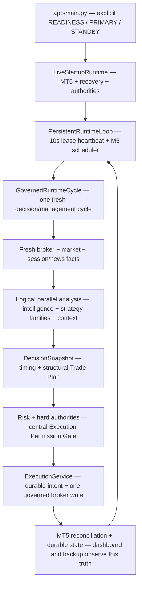
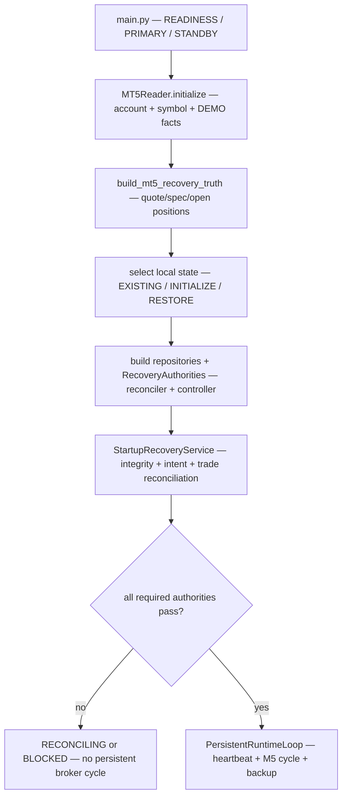
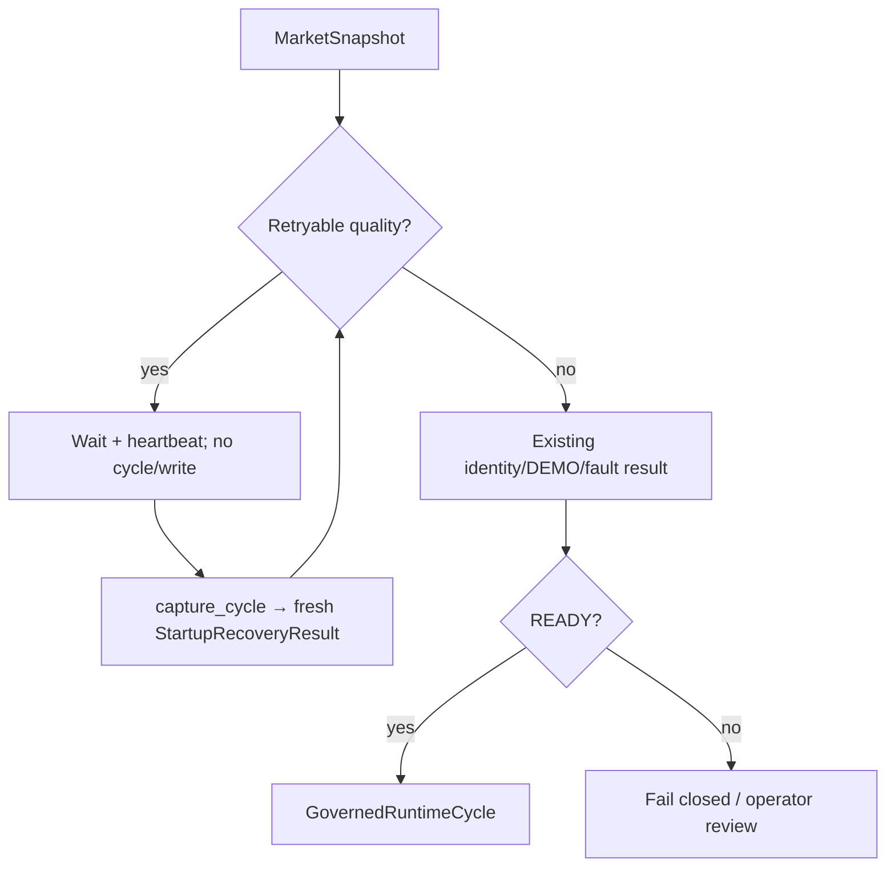
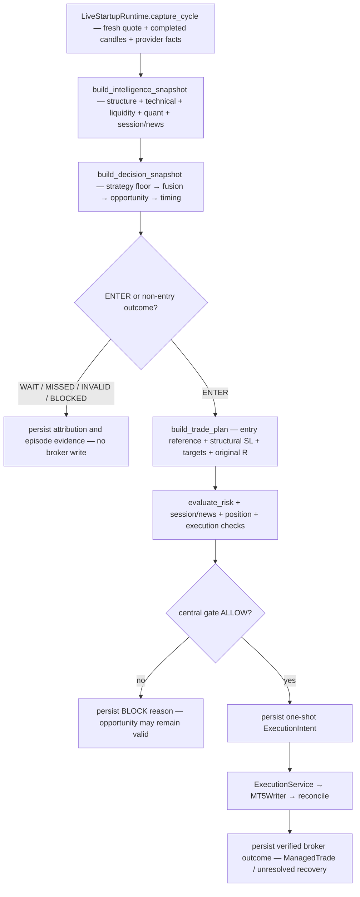
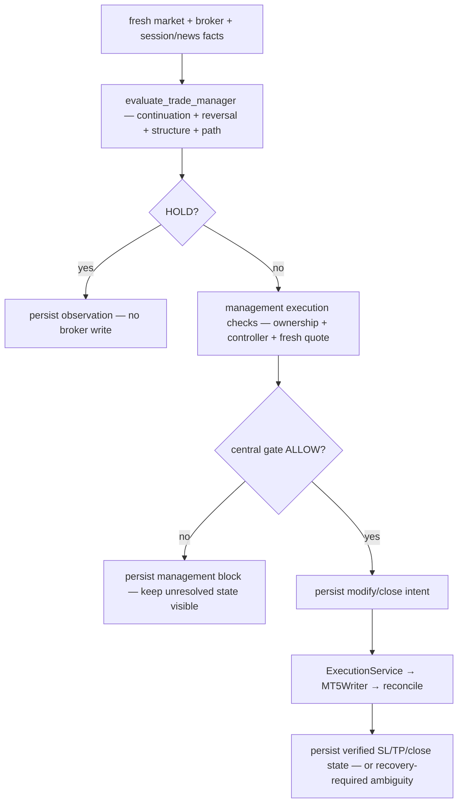
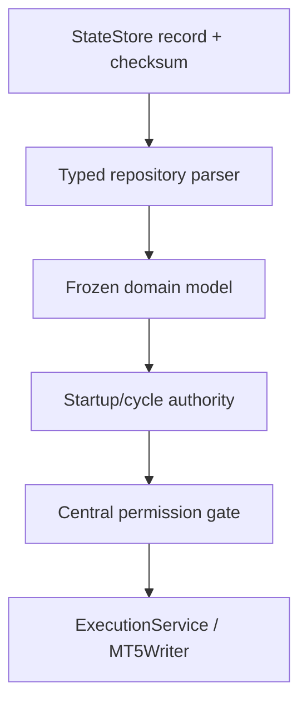

# GoldSwingTraderAI — Coder Guide

**Status:** PROVISIONAL — AUTHORITATIVE DEVELOPER MANUAL
**Version:** 4.1-implementation-map
**Authority:** Feature-oriented developer navigation and implementation map. It does not redefine trading behaviour.

## Purpose

This guide is the feature-oriented map from a requirement to its behavioural
authority, source owner, public entry point and executable tests. It explains
how the runtime lanes connect and where new code belongs; it does not replace
the detailed contracts.

## Core rule

> **Behaviour comes from authoritative topic docs. Code implements it. This guide tells you where implementation lives and what has actually been verified.**

Use `CHATGPT_PROJECT_BUILD_AND_RECOVERY_GUIDE.md` for sequencing/recovery and `60-engineering/CODING_STANDARD.md` for frozen engineering rules.

## How to use this guide

Start with the runtime picture below, then follow the feature-to-code map before
opening a source file. The authoritative topic document defines what a rule
means; the owner module defines where it is implemented; the listed tests define
the executable proof. A new rule is not complete until all three locations are
updated when the change affects behaviour.

This guide is intentionally additive to the topic documents. It is a developer
navigation layer, not a replacement for the contracts in `docs/00-foundation/`,
`docs/10-market-intelligence/`, `docs/20-trading-decisions/`,
`docs/30-risk-execution/` and `docs/40-research-learning/`.

## System in one picture



### What “parallel” means here

“Parallel” is a dataflow and ownership guarantee, not a promise that every
function runs in a Python thread. Specialist calculations consume the same
validated, read-only snapshot and do not call one another to manufacture a
sequential veto chain. The current implementation may evaluate those pure
functions sequentially for deterministic ordering and simpler auditing; they
remain logically independent and can be scheduled later only if that improves
measured runtime without changing chronology or authority.

The following rules are binding for both sequential and future concurrent
implementations:

- one cycle has one explicit snapshot boundary;
- intelligence desks and strategy-family evaluators do not write broker state,
  mutate risk state or mutate each other’s results;
- outputs are typed, bounded evidence, not hidden permission;
- fusion, timing, Trade Plan, risk and execution remain ordered authorities;
- a dashboard refresh, backup, research job or heartbeat can never become a
  second execution path;
- if a concurrent implementation is introduced, results must remain
  deterministic for the same snapshot and policy version.

### Runtime lanes and their authority

| Lane | Cadence/trigger | Reads | May write | Must never do |
|---|---|---|---|---|
| Startup/recovery | process start, restart, takeover | MT5 truth, durable records, controller state | recovery state, reconciliation records, lease state | create a trade before governed recovery is complete |
| Readiness monitor | initial read-only launch and stale-data poll | account, symbol, quote, completed candles, DEMO fact | logs/wait state only | enter strategy, create authority, or send a broker write |
| M5 decision cycle | completed-candle schedule | fresh market facts, session/news facts, durable risk/trade state | decision evidence, intents, managed-trade state through owners | bypass the central gate or reuse stale broker outcome |
| Controller heartbeat | every 10 seconds while live | coordination store and lease identity | lease renewal/epoch state | renew a lease and assume that recovery is unnecessary |
| Local backup | configured rolling interval | durable records/events and runtime metadata | verified local backup/catalog | publish credentials or claim external publication succeeded |
| Dashboard | operator refresh cadence | read-only runtime DTOs and health | none | recalculate strategy/risk or trigger broker writes |
| Research/discovery | offline/operator-invoked | immutable datasets, journal/evidence | candidate/evidence artifacts | write to the production broker path |

Only the decision/management lane may request a broker operation, and it may do
so only through `ExecutionService` after the final permission gate, durable
intent and fresh execution checks have passed.

## Startup lifecycle: from process launch to READY

Startup is not the first trading cycle. It is a safety protocol that establishes
identity, broker truth, durable state, authorities and controller ownership
before the cycle is allowed to run.



The three launcher responsibilities are deliberately different:

| Entry point | Purpose | Broker-write capability |
|---|---|---|
| run_readiness | Read-only connectivity/account/symbol/DEMO inspection for setup and diagnosis | none |
| run_startup | Initialize the live dependency graph, recover state and return a governed runtime | only after recovery and controller authority |
| run_persistent | Own the process lifetime, renew the lease, schedule cycles, backup and shut down safely | delegates only through the governed cycle |

The state selection rule prevents accidental overwrite:

| Mode | Local database expectation | Meaning |
|---|---|---|
| EXISTING | database exists and contains a valid risk-day/runtime scope | load and validate it; missing required risk state blocks |
| INITIALIZE | store is empty and the operator explicitly requests first baseline | create the first UTC risk-day baseline, then recover |
| RESTORE | a verified checkpoint is restored to a new runtime database | validate the restored copy before broker reconciliation |

Recovery authorities are built from real owners, not from caller-created test
traces. They cover account identity, market data quality, session/news truth,
risk state, position/exposure state and execution environment. Their aggregate
result determines whether the runtime is READY, still RECONCILING or BLOCKED.

### Market-closed / stale-data wait ownership

`app/main.py::run_readiness()` owns the safe default read-only wait. It reuses
one initialized `MarketSnapshotBuilder`, rechecks account identity and positive
DEMO verification on every poll, and waits only for `DataQuality.STALE`,
`INSUFFICIENT` or `SPARSE`. `GSTAI_READINESS_KEEP_ALIVE` and
`GSTAI_READINESS_POLL_SECONDS` are validated in `config/settings.py`.

`app/loop.py::PersistentRuntimeLoop` owns the live pre-`READY` wait. When
`StartupRecoveryResult.reason` is exactly `MARKET_DATA_STALE`,
`MARKET_DATA_INSUFFICIENT` or `MARKET_DATA_SPARSE`, it renews the controller
heartbeat and calls `LiveStartupRuntime.capture_cycle()` at the bounded wait
interval. It does not call `GovernedRuntimeCycle.run()` until recovery becomes
`READY`. Any other startup blocker follows the original terminal/fail-closed
contract.



## One completed-candle M5 cycle

The cycle is the repeatable unit a coder should trace when implementing or
debugging an entry. The loop supplies one fresh LiveCycleFacts object; the cycle
does not quietly query a second market-data client.



Important ordering:

1. facts are captured once and normalized;
2. analytical desks and strategy families produce bounded evidence;
3. fusion and timing decide whether an opportunity is executable now;
4. the Trade Plan fixes structural geometry before monetary sizing;
5. risk and hard permissions decide affordability/safety;
6. the final gate decides broker-write permission;
7. only then can an intent be persisted and a single send be attempted;
8. broker truth is reconciled before the cycle reports an open trade.

WAIT, MISSED, INVALID and BLOCKED are not interchangeable. Preserve the
distinction in code, persistence and dashboard output: timing can pause a valid
opportunity, invalidation destroys its structural thesis, and a hard block says
an otherwise eligible action was stopped by an independent authority.

## Open-trade management cycle

Management is a second branch of the same governed cycle, not an alternate
writer. A managed trade is read from durable state and matched to fresh broker
position facts before any protection or close decision.



PRE_CLOSE mandatory flatten, exposure mismatch, ambiguous acknowledgement and
controller loss outrank a normal HOLD/RUNNER decision. Management may protect
or close; it may not silently widen the original approved risk or create a
second independent Gold position.

## Feature-to-code traceability

This is the shortest route from a requirement to its implementation. The topic
document remains the behavioural authority; the source owner and tests below
are the navigation points.

| Feature | Authoritative document | Primary source owner / entry point | Main tests |
|---|---|---|---|
| Broker reads, symbol aliases, candles, quote and positions | 10-market-intelligence/MARKET_DATA_AND_HISTORY.md | market_data/mt5_reader.py: MT5Reader | tests/test_market_data.py |
| Normalized cycle snapshot | 10-market-intelligence/MARKET_DATA_AND_HISTORY.md | market_data/snapshot.py: MarketSnapshotBuilder | tests/test_intelligence_snapshot.py, tests/test_market_data.py |
| Candle structure, swings, BOS/MSS | 10-market-intelligence/CANDLE_STRUCTURE.md | intelligence/candle_structure.py: analyze_structure | tests/test_intelligence_core.py |
| Technical zones and soft Trendline/Fibonacci/POC | 10-market-intelligence/TECHNICAL_STRUCTURE_AND_LEVELS.md | intelligence/technical.py and intelligence/confluence.py | tests/test_technical_confluence.py |
| Liquidity pools, sweeps, FVG and OB | 10-market-intelligence/LIQUIDITY_AND_SMC.md | intelligence/liquidity.py: analyze_liquidity | tests/test_technical_liquidity.py |
| EMA/RSI/ATR, volatility and extension | 10-market-intelligence/INDICATORS_AND_VOLATILITY.md | intelligence/indicators.py: analyze_quant | tests/test_intelligence_core.py |
| Session/news facts and provider health | 10-market-intelligence/FUNDAMENTAL_AND_NEWS.md; 30-risk-execution/SESSION_NEWS_PROVIDER_CONTRACT.md | app/session_news.py; intelligence/news.py | tests/test_session_news_provider.py, tests/test_session_news_permissions.py |
| Six-family strategy floor | 20-trading-decisions/STRATEGY_FLOOR.md | strategies/floor.py: evaluate_strategy_floor | tests/test_strategy_decisions.py |
| BUY/SELL fusion and attribution | 20-trading-decisions/SCORING_AND_DECISION_FUSION.md | decisions/fusion.py; decisions/snapshot.py: build_decision_snapshot | tests/test_strategy_decisions.py |
| Opportunity lifecycle and entry timing | 20-trading-decisions/ENTRY_TIMING.md | decisions/timing.py: evaluate_entry_timing | tests/test_strategy_decisions.py |
| Structural Trade Plan and original R | 20-trading-decisions/TRADE_PLAN.md | decisions/trade_plan.py: build_trade_plan | tests/test_trade_plan_risk.py |
| Monetary risk, sizing and daily lock | 30-risk-execution/RISK_CONTRACT.md | risk/engine.py: evaluate_risk; risk/state.py | tests/test_trade_plan_risk.py, tests/test_risk_state_regressions.py |
| Session/news/risk permission composition | 30-risk-execution/SESSION_AND_RISK_STATE_MACHINE.md | risk/permissions.py | tests/test_session_news_permissions.py |
| Central gate and broker checks | 30-risk-execution/EXECUTION_AND_BROKER_SAFETY.md | execution/gate.py; execution/checks.py | tests/test_execution_safety.py |
| One-shot intent and MT5 write | 30-risk-execution/EXECUTION_AND_BROKER_SAFETY.md | execution/models.py; execution/service.py; execution/mt5_writer.py | tests/test_execution_safety.py |
| Controller lease/fencing | 30-risk-execution/EXECUTION_AND_BROKER_SAFETY.md | execution/controller.py; execution/sqlite_coordination.py | tests/test_startup_recovery.py, tests/test_live_startup_runtime.py, tests/test_sqlite_coordination.py |
| Reconciliation and startup recovery | 30-risk-execution/PERSISTENCE_RESTART_AND_RECOVERY.md | app/recovery.py; app/recovery_mt5.py; app/startup.py | tests/test_startup_recovery.py, tests/test_recovery_mt5.py |
| Trade Manager and exit | 20-trading-decisions/TRADE_MANAGER_AND_EXIT.md | management/manager.py; management/execution.py | tests/test_trade_manager.py, tests/test_management_execution.py |
| Persistent runtime loop and stale-data wait | 00-foundation/ARCHITECTURE.md; 50-operator/SETUP_AND_RUN_GUIDE.md | app/runtime.py; app/cycle.py; app/loop.py | tests/test_live_startup_runtime.py, tests/test_runtime_loop.py |
| Readiness keep-alive monitor | 50-operator/SETUP_AND_RUN_GUIDE.md; 00-foundation/ARCHITECTURE.md | config/settings.py; app/main.py | tests/test_settings.py, tests/test_app_readiness.py |
| Durable state, checkpoint and local backup | 30-risk-execution/PERSISTENCE_RESTART_AND_RECOVERY.md | persistence/store.py; runtime_state.py; checkpoint.py; backup.py | tests/test_persistence_recovery.py, tests/test_runtime_checkpoint.py, tests/test_backup_catalog.py |
| Intent/ManagedTrade/research restore typing | 30-risk-execution/PERSISTENCE_RESTART_AND_RECOVERY.md | execution/intent_store.py; management/store.py; research/episode_journal.py; research/discovery.py | tests/test_execution_safety.py, tests/test_management_execution.py, tests/test_persistence_recovery.py, tests/test_discovery_journal.py |
| Public-safe backup staging | 30-risk-execution/PERSISTENCE_RESTART_AND_RECOVERY.md | persistence/publication.py; scripts/stage_public_backup.py | tests/test_operator_scripts.py, tests/test_backup_catalog.py |
| Dashboard data and rendering | 50-operator/DASHBOARD_AND_UX.md | app/dashboard.py; operator/dashboard.py | tests/test_dashboard.py |
| Replay, walk-forward and stress | 40-research-learning/RESEARCH_AND_VALIDATION.md | research/replay.py; validation.py; stress.py | tests/test_research_validation.py, tests/test_research_stress.py, tests/test_walk_forward_script.py |
| Discovery, invention and promotion | 40-research-learning/GOVERNED_STRATEGY_DISCOVERY.md; AUTONOMOUS_STRATEGY_INVENTION.md; GOVERNED_EXPERIMENTS_AND_PROMOTION.md | research/discovery.py; invention.py; promotion.py | tests/test_discovery_invention.py, tests/test_promotion_governance.py |

## Three feature traces developers should know

### Demo guard

The DEMO guard begins at market_data/mt5_reader.py, where account facts are
normalized and the broker environment is verified. Startup turns that result
into an execution-environment authority. Each entry/management cycle carries
the authority into app/cycle.py, execution/gate.py combines it with all other
hard authorities, and execution/mt5_writer.py remains the only irreversible
write boundary. The guard is positive evidence, not a configuration flag.
Test market-data normalization separately from gate composition and runtime
assembly.

### Strategy floor

strategies/floor.py is the family owner. It consumes the shared
IntelligenceSnapshot and evaluates the six independent families: trend
pullback, breakout expansion, breakout retest, liquidity sweep reversal,
failed-breakout reversal and compression expansion. Optional confluence is
applied by strategies/confluence.py; it cannot become a universal hard gate.
decisions/snapshot.py then fuses family evidence, preserves BUY/SELL conflict
and sends timing to decisions/timing.py. The strategy floor never sizes lots,
checks controller ownership or calls MT5.

### Risk engine

risk/engine.py receives a structural TradePlan and account/risk context. It
resolves the account-size profile, computes broker-aware all-in risk, checks
volume limits and capacity and returns an explicit risk evaluation. risk/state.py
owns UTC-day/loss-lock/cooldown state; risk/permissions.py owns hard
session/news/risk composition. execution/gate.py consumes these results but
does not recompute monetary policy. This separation keeps structural
invalidation and monetary affordability independently auditable.

## Where new code belongs

| If the change is about… | Put it in… | Do not put it in… |
|---|---|---|
| translating MT5 rows into facts | market_data or domain | intelligence, risk or execution service |
| deriving market evidence | intelligence | broker adapter or dashboard |
| family hypothesis or score | strategies | risk or gate |
| timing/lifecycle/Trade Plan | decisions | MT5 writer |
| affordability/daily lock | risk | strategy score |
| hard permission | risk/permissions or execution/gate, according to authority | UI or research |
| intent/write/reconciliation | execution | strategy, management decision or dashboard |
| post-entry action decision | management | raw MT5 writer |
| durable storage/restore/backup | persistence | business-rule modules |
| live dependency composition/scheduling | app | domain calculators |
| presentation-only formatting | operator | runtime authorities |
| offline evidence/candidates | research | production broker path |

If a change appears to fit two rows, stop and identify the single behavioural
owner before coding. Add a typed result or adapter at the boundary rather than
copying the rule into both modules.

## Runtime, persistence and research implementation map

The runtime composition is organized through the Phase-10 research boundary
and the Phase-11/12 recovery and persistent-runtime boundaries. `app/main.py`
defaults to read-only readiness; its stale-data monitor may keep the process
alive without creating runtime authority or broker writes. Explicit
`PRIMARY`/`STANDBY` modes assemble live dependencies, run governed recovery and
keep the lease/MT5 runtime alive until a safe stop. Missing or invalid
session/news truth remains fail-closed.
External provider operation and connected DEMO evidence belong to the release
proof boundary; they must not be simulated by weakening the software
authority model.

## How to trace a durable value safely

The most important implementation distinction is between a value that is
descriptive evidence and a value that can influence a broker write. Follow the
same path for every persisted lifecycle object:



For risk day, Opportunity and Trade Plan use
`persistence/runtime_state.py`. For an unresolved broker order use
`execution/intent_store.py`; for an open bot-owned position use
`management/store.py`. Research episodes and discovery status use
`research/episode_journal.py` and `research/discovery.py` and never gain broker
authority. Candidate/promotion registries and portable checkpoint/catalog or
dataset/evidence manifests use the same strict parser discipline. At every
restore boundary, required booleans/integers are checked as their JSON types,
numbers must be finite, UTC timestamps must be explicit, and malformed records
raise an integrity error instead of becoming a safe-looking default.

This is why a coder should not add `bool(payload[...])`, `int(...)`, `float(...)`
or `str(...)` directly to a persistence adapter: those conversions can turn
corrupt state into a different valid state and hide the recovery problem.

## Runtime lanes versus ordered authorities

The specialist desks are logically parallel because they consume the same
immutable snapshot. They are intentionally followed by ordered authorities:


Do not parallelize away the order of Trade Plan → Risk → Gate → Intent →
broker reconciliation. The parallelism is logical/data-level, not permission
level; it keeps optional evidence from becoming an accidental sequential hard
filter while preserving a single auditable write path.

## Phase map

### 1–9 production foundation
Foundation/config/domain → MT5 read layer → market intelligence → strategies/fusion/timing → Trade Plan/Risk → session/news/persistence → execution/reconciliation → Trade Manager → dashboard.

### Phase 10 research
`research/` owns chronological replay, historical PRE_CLOSE/session facts, stress/walk-forward, portable datasets, MT5 history acquisition, evidence packages, metrics/learning/discovery/invention/promotion. `scripts/acquire_mt5_dataset.py` is the read-only Windows/MT5 exact-count acquisition boundary; `scripts/run_walk_forward.py` consumes its verified bundle and produces an immutable walk-forward evidence package.

### Phase 11 backup / recovery / controller

```text
persistence/store.py
persistence/runtime_state.py
persistence/checkpoint.py
persistence/backup.py
persistence/publication.py
execution/controller.py
execution/sqlite_coordination.py
app/recovery.py
app/recovery_mt5.py
app/runtime.py
security/financial_secrets.py
```

#### Checkpoint / local backup
Portable records+events checkpoint is immutable, secret-scanned and fresh-DB-only on restore. Local rolling backup uses verified hashed catalog, configurable 15-minute / keep-96 baseline and last-known-good preservation.

#### Durable controller
SQLite coordination provides one-winner transactional lease semantics + durable monotonic fencing epochs. Cross-laptop deployment remains certification-dependent.

Expired-lease takeover gets a higher epoch but stays blocked until governed recovery completes.

#### Startup recovery
`app/recovery.py` composes persistence, Intent reconciliation, ManagedTrade reconciliation, hard authorities and controller completion. It has no raw broker-write authority.

#### Live MT5 recovery truth
`domain/market.py` now includes `OpenPositionFacts`.

`MT5Reader.open_positions(symbol)` is the **single read-only broker boundary** for current open-position facts. It distinguishes positive empty exposure from unknown/corrupt exposure and normalizes BUY/SELL, volume, open price, SL/TP, magic/comment.

`app/recovery_mt5.py` builds:

```text
MT5Reader account facts
+ resolved Gold symbol
+ verified SymbolSpec
+ normalized open positions
→ MT5RecoveryTruth
```

`MT5RecoveryTruth.price_tolerance` is one verified broker `tick_size`; no hard-coded Gold recovery tolerance.

#### Integrated startup composition
`app/runtime.py` is the live composition owner. It initializes the existing
`MT5Reader`, derives the account/symbol scope, selects EXISTING/INITIALIZE/
RESTORE state explicitly, constructs typed SQLite repositories plus
`SQLiteCoordinationStore`, builds `MT5Reconciler`/`MT5Writer` from the same
loaded MT5 module, acquires the controller and calls the governed recovery
coordinator. `app/cycle.py` shares one fresh snapshot across intelligence,
decisions, Trade Plan, risk, gate and Trade Manager. `app/loop.py` renews the
lease every 10 seconds, retries only the explicit STANDBY
`ANOTHER_ACTIVE_CONTROLLER` state after releasing local handles, waits safely
for retryable stale/insufficient/sparse market data before `READY`, runs M5
cycles, creates local verified backups and shuts down fail-closed. The
pre-`READY` wait never runs strategy or broker execution. `app/main.py` owns
the separate read-only readiness monitor and its validated poll settings.
`app/session_news.py` validates the configured provider-neutral snapshot;
missing or invalid session/news truth remains UNKNOWN.

## Tests and evidence ownership

Important later suites:

```text
tests/test_market_data.py
tests/test_recovery_mt5.py
tests/test_persistence_recovery.py
tests/test_runtime_checkpoint.py
tests/test_backup_catalog.py
tests/test_execution_safety.py
tests/test_sqlite_coordination.py
tests/test_startup_recovery.py
tests/test_live_startup_runtime.py
tests/test_runtime_loop.py
tests/test_management_replay.py
tests/test_coding_contract_regressions.py
tests/test_research_*.py
```

Run the complete deterministic test, lint, compile and secret-scan command set
from `60-engineering/TESTING_AND_VERIFICATION.md`. The exact revision and
environment results belong to `60-engineering/FINAL_RELEASE_AUDIT.md`.

## Feature ownership index

| Feature | Authority | Owner |
|---|---|---|
| Market data/current broker reads | `10-market-intelligence/MARKET_DATA_AND_HISTORY.md` | `market_data/` |
| Live recovery snapshot adapter | Market Data + Recovery docs | `app/recovery_mt5.py` |
| Live startup composition | Persistence/Execution/Setup docs | `app/runtime.py`, `app/main.py` |
| Session/news handoff | `30-risk-execution/SESSION_NEWS_PROVIDER_CONTRACT.md` | `app/session_news.py`, `app/main.py` |
| Persistent M5 cycle and stale-data wait | Architecture/Execution/Trade Manager docs | `app/cycle.py`, `app/loop.py` |
| Technical/confluence | `10-market-intelligence/*` | `intelligence/`, `strategies/confluence.py` |
| Strategy/Trade Plan | `20-trading-decisions/*` | `strategies/`, `decisions/` |
| Risk/session/news | `30-risk-execution/*` | `risk/` |
| Persistence/backup/recovery | `30-risk-execution/PERSISTENCE_RESTART_AND_RECOVERY.md` | `persistence/`, `app/recovery.py` |
| Execution/controller | `30-risk-execution/EXECUTION_AND_BROKER_SAFETY.md` | `execution/` |
| Trade Manager | `20-trading-decisions/TRADE_MANAGER_AND_EXIT.md` | `management/` |
| Dashboard | `50-operator/DASHBOARD_AND_UX.md` | `operator/` |
| Research/learning | `40-research-learning/*` | `research/` |

## Coding invariants

- Python 3.11+; standard-library first;
- no lookahead;
- analysis parallel, scoring centralized, safety binary, execution last;
- raw broker writes only in `execution/mt5_writer.py`;
- **all raw MT5 runtime reads reuse `MT5Reader` where its authority applies; no duplicate recovery read client**;
- `positions_get() is None` is UNKNOWN/unavailable, never zero exposure;
- positive empty positions is valid zero exposure;
- broker position facts do not automatically imply bot ownership;
- recovery price tolerance comes from verified symbol tick size;
- checkpoint restore is not broker truth;
- uncertain Intent is reconciled, never resent blindly;
- takeover requires governed recovery before PRIMARY write authority;
- remote credentials remain outside runtime/repository state.

## Release proof and remaining evidence

1. select and operate the accepted external session/news producer through the implemented handoff;
2. restart/fault-injection certification after the safe UTC risk-day rollover;
3. real fresh-machine MT5 reconciliation drill using the restore CLI;
4. controlled cross-laptop failover proof;
5. authenticated external GitHub publication of reviewed staged artifacts;
6. controlled real-history/real-session/DEMO evidence;
7. final release audit.

The offline walk-forward execution path is isolated from broker authority.
Real XAU history, broker-session truth, final holdout evidence and DEMO
forward evidence are separate proof inputs and must be supplied and reviewed
before making any market-performance claim.

`app/main.py` remains read-only by default. Its default readiness monitor may
stay alive while required market data is stale, but it never creates runtime
authority or broker writes. `PRIMARY`/`STANDBY` enter the persistent
startup/recovery/cycle launcher only after the documented authorities pass;
their pre-`READY` market-data wait is the sole retryable startup wait. The
launcher never treats missing provider input or absent broker evidence as DEMO
certification.
