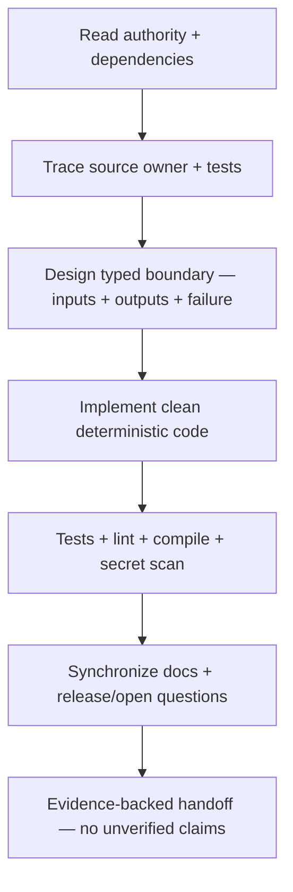

# GoldSwingTraderAI — Final Build Prompt

**Status:** PROVISIONAL — IMPLEMENTATION HANDOFF CONTRACT
**Version:** 1.0-design
**Location:** `docs/` root. This is a whole-project implementation handoff, not a competing behavioural authority.

## Purpose and role

Implement and complete **GoldSwingTraderAI**, a fresh XAUUSD/XAUUSDm trading system for meaningful intraday/open-session directional moves. Build the documented system; do not recreate a prior scalper or invent undocumented shortcuts.

Use `docs/CHATGPT_PROJECT_BUILD_AND_RECOVERY_GUIDE.md` for large implementation phases, phase completion and recovery after interrupted work.

## Authority order

1. `docs/00-foundation/SYSTEM_CONTRACT.md`
2. authoritative topic document for the feature
3. `docs/90-governance/DESIGN_DECISIONS.md`
4. `docs/90-governance/OPEN_QUESTIONS.md`
5. `docs/60-engineering/CODING_STANDARD.md`
6. `docs/60-engineering/MODULE_STRUCTURE.md`
7. `docs/CODER_GUIDE.md`
8. operator/testing/release supporting docs
9. this prompt as summary/handoff only

If authoritative documents conflict, resolve the documentation contradiction before coding the affected behaviour. Never silently guess a critical rule.

## How an implementation agent must use this prompt

This prompt is the compact execution brief for an AI coding agent. It is not a
replacement for the detailed docs. The agent must use it to orient itself, then
open the authoritative document and source/test map for the feature being
changed.

For every requested change, follow this loop:

1. identify the behavioural authority and the single source owner;
2. read the surrounding contracts that feed it and consume it;
3. inspect the existing implementation and tests before designing a new layer;
4. state the dataflow, failure/UNKNOWN behaviour, persistence effect and
   broker-authority boundary;
5. implement the smallest typed, deterministic change;
6. add or update focused tests for positive, negative, unknown, chronology,
   restart and boundary cases as applicable;
7. update the authority, module map, coder guide, operator/research/release
   docs affected by the change;
8. run the standard verification commands and inspect the diff for accidental
   deletion or secret exposure;
9. report what is software-proven, what is environment-pending and what the
   next safe step is.

The implementation graph is:



When a rule appears to belong to two documents or modules, stop and resolve
ownership before coding. Do not solve uncertainty by adding another wrapper,
filter or fallback.

## Architecture that must survive implementation

- XAUUSD/XAUUSDm focused.
- H4 context, H1 direction, M15 opportunity/location, M5 entry timing.
- Completed candles own structural confirmation; no future-confirmed pivots/lookahead.
- Parallel specialist desks, not a long sequential filter chain.
- Independent BUY and SELL theses.
- Opportunity and Entry Timing are separate dimensions.
- Explicit conflict/Red-Team handling.
- Six initial V1 strategy families operate in parallel:
  1. Trend Pullback Continuation
  2. Breakout Expansion
  3. Breakout Retest Continuation
  4. Liquidity Sweep Reversal
  5. Failed Breakout Reversal
  6. Compression Expansion
- Candle/structure leads; EMA20/EMA50, RSI, ATR, FVG, OB, trendlines, Fibonacci and POC/volume-profile context are supporting evidence rather than universal hard gates.
- Technical confluence is **bonus-only in the initial implementation**: supportive Trendline/Fibonacci/POC may add a bounded score bonus; missing confluence must not reduce the base strategy score; opposed/unclear confluence may be recorded as context/conflict but cannot automatically hard-block a trade.
- POC is broker-local context. Prefer real volume where available; otherwise label tick-volume approximation honestly.
- Safety is binary authority outside soft scoring.
- Structural Trade Plan exists before monetary sizing.
- Original R is immutable.
- One centralized Execution Permission Gate owns final irreversible MT5 write permission.
- One-shot irreversible submission; ambiguous acknowledgement is reconciled, never blind-retried.
- One active execution controller per managed account/symbol.
- Persistent risk/order/trade/opportunity/research/learning state survives restart and laptop migration.
- Research/learning/invention cannot silently self-promote or bypass hard safety.

## Feature navigation map for the agent

| If the task mentions… | Read first | Then inspect |
|---|---|---|
| candles, swings, BOS/MSS, no-lookahead | 10-market-intelligence/CANDLE_STRUCTURE.md | intelligence/candle_structure.py and intelligence/snapshot.py |
| EMA, RSI, ATR, volatility, extension | 10-market-intelligence/INDICATORS_AND_VOLATILITY.md | intelligence/indicators.py |
| levels, location, Trendline, Fib, POC | 10-market-intelligence/TECHNICAL_STRUCTURE_AND_LEVELS.md | intelligence/technical.py and intelligence/confluence.py |
| sweeps, FVG, OB, liquidity path | 10-market-intelligence/LIQUIDITY_AND_SMC.md | intelligence/liquidity.py |
| strategy family or confluence bonus | 20-trading-decisions/STRATEGY_FLOOR.md | strategies/floor.py and strategies/confluence.py |
| BUY/SELL score, conflict, WAIT/MISSED/INVALID | 20-trading-decisions/SCORING_AND_DECISION_FUSION.md and ENTRY_TIMING.md | decisions/fusion.py, opportunity.py, timing.py |
| SL, targets, RR, original R | 20-trading-decisions/TRADE_PLAN.md | decisions/trade_plan.py |
| lot size, daily lock, cooldown, exposure | 30-risk-execution/RISK_CONTRACT.md | risk/engine.py and risk/state.py |
| session/news blackout or reopen | 30-risk-execution/SESSION_AND_RISK_STATE_MACHINE.md | risk/permissions.py and app/session_news.py |
| order send, duplicate prevention, controller | 30-risk-execution/EXECUTION_AND_BROKER_SAFETY.md | execution/gate.py, service.py, mt5_writer.py, controller.py |
| restart, restore, backup, reconciliation | 30-risk-execution/PERSISTENCE_RESTART_AND_RECOVERY.md | persistence/ and app/recovery*.py |
| open-trade behaviour | 20-trading-decisions/TRADE_MANAGER_AND_EXIT.md | management/ and app/cycle.py |
| loop/startup/dashboard | 00-foundation/ARCHITECTURE.md and 60-engineering/MODULE_STRUCTURE.md | app/runtime.py, cycle.py, loop.py, dashboard.py |
| learning, discovery, AI, promotion | 40-research-learning/ | research/ |

This table is a route into the docs; the authority order above remains binding.

## Accuracy without unnecessary restriction

The system objective is **better accuracy + healthy valid trade opportunity coverage**, not maximum filtering.

Implementation must preserve these principles:

- one strong coherent strategy family may create an opportunity;
- all six families do not need to agree;
- missing optional evidence is absent/unknown, not score zero;
- soft conflict adjusts evidence/confidence rather than becoming arbitrary hard BLOCK;
- H4/H1/M15/M5 need not form perfect alignment for every valid setup;
- poor current timing normally means `WAIT`, not destruction of a valid thesis;
- research evaluates Opportunity Recall, missed meaningful moves and sensible trade frequency alongside Net R/drawdown/accuracy;
- a rule that improves headline win rate by discarding too many good Gold opportunities is not automatically an improvement.

## Frozen coding and implementation style

The implementation must obey `docs/60-engineering/CODING_STANDARD.md`, which is **FROZEN FOR INITIAL IMPLEMENTATION**.

This requirement is project-wide: it covers every maintained code path,
including runtime, risk/execution, persistence/recovery, dashboard/operator
tools, research/discovery/learning, scripts, configuration and tests. Research
or test-specific exceptions are allowed only where the Coding Standard names
the boundary; they never permit weaker safety, chronology, determinism or
secret-handling rules.

Primary engineering objective:

> **Use the minimum clear production-grade code that fully expresses required behaviour and safety. Keep runtime light, explicit, optimized enough for the real workload, professionally commented and easy to audit. Do not build unnecessary bulk.**

Mandatory engineering rules:

- Python 3.11+;
- standard library first; minimal runtime dependencies;
- official `MetaTrader5` package for terminal integration;
- no pandas/web framework/ORM/task queue/ML stack in live runtime without a real requirement;
- heavier research dependencies isolated from normal runtime;
- pure typed functions for deterministic market/risk/math where practical;
- classes only for genuine state/resource/lifecycle ownership;
- typed dataclasses/enums/IDs where they protect semantics;
- one verified snapshot/shared derived facts instead of repeated MT5 reads or duplicate EMA/ATR/structure work;
- fresh execution reads remain mandatory where execution contract requires them;
- avoid both giant all-in-one files and hundreds of trivial micro-files;
- no speculative Factory/Service/Manager abstraction jungle;
- comments/docstrings explain why, chronology, safety invariants and broker quirks;
- no broad silent exception swallowing;
- concise structured secret-redacting logs;
- centralized/configurable policy values rather than scattered magic numbers;
- tests protect behaviour/safety/regressions rather than pad counts;
- safety code stays direct and boring rather than clever/metaprogrammed.

Before each phase closes, review for dead code, duplicate calculations, unnecessary abstraction, mixed responsibility, needless dependencies, silent errors and weak safety tests.

An expert-level change also makes the following explicit:

- which functions are pure and which classes own real lifecycle/resources;
- which inputs are immutable/shared and which reads must be fresh;
- the expected complexity and bounded history/memory behaviour;
- deterministic ordering/tie-breaks and UTC chronology;
- the comment/docstring explaining the non-obvious safety or market invariant;
- the exception/result taxonomy for unavailable, corrupt and ambiguous truth;
- the transaction/idempotency/fencing identity for durable or broker actions;
- the exact test proving the new boundary cannot bypass hard authority.

## Positive DEMO guard — V1

V1 defines one environment rule only:

```text
Connected MT5 account verified DEMO
→ DEMO_GUARD = PASS
```

Broker writes may proceed only when this guard and every other required execution authority pass.

If DEMO status is not verified, broker-write permission is not granted.

Do **not** implement a separate REAL authorization system, REAL mode workflow, or V1 REAL hard-block contract. Do not scatter environment checks through strategy/UI code.

## Initial frozen risk policy

```text
Profile  Equity Range            Normal Risk   Elevated Risk    Entry Ceiling   Daily Lock
SMALL    >0 and < $300           3.0–4.5%      >4.5–6.5%        7%              12%
MEDIUM   $300–$999.99            2.0–3.0%      >3.0–4.5%        5%               9%
NORMAL   $1,000+                 1.0–2.0%      >2.0–3.5%        4%               7%
```

Important rules:

- **No V1 `$100` minimum balance/equity floor.** Any positive DayStartEquity below `$300` is SMALL.
- `$99`, `$50`, `$30`, etc. are not blocked merely because account is below `$100`.
- Account size alone must not become an extra hard filter; actual executable risk geometry is authoritative.
- SMALL evaluates practical broker minimum volume such as `0.01`; theoretical raw lot below minimum is not automatic reject.
- Actual all-in risk of executable volume decides affordability.
- If minimum volume exceeds SMALL `7%` new-entry ceiling, block only that current plan without distorting SL; opportunity may remain ARMED for a naturally better entry.
- Never move structural SL merely to fit desired risk.
- High strategy score does not increase monetary risk.
- Profile is fixed from positive DayStartEquity for the UTC risk day rather than switching with intraday floating P/L.
- V1 capacity is `0/1`: one independently risk-bearing Gold position.
- Manual/foreign/unknown-owner Gold exposure blocks fresh bot Gold entry and is never treated as bot-owned.
- Daily loss accounting uses cash-flow-adjusted verified account equity so floating account drawdown counts.
- Manual loss reset is OFF by default; if explicitly enabled, maximum one governed `R,R` reset per UTC risk day.
- One ordinary loss does not create global cooldown.
- At most one genuinely fresh same-Market-Episode re-entry; a second loss in that episode locks it.
- Three consecutive closed bot losses trigger minimum 30-minute cooldown plus fresh completed M15 context and fresh valid opportunity before release.
- Generic margin estimates are diagnostic only; exact broker margin is authoritative when available and freshly revalidated before execution.

## Trade Plan, target and runner policy

No fixed 100/200/300-pip take-profit system.

```text
<1.20R          → reject current plan
1.20R–<1.50R    → conditional; credible ~2R+ expansion path required
1.50R–<2.00R    → good
2.00R+          → strong
3R/4R+          → runner potential, not guaranteed
```

Target roles:

- Immediate Obstacle;
- Primary Structural Target — management checkpoint, not automatic full exit;
- Expansion Target — default initial broker TP when valid;
- Runner Objective — only after fresh continuation/acceptance evidence and a newly defined objective.

V1 management must work correctly with one indivisible `0.01` position; partial profit is not required.

## Open-trade management

Trade Manager actions:

```text
HOLD
PROTECT
TRAIL
RUNNER
EXIT
```

Do not close healthy Gold expansion merely because a small floating profit was reached. Protection/trailing is earned by confirmed structure/continuation and must not intentionally widen beyond original approved risk.

## Scheduled closure / reopen policy

V1 does not intentionally carry bot-managed Gold through known scheduled XAU closure/reopen gap risk.

```text
Daily break:
T-20m  no new entry
T-10m  mandatory governed flatten
Reopen normalized + at least 1 clean completed M5

Weekend:
T-60m  no new entry
T-30m  mandatory governed flatten
Reopen gap assessment + normalized conditions + at least 2 clean completed M5
```

Timing is relative to verified broker Gold session schedule. PRE_CLOSE flatten overrides runner logic. Ambiguous close remains unresolved/durable until broker reconciliation proves truth.

## News safety

```text
TIER 1 CRITICAL  → -15/+15 min hard new-entry blackout
TIER 2 HIGH      → -5/+5 min hard new-entry blackout
TIER 3 CONTEXT   → no automatic hard blackout
```

Linked Tier-1 clusters remain blocked through final critical item +15 minutes. Scheduled news does not automatically force-close an existing managed trade. Severe post-event dislocation requires normalized execution plus at least one clean completed M5. Missing required calendar truth becomes `NEWS_SAFETY_UNKNOWN`.

## Spread and price drift

```text
SpreadRatio <=1.50         → NORMAL
>1.50–2.25                 → ELEVATED + full revalidation
>2.25                      → current entry prevented
spread >25% of SL distance → current entry prevented
```

Adverse price drift from Approved Entry Reference:

```text
<=10% of planned SL distance → normal revalidation
>10–20%                      → elevated full revalidation
>20%                         → current intent prevented / WAIT if thesis survives
```

Fresh risk/stop/target/chase invalidation prevents execution regardless of ratio.

## Central execution permission and broker-write path

All create/modify/close actions pass one auditable boundary.

Inputs include authoritative results for:

```text
DEMO guard
account identity
market/data/quote integrity
news/session permission
risk
position ownership/capacity
order lifecycle/reconciliation
controller ownership
fresh broker execution checks
```

Output exposes:

```text
ALLOW / BLOCK / UNKNOWN
Primary Reason
Secondary Reasons
Would Otherwise Trade where meaningful
```

Raw irreversible MT5 calls must not be reachable directly from strategy, scoring, timing, Trade Plan, dashboard, research, learning or autonomous invention.

Before send, persist durable Execution Intent. One Intent ID allows at most one irreversible send for its lifetime. Pre-check rejection is not a send attempt. Success-like MT5 acknowledgement alone is not final exposure truth; verify positions/orders/deals. Ambiguous result becomes reconciliation-only, never blind retry.

## Controller / second-laptop policy

```text
one PRIMARY
renewal target 10 seconds
lease TTL 30 seconds
monotonic fencing epoch
fresh controller ownership before every broker write
```

Second laptop remains Observer while another valid controller exists. Standby takeover requires authoritative lease expiry, atomic new epoch and full broker/state reconciliation before PRIMARY READY. Returned stale old primary cannot write.

A deterministic in-memory backend may test lease semantics, but cross-laptop DEMO certification requires a real shared atomic coordination backend.

## Persistence and broker truth

Broker is authority for current positions/orders/deals/account facts. Local state owns intent, context and lifecycle history.

Initial V1 local durable foundation uses:

```text
standard-library SQLite
+ canonical JSON records
+ checksums/schema versions
+ transactional updates/event history
+ typed recovery adapters
```

Persist/recover as applicable:

- risk day/loss lock/reset/cooldown;
- Execution Intents and unresolved broker lifecycle;
- managed trade/original R/SL/TP/objectives;
- Opportunity/Market Episode lineage;
- journals/performance;
- Candidate/Promotion registries and rejected memory;
- StrategyMemory/entry/exit learning;
- research/invention history;
- schema/integrity/backup metadata.

Restart never means blank financial/order state. Reconcile broker truth before new writes.

The integrated startup composition now makes state selection explicit:

```text
READINESS  → one read-only MT5 snapshot
PRIMARY    → controller-gated persistent startup/recovery/runtime loop
STANDBY    → governed lease/takeover attempt and recovery
EXISTING   → use local runtime DB; missing risk state blocks
INITIALIZE → create first risk-day baseline only in an otherwise empty store
RESTORE    → verify checkpoint and restore only to a new runtime DB
```

Absent authoritative session/news input remains UNKNOWN. The persistent M5
runtime loop and provider-neutral snapshot handoff now exist, but the launcher
cannot be called live-ready until an accepted external producer and real broker
evidence are supplied.

## Public backup / financial-secret policy

Public repository may back up source, docs, strategies, learned parameters, candidates, performance/research history and portable recovery intelligence.

Never commit authority-bearing secrets capable of financial action/authenticated account control/direct paid-service cost: MT5 passwords, private broker/session tokens, paid API keys, GitHub PATs, private/signing keys, paid cloud/database credentials or recovery keys with financial authority.

Run financial-secret scanning before public backup. If a credential was exposed publicly, revoke/rotate it; deletion alone is insufficient.

## Research, learning and autonomous improvement

Research should analyze taken, missed, blocked/rejected and invalidated opportunities where practical.

Required principles:

- chronological/no-lookahead replay;
- production decision semantics reused where parity is claimed;
- actual broker P/L and counterfactual missed/blocked outcomes kept separate;
- MFE/MAE, realized R, Capture Efficiency, Entry Efficiency, premature-exit cost;
- Opportunity Recall and large-move recall;
- StrategyMemory influence bounded/versioned;
- candidates declarative/bounded, never arbitrary executable Python;
- hard risk/broker safety outside candidate search space;
- production promotion governed, never silent.

### Discovery liveness

Strategy discovery/invention must be **operational, not decorative**:

```text
real/replay outcome episode
→ durable research journal
→ audited primitive mapping
→ recurring eligible cluster
→ candidate created
OR explicit governed suppression reason
→ durable Candidate Registry
→ validation/promotion lifecycle
```

If eligible evidence disappears without candidate or suppression reason, Discovery Health is `DEGRADED`.

Rejected/duplicate ideas remain durable so restart does not repeatedly reinvent them. Candidates cannot skip stages, mutate after lock and reuse the same holdout, self-promote or gain raw broker authority.

Trendline/Fibonacci/POC must be available to research as audited confluence primitives/context so replay can measure whether they improve accuracy/Net R/capture without unnecessarily damaging Opportunity Recall/trade frequency.

## Dashboard requirements

Preserve useful GoldScalperAI visibility:

- runtime mode/role;
- XAU symbol;
- Bid/Ask;
- spread + quality;
- M5 candle timer;
- trend/structure;
- EMA20/EMA50;
- RSI;
- ATR;
- signal/action + exact reason;
- risk profile/risk/lot;
- daily P/L/limit/remaining budget;
- position count/capacity;
- loss streak/cooldown;
- open trade entry/SL/TP/objectives.

Add compact Decision, Execution, Learning/Discovery, Backup and System Health panels. Trendline/Fibonacci/POC may be shown compactly as confluence/context but must never be presented as hard permission.

## Prohibited shortcuts

Do not:

- turn every soft signal into a hard gate;
- require every indicator/SMC/Trendline/Fibonacci/POC primitive for every trade;
- treat missing optional evidence as score zero;
- let score override risk/news/account/data/execution safety;
- use future candles/future-confirmed pivots;
- move structural SL to fit desired risk;
- redefine original R after trailing;
- invent arbitrary `$100` or other positive-equity minimum trading floor;
- open automatic second independent Gold position/hedge in V1;
- manage manual/foreign exposure as bot-owned;
- blind-retry ambiguous broker writes;
- assume unknown broker/order/P&L/exposure truth is safe/zero;
- bypass centralized write gate;
- let two controllers write simultaneously;
- silently reset critical state after crash/corruption;
- allow research/AI to self-promote or modify hard safety;
- allow eligible discovery evidence to vanish silently;
- generate/eval/exec arbitrary autonomous Python;
- leak financial-authority secrets;
- introduce unnecessary abstractions/dependencies/frameworks;
- duplicate expensive calculations/MT5 reads when a verified shared result exists;
- treat calibration/ordinary implementation choices as reasons to stall the build.

## Large implementation sequence

Use `docs/CHATGPT_PROJECT_BUILD_AND_RECOVERY_GUIDE.md`:

1. Foundation/package/contracts
2. MT5 read layer + market data
3. Full market intelligence
4. Strategy floor + BUY/SELL fusion + entry timing
5. Trade Plan + Risk Engine
6. Session/news + persistence/recovery foundation
7. Execution gate + controller + governed MT5 writes
8. Trade Manager + runner/exit
9. Dashboard + operator workflows
10. Replay/research/learning/autonomous lab
11. Backup/migration/fault-recovery drill
12. Full integration + controlled DEMO certification + release audit

After every coherent phase, code, tests and relevant documentation must agree before proceeding.

## Validation principles

- Documentation completion is not implementation proof.
- Static/deterministic CI is not live broker proof.
- Software correctness is not profitability proof.
- Historical results do not guarantee future profit.
- Replay claims require chronological no-lookahead proof.
- Optional confluence requires ablation/opportunity-recall evidence; popularity is not proof of value.
- Irreversible broker writes require duplicate-prevention/fault/restart evidence.
- Backup existence is not recovery proof; fresh-machine restore must be tested.
- Learning/promotion must prove production cannot silently mutate.
- Dashboard/reason traces are tested behaviour, not decoration.
- Passing tests does not excuse unnecessary complexity.

## Implementation readiness

`docs/90-governance/OPEN_QUESTIONS.md` classifies remaining items as frozen direction, research calibration, implementation choice, operator detail or later work. Research calibration and ordinary implementation choices are not reasons to delay implementation.

Before final release, perform a cross-document contradiction/coverage audit and controlled DEMO certification. Do not relabel pending live evidence as VERIFIED.
