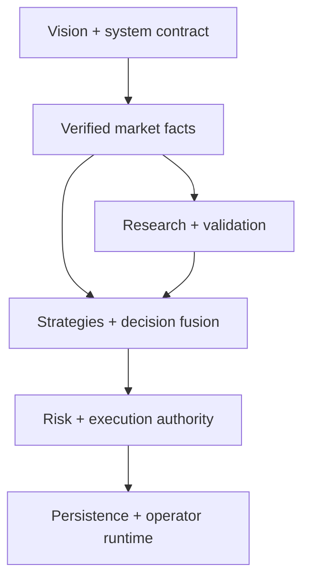

# GoldSwingTraderAI Documentation Index

This folder is the design source of truth for GoldSwingTraderAI.

> **One topic, one authoritative home. Supporting documents link to that authority instead of creating competing versions.**

## Status meanings

- **DRAFT** — incomplete working document.
- **PROVISIONAL** — agreed direction; still open to refinement/calibration.
- **FROZEN** — approved behavioural/engineering contract for implementation.
- **IMPLEMENTED** — corresponding behaviour exists in code.
- **VERIFIED** — exact implementation passed required executable validation.
- **SUPERSEDED** — replaced by a named authoritative document or contract; the
  useful meaning remains traceable through a redirect or replacement note.

## Documentation architecture and proof boundary

The documentation is written as a set of design contracts: intent first,
facts next, decisions after facts, hard monetary/broker authority after
decisions, and durable/operator/research boundaries alongside the runtime.
The reading order below follows that dependency direction.

Executable software proof is owned by
[`TESTING_AND_VERIFICATION.md`](60-engineering/TESTING_AND_VERIFICATION.md).
Revision-specific live, broker and DEMO evidence is owned by
[`FINAL_RELEASE_AUDIT.md`](60-engineering/FINAL_RELEASE_AUDIT.md). Calibration
and external proof gates are classified in
[`OPEN_QUESTIONS.md`](90-governance/OPEN_QUESTIONS.md). None of these
evidence documents silently overrides a behavioural authority.

### Documentation consistency rule

Whenever a contract, source owner, state, schema or release gate changes,
update the authoritative topic, its module/test map and the relevant operator,
research and release references. Compatibility redirects remain pointers only.

## Quick-access whole-project guides

- [`FINAL_BUILD_PROMPT.md`](FINAL_BUILD_PROMPT.md) — whole-project implementation handoff contract.
- [`CHATGPT_PROJECT_BUILD_AND_RECOVERY_GUIDE.md`](CHATGPT_PROJECT_BUILD_AND_RECOVERY_GUIDE.md) — large phases, resume/recovery and project-completion guide.
- [`USER_MANUAL.md`](USER_MANUAL.md) — operator-facing behaviour/manual.
- [`SETUP_AND_RUN_GUIDE.md`](SETUP_AND_RUN_GUIDE.md) — setup, safe READINESS mode, explicit live startup/recovery modes and future persistent-runtime workflow.
- [`CODER_GUIDE.md`](CODER_GUIDE.md) — feature-oriented implementation map and source/test ownership.
- [`60-engineering/CODING_STANDARD.md`](60-engineering/CODING_STANDARD.md) — **FROZEN** project-wide code quality/dependency/complexity/commenting contract.

Old subfolder locations for User Manual, Setup/Run Guide and Coder Guide are compatibility redirects only.

## Recommended reading order

The documents are interconnected, but a reader should not have to discover the
order by trial and error:

1. [Project Vision](00-foundation/PROJECT_VISION.md) — why the system exists and what it is not.
2. [System Contract](00-foundation/SYSTEM_CONTRACT.md) — system-wide behavioural invariants.
3. [Architecture](00-foundation/ARCHITECTURE.md) — runtime/dataflow and authority boundaries.
4. [Trading Floor Architecture](00-foundation/TRADING_FLOOR_ARCHITECTURE.md) — specialist desks and ownership.
5. The 10, 20 and 30 folders — facts → decisions → hard permission/execution.
6. [Module Structure](60-engineering/MODULE_STRUCTURE.md) and [Coder Guide](CODER_GUIDE.md) — exact source/test navigation.
7. [Coding Standard](60-engineering/CODING_STANDARD.md) — how code must be written, commented, optimized and verified.
8. The 40 folder — offline replay, learning, discovery and promotion boundaries.
9. [Setup and Run Guide](SETUP_AND_RUN_GUIDE.md), [User Manual](USER_MANUAL.md) and [Dashboard and UX](50-operator/DASHBOARD_AND_UX.md) — how a human operates the system.
10. [Final Build Prompt](FINAL_BUILD_PROMPT.md) and [ChatGPT Build and Recovery Guide](CHATGPT_PROJECT_BUILD_AND_RECOVERY_GUIDE.md) — how an implementation agent completes and safely resumes the project.
11. The 90 folder — decisions, freeze matrix and documentation governance.

This is a reading path, not a new authority order. The authority order below
still decides which document owns a rule.

## Folder ownership

| Folder | Owns |
|---|---|
| `00-foundation/` | Mission, system-wide invariants, high-level architecture, trading-floor ownership |
| `10-market-intelligence/` | Market facts/inference: data, candles, structure, levels/confluence, liquidity, indicators, macro, sessions |
| `20-trading-decisions/` | Strategy families, theses, scoring/fusion, entry timing, Trade Plan, exits |
| `30-risk-execution/` | Monetary risk, permission states, broker-write safety, persistence/restart/reconciliation |
| `40-research-learning/` | Replay/validation, discovery, invention, experiments/promotion, learning/AI boundaries |
| `50-operator/` | Dashboard/UX supporting docs; primary User/Setup guides are at docs root |
| `60-engineering/` | Coding standard, module map, diagnostics, testing, release gates/audit; primary Coder Guide at docs root |
| `90-governance/` | Design decisions, freeze matrix/open questions and documentation/change governance |

## 00 — Foundation

| Document | Status | Purpose |
|---|---|---|
| [Project Vision](00-foundation/PROJECT_VISION.md) | PROVISIONAL | Mission, trading personality, timeframe intent, non-goals |
| [System Contract](00-foundation/SYSTEM_CONTRACT.md) | PROVISIONAL | Highest-level behavioural contract |
| [Architecture](00-foundation/ARCHITECTURE.md) | PROVISIONAL | High-level system flow/authority boundaries including technical confluence |
| [Trading Floor Architecture](00-foundation/TRADING_FLOOR_ARCHITECTURE.md) | PROVISIONAL | Specialist desks, BUY/SELL teams, debate/red-team and authority model |

## 10 — Market Intelligence

| Document | Status | Purpose |
|---|---|---|
| [Market Data and History](10-market-intelligence/MARKET_DATA_AND_HISTORY.md) | PROVISIONAL | Rolling history, timeframe data and data-quality rules |
| [Candle Structure and Price Behaviour](10-market-intelligence/CANDLE_STRUCTURE.md) | PROVISIONAL | Candle sequences, swing lifecycle, BOS/MSS, displacement, rejection, compression/expansion |
| [Technical Structure and Levels](10-market-intelligence/TECHNICAL_STRUCTURE_AND_LEVELS.md) | PROVISIONAL | S/R zones, location/target room plus causal Trendline/Fibonacci/broker-local POC confluence ownership |
| [Liquidity and SMC](10-market-intelligence/LIQUIDITY_AND_SMC.md) | PROVISIONAL | Liquidity pools/sweeps, FVG, qualified OB, premium/discount/path |
| [Indicators and Volatility](10-market-intelligence/INDICATORS_AND_VOLATILITY.md) | PROVISIONAL | EMA/RSI/ATR, volatility, momentum, extension |
| [Fundamental and News](10-market-intelligence/FUNDAMENTAL_AND_NEWS.md) | PROVISIONAL | Macro opinion/event facts/provider health; hard permission lives in risk/session safety |
| [Session Context](10-market-intelligence/SESSION_CONTEXT.md) | PROVISIONAL | Asia/London/New York market evidence; not hard permission state |

Trendline/Fibonacci/POC are optional soft confluence in V1. They are not mandatory trade gates.

## 20 — Trading Decisions

| Document | Status | Purpose |
|---|---|---|
| [Strategy Floor](20-trading-decisions/STRATEGY_FLOOR.md) | PROVISIONAL | Six parallel production families + optional bounded confluence support |
| [Entry Timing](20-trading-decisions/ENTRY_TIMING.md) | PROVISIONAL | Persistent setup lifecycle/executable timing |
| [Scoring and Decision Fusion](20-trading-decisions/SCORING_AND_DECISION_FUSION.md) | PROVISIONAL | BUY/SELL theses, conflict/scoring/Red Team/why-no-trade |
| [Trade Plan](20-trading-decisions/TRADE_PLAN.md) | PROVISIONAL | Entry reference, structural invalidation/SL, targets/RR/original R |
| [Trade Manager and Exit](20-trading-decisions/TRADE_MANAGER_AND_EXIT.md) | PROVISIONAL | HOLD/PROTECT/TRAIL/RUNNER/EXIT |

## 30 — Risk and Execution

| Document | Status | Purpose |
|---|---|---|
| [Risk Contract](30-risk-execution/RISK_CONTRACT.md) | PROVISIONAL | Monetary risk, hybrid sizing, UTC risk day, loss lock/reset/exposure |
| [Session and Risk State Machine](30-risk-execution/SESSION_AND_RISK_STATE_MACHINE.md) | PROVISIONAL | Hard market/news/risk/system permission states |
| [Session/News Provider Contract](30-risk-execution/SESSION_NEWS_PROVIDER_CONTRACT.md) | PROVISIONAL | Strict provider-neutral live session/news snapshot boundary |
| [Execution and Broker Safety](30-risk-execution/EXECUTION_AND_BROKER_SAFETY.md) | PROVISIONAL | DEMO guard, gate, MT5 safety, one-shot writes, controller/reconciliation |
| [Persistence, Restart and Recovery](30-risk-execution/PERSISTENCE_RESTART_AND_RECOVERY.md) | PROVISIONAL | SQLite durable lifecycle, backup/restore/laptop migration contract |

## 40 — Research and Learning

| Document | Status | Purpose |
|---|---|---|
| [Research and Validation](40-research-learning/RESEARCH_AND_VALIDATION.md) | PROVISIONAL | Chronological replay, validation, ablation, Opportunity Recall, holdouts/stress |
| [Governed Strategy Discovery](40-research-learning/GOVERNED_STRATEGY_DISCOVERY.md) | PROVISIONAL | Working discovery liveness, audited primitives, candidate comparison |
| [Autonomous Strategy Invention](40-research-learning/AUTONOMOUS_STRATEGY_INVENTION.md) | PROVISIONAL | Bounded declarative invention/genealogy/prohibited self-writing |
| [Governed Experiments and Promotion](40-research-learning/GOVERNED_EXPERIMENTS_AND_PROMOTION.md) | PROVISIONAL | Challenger/holdout/Shadow/DEMO Canary/promotion/rollback |
| [Learning and AI Boundaries](40-research-learning/LEARNING_AND_AI_BOUNDARIES.md) | PROVISIONAL | StrategyMemory, entry/exit learning, AI authority limits |

A separate authoritative `OFFLINE_RESEARCH.md` is intentionally not used.

## 50 — Operator

| Document | Status | Purpose |
|---|---|---|
| [Dashboard and UX](50-operator/DASHBOARD_AND_UX.md) | PROVISIONAL | Compact terminal dashboard, confluence context, discovery health, reason/execution/health visibility |
| [User Manual](USER_MANUAL.md) | DRAFT | Normal operation/interpretation, safety and operator evidence boundary |
| [Setup and Run Guide](SETUP_AND_RUN_GUIDE.md) | DRAFT | Readiness/live startup modes, persistent runtime, installation, recovery and migration |

## 60 — Engineering

| Document | Status | Purpose |
|---|---|---|
| [Coding Standard](60-engineering/CODING_STANDARD.md) | **FROZEN** | Lightweight production-grade Python/dependency/abstraction/commenting/performance rules |
| [Coder Guide](CODER_GUIDE.md) | PROVISIONAL implementation map | Feature-oriented real file/test ownership |
| [Module Structure](60-engineering/MODULE_STRUCTURE.md) | PROVISIONAL module map | Module/dependency ownership and boundaries |
| [System Health and Diagnostics](60-engineering/SYSTEM_HEALTH_AND_DIAGNOSTICS.md) | PROVISIONAL | Fault severity/trading impact/recovery/health aggregation |
| [Testing and Verification](60-engineering/TESTING_AND_VERIFICATION.md) | PROVISIONAL | No-lookahead, confluence, discovery liveness, execution/recovery/DEMO proof architecture |
| [Release Checklist](60-engineering/RELEASE_CHECKLIST.md) | PROVISIONAL | DEMO release gates/sign-off checklist |
| [Final Release Audit](60-engineering/FINAL_RELEASE_AUDIT.md) | DRAFT TEMPLATE | Evidence-backed release snapshot; PASS only after actual evidence |

## 90 — Governance

| Document | Status | Purpose |
|---|---|---|
| [Design Decisions](90-governance/DESIGN_DECISIONS.md) | Authoritative ledger | Accepted/provisional decisions, including SQLite/confluence/discovery-liveness decisions |
| [Open Questions / Freeze Matrix](90-governance/OPEN_QUESTIONS.md) | Authoritative matrix | Frozen direction vs calibration vs implementation choice vs later work |
| [Documentation Standard](90-governance/DOCUMENTATION_STANDARD.md) | FROZEN | Placement, authority, status, preservation, synchronization and change-control rules |

## Key boundaries

- Candle Structure owns BOS/MSS/swing geometry.
- Technical owns generic zones/location/target room and documented confluence authority; implementation may split technical/confluence modules for clean code.
- Trendline/Fibonacci/POC are soft bonus/context, not hard permission.
- Liquidity owns pools/sweeps/FVG/OB interpretation.
- Fundamental/News publishes facts/opinion; Session/Risk owns hard news permission.
- Trade Plan owns initial entry/SL/targets/original R; Trade Manager owns post-entry management.
- Risk owns monetary affordability; Execution owns final broker-write path.
- Scoring/Fusion owns decision attribution; System Health owns technical fault aggregation.
- Persistence owns storage/recovery/backup mechanics; research docs own learning/candidate semantics.
- Coding Standard owns source-quality/complexity/dependency/commenting rules.

## Authority rule

When documents conflict:

1. `00-foundation/SYSTEM_CONTRACT.md`
2. specific authoritative topic document
3. `90-governance/DESIGN_DECISIONS.md`
4. `90-governance/OPEN_QUESTIONS.md`
5. `60-engineering/CODING_STANDARD.md` for engineering rules
6. supporting engineering/operator docs
7. `FINAL_BUILD_PROMPT.md` as handoff summary only

No implementation should silently resolve contradiction by guessing.
