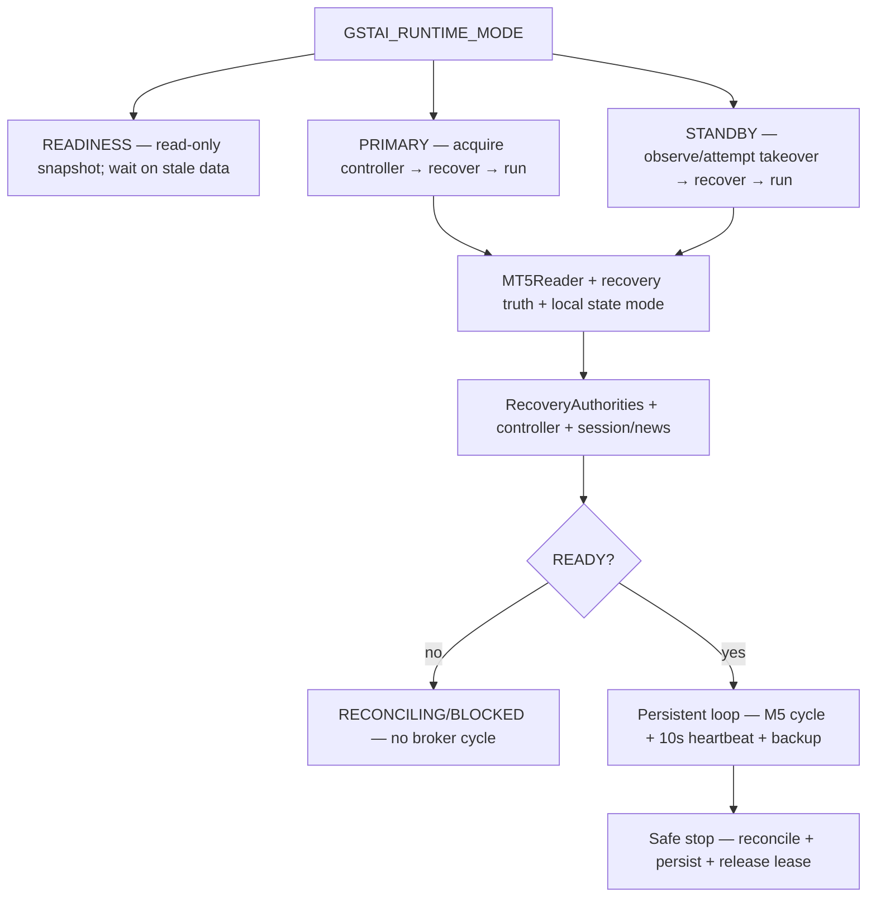
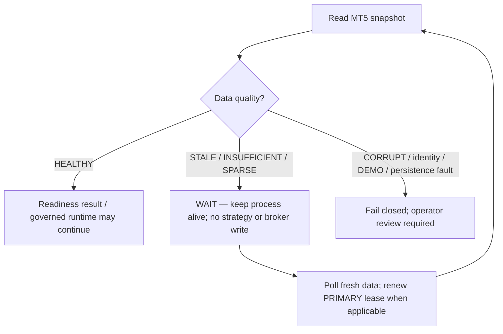

# GoldSwingTraderAI — Setup and Run Guide

**Status:** DRAFT — OPERATOR WORKFLOW MANUAL
**Version:** 0.11-implementation
**Authority:** Operator workflow for installation, startup, safe shutdown, migration, restore and common blocked-state handling.
**Depends on:** `50-operator/DASHBOARD_AND_UX.md`, `30-risk-execution/EXECUTION_AND_BROKER_SAFETY.md`, `30-risk-execution/PERSISTENCE_RESTART_AND_RECOVERY.md`

## Purpose

This guide defines the operator commands and runtime modes from installation
through safe shutdown, restore and release proof.

## Source ownership and proof

| Operator concern | Source owner | Proof owner |
|---|---|---|
| Settings and launcher mode | `config/settings.py`, `app/main.py` | `tests/test_settings.py`, `tests/test_app_readiness.py` |
| Readiness stale-data monitor | `config/settings.py`, `app/main.py` | `tests/test_settings.py`, `tests/test_app_readiness.py` |
| Readiness terminal dashboard | `app/dashboard.py`, `operator/dashboard.py` | `tests/test_app_readiness.py`, `tests/test_dashboard.py` |
| MT5 initialization and broker facts | `market_data/mt5_reader.py`, `app/recovery_mt5.py` | `tests/test_market_data.py`, `tests/test_recovery_mt5.py` |
| Startup/recovery/controller | `app/runtime.py`, `app/startup.py`, `app/recovery.py`, `execution/controller.py` | `tests/test_live_startup_runtime.py`, `tests/test_startup_recovery.py`, `tests/test_sqlite_coordination.py` |
| Persistent cycle and shutdown | `app/cycle.py`, `app/loop.py` | `tests/test_runtime_loop.py` |
| Restore and public-safe backup | `persistence/`, `scripts/restore_runtime_checkpoint.py`, `scripts/stage_public_backup.py` | `tests/test_runtime_checkpoint.py`, `tests/test_backup_catalog.py` |

This guide describes operator actions; it does not reimplement risk,
permission or execution policy. Follow the linked authority documents when a
runtime state is `BLOCKED`, `UNKNOWN` or `RECONCILING`.

Important distinction:

- the production architecture is divided into strategy, risk, execution,
  management and research boundaries, with startup/recovery composing them;
- the default `goldswing` / `python -m goldswingtraderai` launcher runs the
  **read-only MT5 readiness path**;
- explicit `PRIMARY`/`STANDBY` mode enters the integrated startup/recovery and
  persistent M5 loop; absent session/news truth fails closed before READY;
- controlled Windows/MT5 DEMO execution is a separate release-evidence gate.

Do not infer that a module is missing merely because the selected launcher mode
does not invoke it, and do not infer live trading readiness merely because
component tests are green.

## Operator startup map

Choose the mode deliberately. READINESS proves connectivity without creating
runtime authority; PRIMARY/STANDBY build the full dependency graph and remain
fail-closed until recovery is complete.



Before PRIMARY/STANDBY can be used, the operator must understand the three
independent requirements:

1. MT5 terminal/account/symbol truth must be readable;
2. local durable state must be selected without destructive overwrite;
3. session/news, risk, position, execution and controller authorities must
   produce a governed READY result.

Green unit tests do not replace these environment checks.

### Closed-market / stale-data operating rule

Market closure is not a process-crash condition. The runtime must distinguish
the operator-visible wait state from a permission to trade:



The common weekend/closed-market case normally appears as stale quote or
completed-candle data because the broker feed is no longer advancing. The code
does not guess that a stale feed is definitely a scheduled closure; it reports
the exact data-quality reason and keeps trading disabled. `READINESS` remains a
read-only monitor. `PRIMARY`/`STANDBY` retain controller heartbeat while they
wait before `READY`, but they do not run a decision cycle or send an order in
that state.

## Prerequisites

For the Windows MT5 read path:

- Windows machine with MetaTrader 5 installed and open;
- intended MT5 account already connected in the terminal;
- Python **3.11+**;
- repository checkout/clone;
- network access required by terminal/broker.

The official `MetaTrader5` Python package is optional in CI but required for local terminal integration.

## First-time development setup

From repository root on Windows PowerShell/cmd:

```text
python -m venv .venv
.venv\Scripts\activate
python -m pip install --upgrade pip
python -m pip install -e ".[dev,mt5]"
copy .env.example .env
```

For deterministic development/CI without MT5 terminal support:

```text
python -m pip install -e ".[dev]"
pytest
python scripts/scan_financial_secrets.py .
```

Do not place MT5 passwords, authentication/session tokens or other financial-authority secrets in the repository.

## `.env` fields

The safe example exposes non-secret configuration such as:

```text
GSTAI_ENV=development
GSTAI_PREFERRED_SYMBOL=XAUUSDm
GSTAI_SYMBOL_ALIASES=XAUUSDm,XAUUSD
GSTAI_MANUAL_RESET_ENABLED=false
GSTAI_STATE_DIR=.state
GSTAI_LOG_LEVEL=INFO
GSTAI_RUNTIME_MODE=READINESS
GSTAI_READINESS_KEEP_ALIVE=true
GSTAI_READINESS_POLL_SECONDS=30
GSTAI_STATE_MODE=EXISTING
GSTAI_RESTORE_CHECKPOINT=
GSTAI_ALLOWED_ACCOUNT_LOGIN=
GSTAI_ALLOWED_SERVER=
GSTAI_MT5_MAGIC=
GSTAI_MT5_DEVIATION_POINTS=
GSTAI_MT5_COMMENT_PREFIX=GSTAI
GSTAI_HEALTHY_SPREAD_BASELINE=
GSTAI_SESSION_NEWS_FILE=
GSTAI_SESSION_NEWS_TTL_SECONDS=1800
```

`GSTAI_ALLOWED_ACCOUNT_LOGIN` and `GSTAI_ALLOWED_SERVER` are optional identity pins.

`GSTAI_READINESS_KEEP_ALIVE=true` makes the default read-only launcher keep
polling when quality is `STALE`, `INSUFFICIENT` or `SPARSE`; it exits normally
after data recovers. `GSTAI_READINESS_POLL_SECONDS` controls that bounded poll
interval. Set the keep-alive flag to `false` only when a one-shot diagnostic is
specifically required. This setting never grants broker-write authority.

### DEMO guard is not a config switch

There is deliberately no setting that disables DEMO verification.

```text
Connected MT5 account positively verified DEMO
→ DEMO_GUARD PASS
```

V1 does not define a separate REAL authorization workflow.

## Launcher commands

With MT5 open and environment activated:

```text
python -m goldswingtraderai
```

Equivalent console command:

```text
goldswing
```

### Integrated startup/recovery modes

The safe default is `GSTAI_RUNTIME_MODE=READINESS`. To run the integrated
startup composition, configure the explicit non-secret broker identifiers and
choose one of:

```text
GSTAI_RUNTIME_MODE=PRIMARY    # acquire/write-capable controller after recovery
GSTAI_RUNTIME_MODE=STANDBY    # wait for/attempt governed takeover after expiry
```

`GSTAI_MT5_MAGIC` and `GSTAI_MT5_DEVIATION_POINTS` are required in these modes.
They are not credentials. The startup path uses the existing initialized
`MT5Reader` module for reconciliation; it does not create a second MT5 client.
`GSTAI_HEALTHY_SPREAD_BASELINE` is optional configuration but required for an
entry/management gate PASS; leave it empty rather than guessing until the
broker-specific healthy XAU spread is calibrated.

`GSTAI_SESSION_NEWS_FILE` optionally points to the provider-neutral live
session/news handoff described in [`SESSION_NEWS_PROVIDER_CONTRACT.md`](30-risk-execution/SESSION_NEWS_PROVIDER_CONTRACT.md).
The producer must atomically replace a complete account/server/symbol-scoped
JSON snapshot. `GSTAI_SESSION_NEWS_TTL_SECONDS` bounds freshness. Missing,
malformed, mis-scoped, future-dated or stale input remains `UNKNOWN`; it never
becomes implicit session/news clearance.

Durable state selection is explicit:

```text
EXISTING   → use the current local runtime DB; missing risk state remains blocked
INITIALIZE → create the first UTC risk-day baseline only in an otherwise empty store
RESTORE    → verify GSTAI_RESTORE_CHECKPOINT and restore only to a new runtime DB
```

`RESTORE` refuses to overwrite an existing `runtime.db`. Checkpoint restore is
context only; live MT5 positions/orders/deals are still authoritative.

### Launcher mode behaviour

`READINESS` performs **read-only readiness**. With the default keep-alive
setting, it continues observing while required market data is stale or warming
up; it does not enter the strategy or execution path. `PRIMARY`/`STANDBY`
continue into the persistent runtime only after startup recovery is READY. The
read-only launcher path is:

```text
load/validate non-secret settings
→ initialize MT5 Python bridge
→ read connected account facts
→ resolve configured Gold symbol
→ read broker symbol specifications
→ read Bid/Ask
→ load completed H4/H1/M15/M5 candles
→ build normalized MarketSnapshot
→ evaluate positive DEMO fact
→ check optional account identity pins
→ map and render read-only readiness dashboard
→ log readiness/data quality
→ if data is retryably stale, wait and poll again; otherwise shutdown MT5 bridge
```

During a readiness wait, the same initialized `MT5Reader` is reused, the
configured symbol/account/DEMO identity is rechecked on every poll and the
process exits only on fresh/non-retryable result or operator stop. A later
identity mismatch or loss of positive DEMO verification returns a failure code;
it is never hidden by the wait loop.

The default readiness mode remains read-only. In `PRIMARY`/`STANDBY`, the
integrated path performs:

```text
initialize MT5 through MT5Reader
→ build normalized MarketSnapshot
→ build live MT5RecoveryTruth and broker-tick tolerance
→ select existing / initialize / verified-restored local state
→ assemble SQLite repositories, reconciler and controller fencing
→ construct RecoveryAuthorities from live account/market/risk/position/environment facts
→ invoke StartupRecoveryCoordinator
→ emit READY / RECONCILING / BLOCKED
→ if recovery reason is MARKET_DATA_STALE/INSUFFICIENT/SPARSE, keep MT5/controller alive and re-probe
→ if READY, keep controller/MT5 alive for persistent M5 cycles
→ renew controller every 10 seconds, checkpoint backups when due, safe shutdown
```

The pre-`READY` market-data wait is deliberately narrow. Corrupt data,
unknown session/news truth, missing risk state, account identity mismatch,
persistence failure and controller failure remain blocked/terminal according to
their existing recovery contracts. Only freshness/warm-up states are retried;
no safety authority is converted into a permissive default.

The READINESS launcher renders one read-only monitor frame after every
normalized snapshot, including stale-data waits. It displays only market/
broker freshness facts and makes the strategy/broker-write lock explicit.

The persistent launcher renders one read-only terminal dashboard frame after
each fresh cycle. It displays the already-produced market/decision/risk/
execution/recovery/controller/research/backup DTO; rendering cannot trigger a
new decision or broker write.

If no authoritative session/news provider or configured snapshot is supplied,
that authority remains `UNKNOWN` and startup cannot become `READY`; no schedule
or news clearance is invented. A supplied provider may return both
`SessionNewsPermission` and optional `NewsFacts`/holiday context for the shared
intelligence snapshot. The file handoff is a boundary adapter, not a choice of
commercial calendar vendor.

## Default history windows

```text
H4    400 completed candles
H1    750 completed candles
M15  2000 completed candles
M5   4000 completed candles
```

MT5 bar position `0` is the forming candle. Completed history starts at position `1`.

## Deterministic subsystem composition

Implemented/tested component families include:

```text
market_data/
intelligence/        # structure, quant, technical, liquidity, session/news, confluence
strategies/
decisions/
risk/
persistence/
execution/
management/
operator/
research/
```

Notable contract behaviour:

- causal Trendline/Fibonacci/broker-local POC confluence exists as optional bonus-only intelligence;
- SMALL is any positive UTC day-start equity below `$300`; no `$100` floor;
- one-shot Execution Intent and reconciliation logic exist;
- SQLite persistence/recovery exists;
- HOLD/PROTECT/TRAIL/RUNNER/EXIT Trade Manager exists;
- discovery/invention has durable liveness/candidate/promotion machinery.

These deterministic modules require an accepted external producer and
controlled broker integration evidence. The provider-neutral handoff wiring
defines the validation boundary, but it does not certify the producer's data
quality.

## Offline fixed-policy research run

For a verified historical dataset bundle, the repository now provides an
operator boundary that runs chronological fixed-policy walk-forward validation
and writes an immutable evidence package:

```text
python scripts/run_walk_forward.py DATASET_BUNDLE EVIDENCE_PACKAGE \
  --development-events 200 \
  --validation-events 50 \
  --step-events 50 \
  --code-revision <reviewed-code-revision> \
  --policy-version <policy-version>
```

Use repeated `--minimum-bars TIMEFRAME=COUNT` options when the research run
requires explicit history gates. Add `--without-stress` only when the omission
is intentional and recorded in the resulting manifest. The command verifies the
dataset bundle, binds the evidence package to its content hash, and never uses
MT5, broker writes or final-holdout authority. It creates reproducible research
evidence; it does not certify profitability or DEMO execution.

### Controlled Windows/MT5 acquisition

On the intended Windows machine, with the connected MT5 terminal already
selected to the research account, acquire a public-safe offline bundle first:

```text
python scripts/acquire_mt5_dataset.py DATASET_BUNDLE \
  --source-label <broker-history-source> \
  --source-version <terminal-export-version>
```

Defaults are `H4=400`, `H1=750`, `M15=2000`, `M5=4000` completed candles. To
declare different exact counts, repeat `--count`, for example
`--count H4=800 --count H1=1200 --count M15=4000 --count M5=8000`.
If positive historical M5 `spread_points` are unavailable, provide an explicit
`--spread-price-override`; the command never silently assumes zero spread.
The output JSON includes dataset/manifest hashes and
`broker_write_performed=false`. Review and preserve those hashes with the
research evidence package.

## Integrated startup composition

```text
select EXISTING / INITIALIZE / RESTORE state mode
→ load/validate durable state
→ connect MT5 and build live recovery truth
→ reconcile positions/orders/deals when an Intent requires it
→ verify account/server/DEMO/symbol and hard RecoveryAuthorities
→ acquire controller lease/epoch
→ governed startup recovery
→ READY / RECONCILING / BLOCKED
```

The persistent runtime slice now rebuilds intelligence on an M5 cadence,
evaluates the centralized entry/management gate, persists one-shot lifecycle
state, keeps the controller lease renewed and refreshes the read-only dashboard
DTO. Durable discovery liveness/candidate state is displayed when research has
written it to the runtime store; external producer selection/operation and
real-environment evidence remain release work.

## Runtime roles

### PRIMARY
Single instance with governed broker-write authority for managed account/symbol.

### STANDBY
May wait for valid lease expiry, then must reconcile before becoming PRIMARY READY.

### OBSERVER
Analysis/dashboard only; no broker writes.

### RESEARCH
Replay/experiments; no production broker writes.

### RECOVERING / RECONCILING
Runtime is restoring/reconciling state and is not yet broker-write ready.

## Expected trading states

`WAIT` normally requires no operator action. A valid setup may remain armed while timing improves.

Expected policy blocks include:

- `NEWS_BLACKOUT`;
- `SESSION_PRE_CLOSE`;
- `LOSS_LOCKED`;
- `POSITION_CAPACITY_FULL`;
- `EXTERNAL_GOLD_EXPOSURE`;
- `SPREAD_TOO_HIGH` / `PRICE_DRIFT`;
- `ANOTHER_ACTIVE_CONTROLLER`;
- `DEMO_GUARD_NOT_VERIFIED`.

System failures such as account mismatch, unresolved broker acknowledgement, corrupt state, controller coordination failure or required-data/news truth failure require recovery/reconciliation rather than forced trading.

## Optional confluence visibility

The integrated runtime/dashboard may show compact lines such as:

```text
Trendline   M15 support TOUCH
Fib         BUY 0.618
POC         NEAR (tick-volume)
```

These are analytical context only. Missing Trendline/Fibonacci/POC is not itself a reason to block a trade.

## Manual daily-loss reset

Feature is OFF by default.

When operator UX is fully wired, reset is available only from `LOSS_LOCKED`, requires deliberate `R,R` confirmation, is limited to one per UTC risk day, and creates durable audit/new-cycle state without erasing cumulative day P/L.

Exact keyboard timing remains an operator-detail item.

## Scheduled closure behaviour

```text
Daily break:
T-20m stop new entries
T-10m mandatory governed flatten

Weekend:
T-60m stop new entries
T-30m mandatory governed flatten
```

Timing comes from verified broker Gold session schedule rather than guessed local clock.

After reopen:

```text
Daily   → normalized conditions + at least 1 clean completed M5
Weekend → gap assessment + normalized conditions + at least 2 clean completed M5
```

Hard permission logic is implemented deterministically; live schedule/provider wiring and controlled DEMO evidence remain integration work.

## Safe shutdown target

READINESS exits after a healthy/non-retryable readiness result; when market data
is stale/warming up it stays alive in read-only wait until recovery or Ctrl+C.
PRIMARY/STANDBY keep the runtime alive during the narrow pre-`READY` market-data
wait and after a READY startup until stop/interruption/controller loss, then
release the controller lease and shut down MT5.

The persistent runtime uses:

```text
stop new entry triggering
→ reconcile any in-flight broker write
→ persist risk/order/trade/opportunity/learning state
→ create/verify checkpoint as configured
→ release controller lease safely
→ exit
```

## Laptop migration target

```text
OLD PRIMARY
stop new intents
→ reconcile in-flight writes
→ safe shutdown
→ verify recovery checkpoint/backup
→ release controller lease

NEW MACHINE
clone/install project
→ configure financial credentials separately
→ restore portable state
→ validate schema/integrity
→ connect intended MT5 DEMO account
→ acquire new controller epoch
→ broker reconciliation
→ rebuild market intelligence
→ validate risk/news/session state
→ startup self-checks
→ PRIMARY READY
```

Production shared cross-laptop coordination backend and fresh-machine drill are
external release-evidence gates.

## Disaster recovery

Recovery requires repository + portable recovery state/checkpoint + separately supplied financial credentials + intended MT5 access.

Never replay a stale backup assumption about open/closed positions without checking broker truth.

## Public backup / secret rule

Public backup may contain code, docs, strategies, learned parameters, research/promotion history and portable recovery intelligence.

Never commit authority-bearing credentials/keys/tokens such as MT5 secrets, private broker/session tokens, paid API keys, GitHub PATs, private/signing keys or paid cloud/database credentials.

Run:

```text
python scripts/scan_financial_secrets.py .
```

If a financial credential was committed publicly, rotate/revoke it; deletion alone is insufficient.

## Verified backup staging and fresh-machine restore

The persistent loop creates verified local backups under `GSTAI_STATE_DIR`.
Before any public publication, stage only the newest catalog-verified artifact:

```text
python scripts/stage_public_backup.py .state/backups public-backups/runtime-20260918 \
  --published-at-utc 2026-09-18T20:00:00Z
python scripts/scan_financial_secrets.py public-backups/runtime-20260918
```

Review the generated `publication_manifest.json`, then perform any Git add,
commit and push explicitly with external GitHub credentials. The staging tool
does not push and does not store a PAT.

On a new machine, restore into a new database before configuring the live
runtime:

```text
python scripts/restore_runtime_checkpoint.py \
  public-backups/runtime-20260918/checkpoints/<checkpoint-name> \
  .state-restored/runtime.db
```

The command reports `broker_reconciliation_required=true` and
`trading_authority_granted=false`. Configure `GSTAI_STATE_MODE=RESTORE` with
the verified checkpoint, connect the intended DEMO MT5 terminal, and allow
governed startup recovery to compare current broker positions/orders/deals
before any new write.

## Verification and release evidence

Repository CI runs Ruff, Pytest and financial-secret scan.

Deterministic green status is software evidence only. The following release
evidence gates must pass before honest DEMO verification:

- accepted external session/news producer from the intended environment and
  verification of its atomic refresh/freshness behaviour;
- UTC risk-day rollover and restart/fault-injection certification;
- real Windows/MT5 read/write lifecycle evidence;
- production shared cross-laptop coordination backend/failover evidence;
- real fresh-machine restore plus current-broker reconciliation drill;
- full end-to-end controlled DEMO certification.
