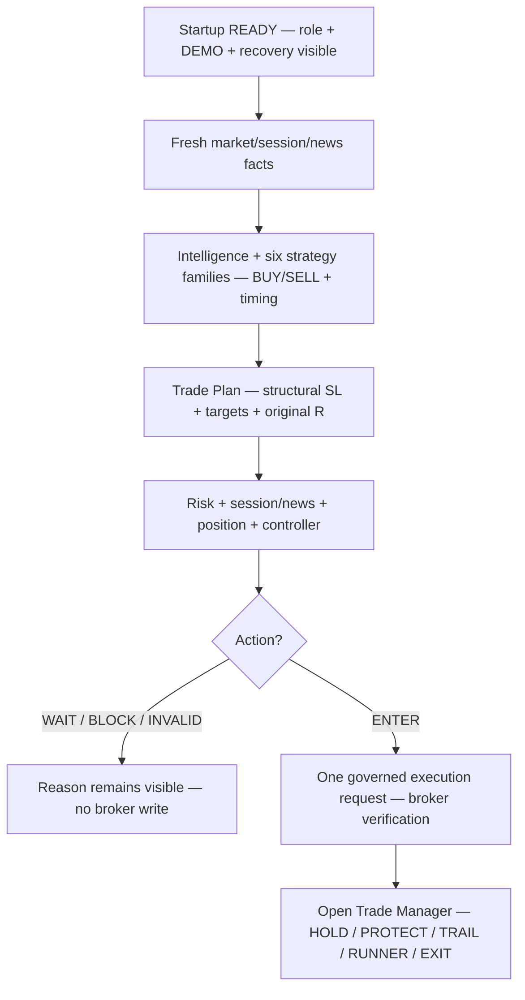

# GoldSwingTraderAI — User Manual

**Status:** DRAFT — OPERATOR BEHAVIOUR MANUAL
**Version:** 0.9-implementation
**Authority:** Human-facing explanation of normal operation and operator actions.
**Depends on:** `50-operator/DASHBOARD_AND_UX.md`, `SETUP_AND_RUN_GUIDE.md`

## Purpose

This manual explains how to operate and interpret GoldSwingTraderAI. It does not redefine trading logic; authoritative subsystem documents own behaviour.

Runtime-mode distinction:

- `READINESS` performs a read-only MT5 readiness snapshot; if the feed is
  stale/warming up it remains alive and waits for fresh data without trading;
- `PRIMARY`/`STANDBY` compose startup recovery, controller ownership and the
  persistent M5 cycle only after the documented authorities pass;
- absent or invalid session/news truth remains `UNKNOWN` and fail-closed;
- deterministic software proof, research evidence and connected DEMO proof are
  separate evidence classes.

## Intended normal daily workflow

```text
1. Open MT5 and connect the intended DEMO account.
2. Start GoldSwingTraderAI.
3. Let startup validation and broker reconciliation complete.
4. Confirm DEMO guard, controller role and execution readiness.
5. Let the bot analyze/manage automatically.
6. Use governed safe shutdown when stopping it.
```

Normal use should not require editing code or manually tuning scores.

### When the market is closed

The bot must remain observable when XAU is closed or the broker feed is not
advancing. `STALE`, `INSUFFICIENT` and `SPARSE` are wait states, not a reason to
invent a signal or send an order:

```text
MT5 snapshot → data not fresh → WAIT / no strategy cycle / no broker write
             → bounded re-poll → fresh data → normal governed path
```

`READINESS` uses `GSTAI_READINESS_KEEP_ALIVE` and
`GSTAI_READINESS_POLL_SECONDS`. `PRIMARY`/`STANDBY` renew the controller while
waiting before `READY`, then resume the normal M5 loop only after recovery
authorities pass. `CORRUPT`, identity, DEMO, persistence and unknown
session/news states remain fail-closed and are not disguised as market closure.

While READINESS is alive, the terminal now shows a compact readiness monitor
after every poll. It displays symbol, DEMO/identity facts, Bid/Ask/spread,
quote age, data quality, completed-candle counts and exact stale-data issues.
The frame explicitly says `STRATEGY NOT RUN` and
`BROKER WRITES DISABLED`. It is not the full Decision/Risk/Execution
dashboard because those values do not exist until a governed persistent cycle
is allowed to run.

## What happens during a normal cycle

The operator should understand the visible flow without reading source code:



The dashboard is the operator's view of this flow. It is normal to see WAIT,
NEWS_BLACKOUT, LOSS_LOCKED or REOPEN_WARMUP; those states are not automatically
software faults. A fault is indicated by the health/recovery panel and an
explicit subsystem reason.

## V1 DEMO guard

Use `GSTAI_RUNTIME_MODE=READINESS` for the safe read-only check. `PRIMARY` and
`STANDBY` additionally require explicit non-secret MT5 magic/deviation settings,
durable state selection and successful governed startup recovery. A missing
session/news provider or configured snapshot remains UNKNOWN and cannot become
execution-ready. The snapshot schema and freshness rules are in
`30-risk-execution/SESSION_NEWS_PROVIDER_CONTRACT.md`.

Broker writes are permitted only when the connected MT5 account is positively verified as DEMO and every other required authority passes.

```text
Environment       DEMO VERIFIED
DEMO Guard        PASS
Controller        PRIMARY
Execution         ALLOW
```

If DEMO status cannot be verified, the DEMO guard does not pass and broker-write permission is not granted. V1 does not define a separate REAL authorization workflow.

## Main status meanings

- `ENTER BUY/SELL` — current market/timing/plan/risk/safety/execution path passed;
- `WAIT` — thesis may remain valid but current timing/entry is not acceptable yet;
- `MISSED` — executable opportunity window passed without justified fill;
- `INVALID` — thesis no longer survives;
- `BLOCKED` — a hard authority prevents action;
- `OPEN TRADE` — Trade Manager owns the managed position.

Always read the reason code and short explanation rather than interpreting color alone.

## Accuracy tools: Trendline, Fibonacci and POC

The bot may use causal Trendline, Fibonacci and broker-local Point of Control / volume-profile context to improve setup quality.

These are **optional confluence**, not mandatory filters.

```text
supportive confluence present → small bounded confidence/score support
confluence missing            → no base-score penalty
opposed/unclear confluence    → context/conflict, not automatic BLOCK
```

The bot does **not** require Trendline + Fibonacci + POC to agree before taking a trade.

Trendline examples:

- support-line touch/reclaim may strengthen a BUY pullback continuation;
- resistance-line touch/reclaim may strengthen a SELL pullback continuation;
- resistance break may strengthen a BUY breakout/retest hypothesis;
- support break may strengthen a SELL breakout/retest hypothesis.

Fibonacci is anchored to already-confirmed structural swings; it may strengthen a suitable retracement/expansion narrative but cannot manufacture a trade on its own.

POC is broker-local context. Real volume is preferred when available; otherwise the system may use an explicitly labelled tick-volume approximation. Price merely being near POC is not by itself a BUY or SELL signal.

## Strategy behaviour and trade frequency

The bot is designed to be selective without becoming ultra-restrictive.

- six initial strategy families evaluate in parallel;
- one strong coherent family may create an opportunity;
- every indicator/SMC/confluence primitive does not need to align;
- missing optional evidence is not treated as a negative zero;
- poor current timing generally produces `WAIT` instead of deleting a valid setup;
- research measures missed meaningful moves and Opportunity Recall as well as accuracy/Net R/drawdown.

The objective is not a fixed trade quota, but the system should not improve headline accuracy merely by refusing most valid Gold opportunities.

## Why no trade?

Examples:

- `ENTRY_EXTENDED` — valid idea, poor current entry;
- `TARGET_ROOM_POOR` — structural reward/path is insufficient;
- `NEWS_BLACKOUT` — scheduled safety window;
- `SESSION_PRE_CLOSE` — scheduled XAU closure is approaching;
- `MIN_LOT_UNAFFORDABLE` — broker minimum volume makes this structural plan too risky;
- `SPREAD_TOO_HIGH` — current execution friction is excessive;
- `PRICE_DRIFT` — price moved too far from approved entry reference;
- `POSITION_CAPACITY_FULL` — bot already has its one V1 Gold risk position;
- `EXTERNAL_GOLD_EXPOSURE` — manual/foreign Gold exposure exists;
- `DATA_STALE` — required market truth is stale/invalid;
- `ANOTHER_ACTIVE_CONTROLLER` — another instance owns broker-write authority.

A non-trade is not automatically a fault.

## Risk profile and daily safety

```text
SMALL   any positive DayStartEquity below $300
MEDIUM  $300–$999.99
NORMAL  $1,000+
```

There is **no `$100` minimum balance/equity floor**. If a SMALL account falls to `$99`, `$50`, `$30` or another positive amount below `$300`, it remains SMALL.

A specific trade is accepted/rejected by actual executable risk, broker minimum volume, structural SL geometry, hard risk ceiling, margin, daily lock and ordinary safety checks — not simply because the account is below `$100`.

The dashboard should show profile, proposed lot, all-in risk, current risk band, hard entry ceiling, daily Account Safety P/L and remaining loss budget.

## Daily loss lock and manual reset

When active daily loss limit is exhausted:

```text
LOSS_LOCKED
→ no new entries/re-entry
→ open managed trade still receives safe management
```

Manual loss reset is **OFF by default**. If deliberately enabled, V1 allows maximum one governed `R,R` reset per UTC risk day from `LOSS_LOCKED`. It does not erase cumulative day losses/history and cannot bypass unrelated safety blocks.

## Loss streak and cooldown

One ordinary losing trade does not trigger global cooldown.

V1 allows at most one genuinely fresh re-entry in the same Market Episode. If that re-entry also loses, that episode is locked.

Three consecutive closed bot losses trigger at least 30 minutes cooldown. Time alone does not release it; fresh completed M15 context, a fresh valid opportunity and healthy execution state are also required.

## Position capacity

V1 uses Gold position capacity `0/1`.

- one independently risk-bearing bot-managed Gold position maximum;
- opposite opportunity first becomes Trade Manager reversal/exit evidence;
- no automatic hedge/second independent Gold position;
- manual/foreign/unknown-owner Gold exposure is never managed as bot-owned and prevents a fresh bot Gold entry until reconciled clear.

## Targets and large-move behaviour

The bot does **not** use fixed 100/200/300-pip take profits.

It tracks:

- Immediate Obstacle;
- Primary Structural Target;
- Expansion Target;
- Runner Objective.

Primary target is normally a management checkpoint, not automatic full exit. A valid Expansion Target is normally the initial broker TP. Runner extension must be earned through fresh continuation/acceptance evidence and a new structural/liquidity objective.

V1 remains fully functional with one indivisible `0.01` position; partial profit is not required.

## Open-trade actions

```text
HOLD
PROTECT
TRAIL
RUNNER
EXIT
```

Small opposite candles or a small floating profit do not automatically mean exit. Protection/trailing follows proven structure and may tighten risk, but must not intentionally widen beyond original approved risk.

## Scheduled market close

V1 intentionally flattens bot-managed Gold before known XAU closure/reopen gap risk.

```text
Daily break:
T-20m no new entry
T-10m mandatory flatten

Weekend:
T-60m no new entry
T-30m mandatory flatten
```

After daily reopen, at least one clean completed M5 plus normalized conditions is required. Weekend reopen requires gap assessment, normalized conditions and at least two clean completed M5 candles.

Runner status does not override mandatory PRE_CLOSE flatten.

## News safety

```text
TIER 1 CRITICAL  -15/+15 min
TIER 2 HIGH      -5/+5 min
TIER 3 CONTEXT   no automatic hard blackout
```

Scheduled news alone does not automatically close an existing managed trade. Severe post-news dislocation keeps new entry paused until execution conditions normalize and at least one clean completed M5 is available.

## Spread and price drift

The bot evaluates spread dynamically against a healthy broker/symbol baseline. Elevated spread may still be tradable after full revalidation; clearly excessive spread prevents the current entry.

Price movement away from approved entry reference is normalized by planned structural stop distance. Large adverse drift prevents the current intent rather than chasing the market.

## Runtime roles

- `PRIMARY` — only instance with current governed broker-write authority;
- `STANDBY` — may take over only after valid lease expiry and full reconciliation;
- `OBSERVER` — analysis/dashboard, no broker writes;
- `RESEARCH` — replay/experiments, no production broker writes;
- `RECOVERING/RECONCILING` — ownership may exist but broker writes are not ready yet.

A second laptop must not independently execute while another valid PRIMARY exists.

## Learning, discovery and invention

The research system measures taken, missed, blocked/rejected and invalidated opportunities plus MFE/MAE, realized R, Entry Efficiency, Capture Efficiency and premature-exit cost.

Strategy discovery is required to be operational rather than decorative:

```text
research episode
→ durable journal
→ approved evidence primitives
→ recurring eligible cluster
→ candidate created
OR explicit suppression reason
```

If eligible evidence cannot be processed and no governed reason is produced, Discovery Health should show `DEGRADED` rather than silently pretending everything is healthy.

Candidates are stored durably, remember rejected/duplicate ideas after restart, cannot execute arbitrary generated code, cannot modify hard safety and cannot self-promote.

Trendline/Fibonacci/POC evidence may participate in discovery/replay as optional audited primitives so research can test whether they genuinely improve outcomes.

## Dashboard interpretation

Main view should preserve useful market facts such as Bid/Ask, spread, M5 timer, structure, EMA20/50, RSI, ATR, decision/reason, risk/lot, day P/L/limit, position count and open-trade context.

Optional confluence may be shown compactly, for example:

```text
Trendline   M15 support TOUCH
Fib         BUY 0.618 zone
POC         NEAR (tick-volume)
```

These lines are context, not execution permission.

Discovery should expose compact health/candidate information such as `IDLE / HEALTHY / DEGRADED`, latest candidate/stage or suppression reason.

## Backups and laptop change

Source, docs, strategies, learning/research state and recovery intelligence may be backed up publicly according to project policy. Financial-authority credentials/keys/tokens must remain outside public backups.

After restore on another laptop, validate state, acquire controller ownership and reconcile current MT5 positions/orders/deals before new entries.

## Do not manually edit critical state

Do not delete/edit order lifecycle, risk state, Strategy Registry, promotion history or critical trade state merely to clear an error. Use governed recovery/reset workflows.

## Verification and evidence boundary

Component and integration tests prove deterministic software behaviour; replay
proves only the declared historical simulation; connected Windows MT5/DEMO
execution, restart and failover require operator evidence recorded by
`FINAL_RELEASE_AUDIT.md`. Do not interpret deterministic CI as profitability
proof or live DEMO certification.
